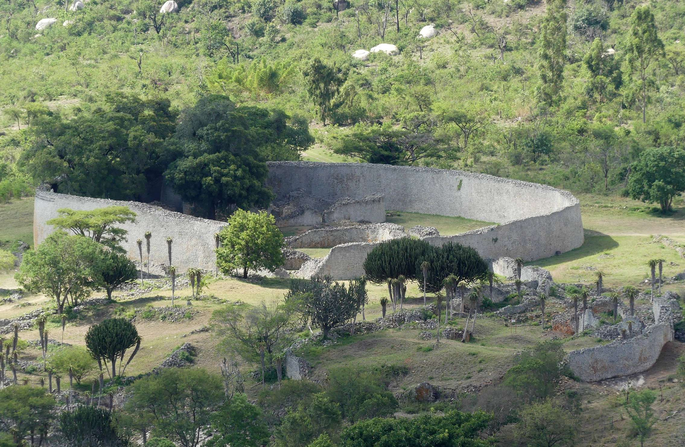
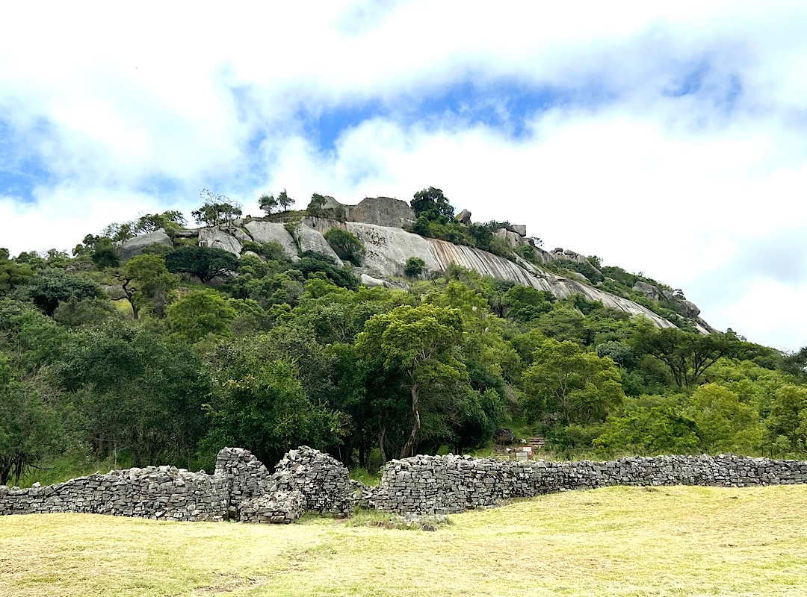
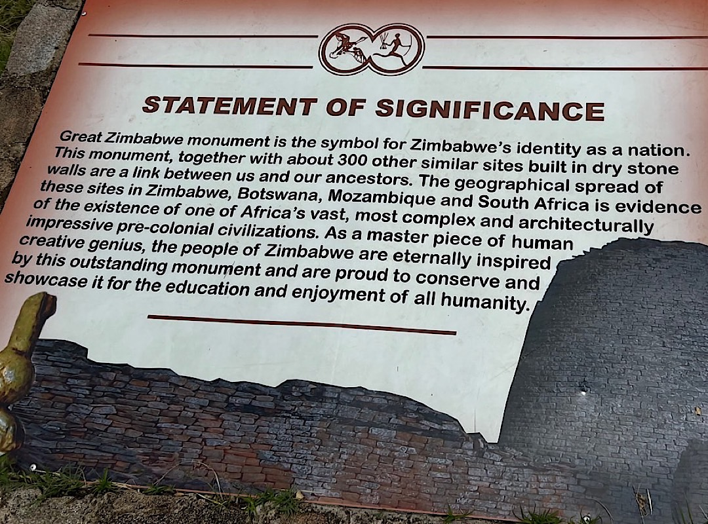
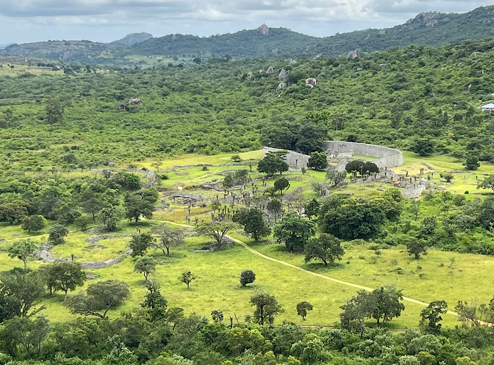
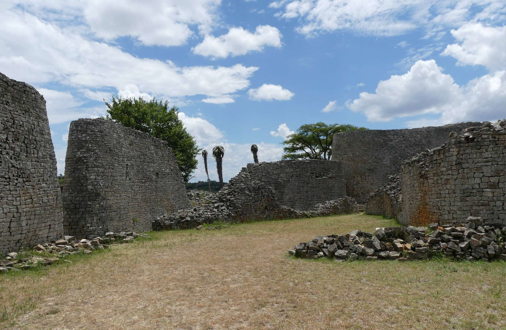
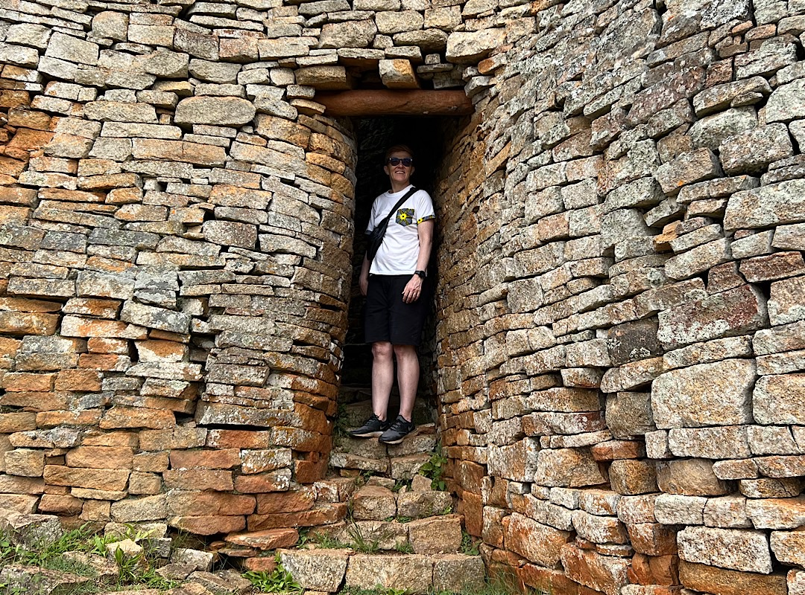
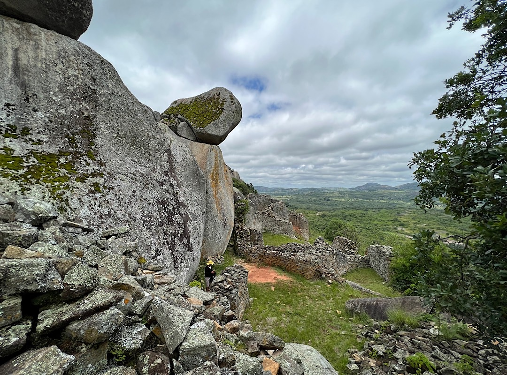

---
taxonomy:
    tags: [Blog, Zimbabwe]
routes:
    default: '/great-zimbabwe'
date: 2023-02-15 12:40
dateformat: 'Y-m-d H:i'
summary: The place I chose for my Lightning wallet test isn't just any place. It's the second largest monument in Africa after the Egyptian pyramides.
thumbnail: _Great-Zimbabwe-enclosure.jpeg
template: article 
---

# Great Zimbabwe second biggest monument in Africa

Great Zimbabwe, the place I chose for my **soon to be released** [Lightning wallet test](/lightning-self-custody-wallets-2023) isn't just any place. It's the second largest monument in Africa after the Egyptian pyramides.

Great Zimbabwe is the name of stone ruins of an ancient city. After the Egyptian pyramides, the ruins of Great Zimbabwe are the second largest monument in Africa. It has been abandoned in the 15th century and is a rural and lightly populated area today. 10,000-20,000 people lived in Great Zimbabwe, which was built around 1100 C.E.. It was part of a large and wealthy global trading network, with trading connections up and down the east African coast reaching to China, Persia and Arabia. 

<small>Photo: Martina Gruber</small>

Great Zimbabwe is located 300 km south of the capital Harare near Masvingo and Lake Mutirikwi and has been a spiritual, holy place for Zimbabweans and is a recognized UNESCO world heritage.

"Significant looting and destruction occurred in the 20th century at the hands of Europeans. Although they were all too happy to explore and loot the ruins of Great Zimbabwe, in their racism, European colonists thought the city was too sophisticated to have been built by Africans, and instead thought it had been built by Phoenicians or other non-African people. However, despite the damage done by these colonial looters, today, the legacy of Great Zimbabwe lives on as one of the largest and most culturally important archaeological sites of its kind in Africa.", [states the National Geographic Magazine](https://education.nationalgeographic.org/resource/great-zimbabwe).

"Great Zimbabwe has since been adopted as a national monument by the Zimbabwean government, and the modern independent state was named after it.

The word _great_ distinguishes the site from the many smaller ruins, now known as "zimbabwes", spread across the Zimbabwe Highveld. There are 200 such sites in southern Africa, such as Bumbusi in Zimbabwe and Manyikeni in Mozambique, with monumental, mortarless walls." [Wikipedia](https://en.wikipedia.org/wiki/Great_Zimbabwe)

<small>Photo: Martina Gruber</small>

The walls of the Great Enclosure are up to 11 meters high. They were built without mortar, relying on carefully shaped rocks to hold the wall's shape on their own. The method of construction is unique in African architecture and, although they are examples of similar work elsewhere, none are as distinguished and imposing as Great Zimbabwe.

According to Shona religion, the ancestors who built Great Zimbabwe still live there, and it therefore is a sacred site. Today Great Zimbabwe is still being used by contemporary communities for spiritual reasons and is one of the most potent symbols of the nation, and the Zimbabwe bird on the flag depicts one of the excavated soapstone sculptures of the fish eagle found at the site.

