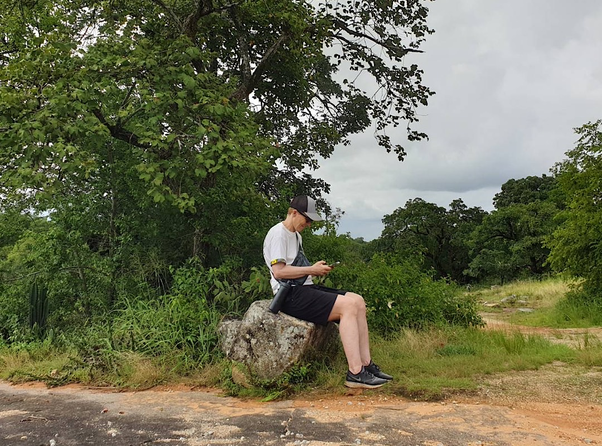
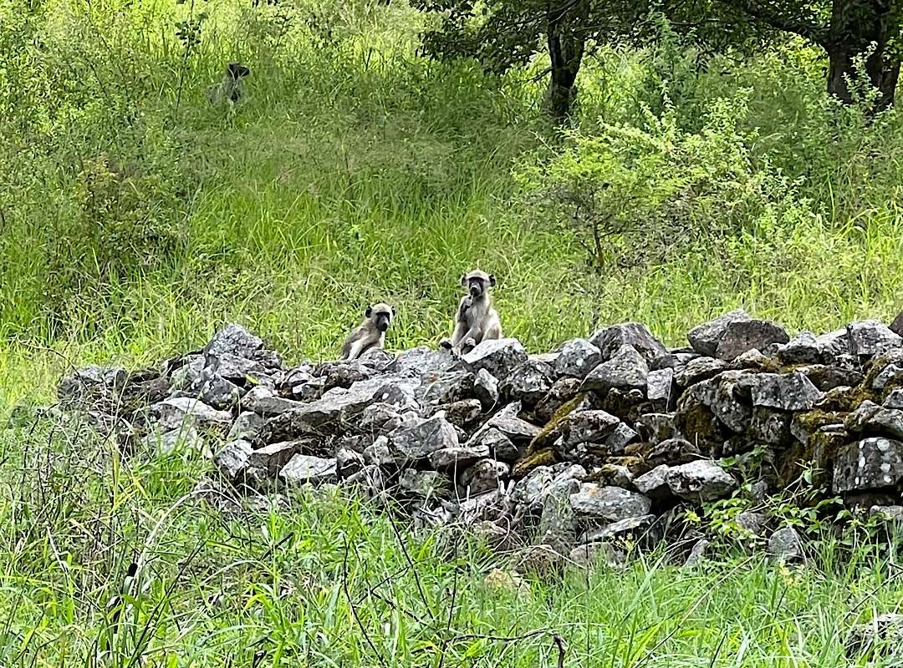

---
taxonomy:
    tags: [Blog, Show]
routes:
    default: '/the-show-will-go-on'
date: 2023-02-16 15:40
dateformat: 'Y-m-d H:i'
summary: You might wonder why I haven't produced a podcast episode in recent weeks, even if you're not, here's a short update from me.
thumbnail: _middlenowhere.jpg
template: article 
---

# Why I'm not podcasting and are you a cracker?

I have been to Southern Africa since September 2022. In this time I worked in Zambia, Ghana and Zimbabwe. The quality of the Internet connections is very different in each country, but in general I'd say that it's much worse compared to Europe or North and Central America. This is one of the reasons why I'm not giving interviews or doing video calls at the moment. It's tedious to even think of a video call with an unreliable connection. That's why I'm not conducting podcast interviews but concentrating on building something new.

After 4 years of releasing a podcast episode every week and last year every other week I'm feeling as if I would let you down by not showing up. But I've got news. The podcast will be back and I'm working on a mentorship program with online courses for Bitcoin newbies, human rights activists and community builders. The name will be "Crack the Orange" like "crack the code", which means to solve a difficult problem or mystery, to break a secret, to decipher coded intelligence with cryptography. Orange, because it's the brand color of Bitcoin. 

A native British English speaker helped me to find the name and said that cracker means something good. I intend to call the participants of my program crackers. Now I've googled the term and in British slang a cracker is a thing or person of notable qualities or abilities. It's just that all other interpretations are somehow negative. 

* One who gains unauthorized access to a computer or network, usually for a malicious purpose such as to steal information or damage programs.
* _Offensive_ Used as a disparaging term for a white person, especially one who is poor and from the southeast United States.
* A person or thing that cracks.

What do you think? Is cracker offensive or does it make the whole thing more mysterious and interesting. Maybe nobody cares ;-)

| Testing wallets in [Great Zimbabwe](/great-zimbabwe) | These fellows don't care about Bitcoin |
| ---------------------------------------------------- | -------------------------------------- |
|                               |                      |

Soon I'm releasing a Lightning wallet test.

