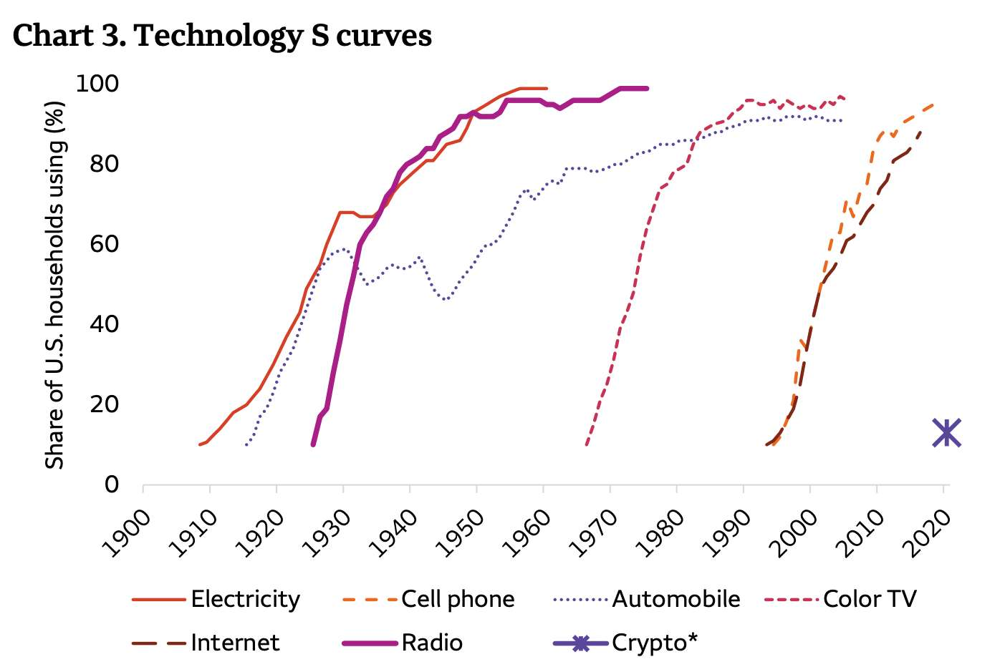
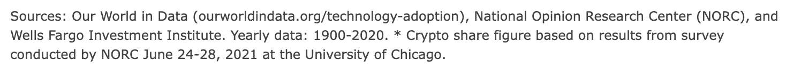
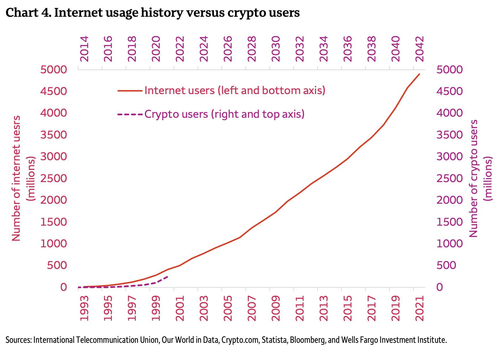
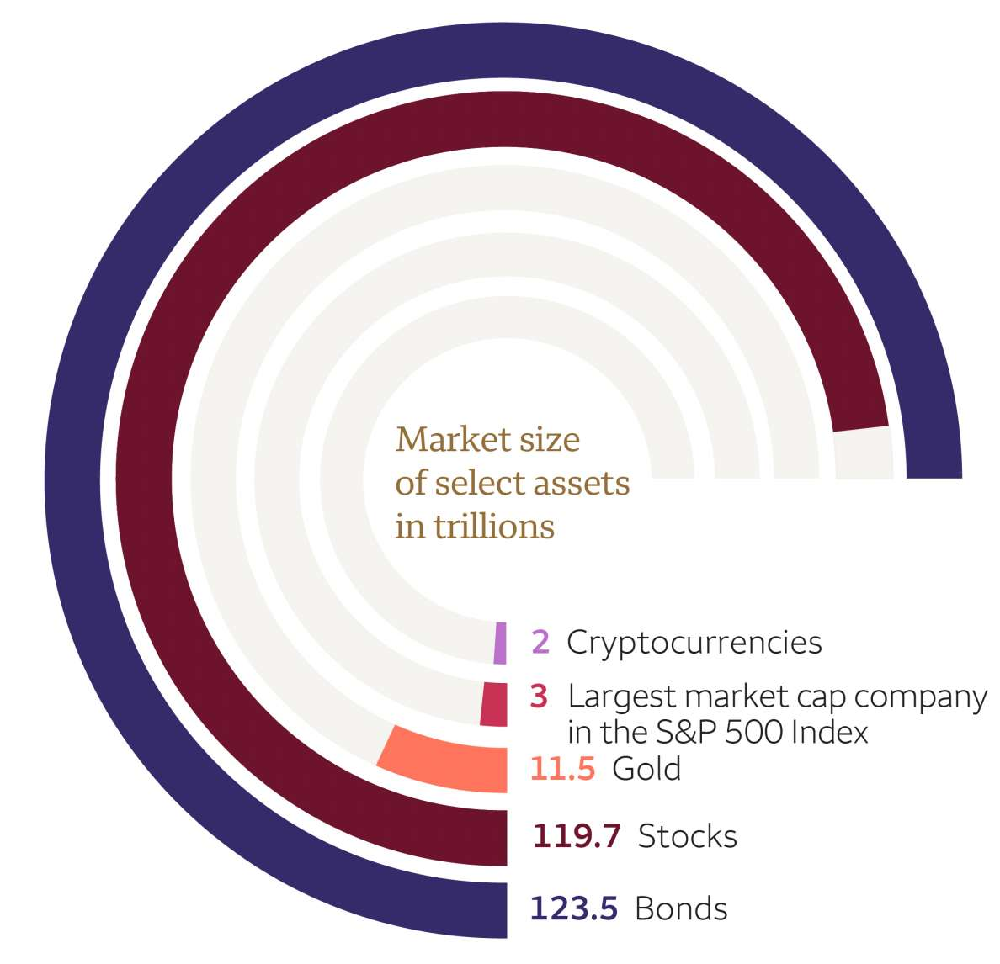
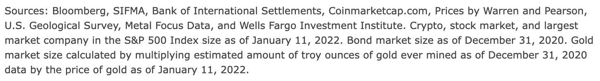

# Technology adoption isn't equally distributed

I'm often told that Bitcoin is unusable in many areas of the world without Internet access. That's true at the moment. The Internet was only available for a small part of the global population in the early 1990ies and now X billion people are using it. It's not yet everywhere available and the quality and speed are very different in different parts of the world. I have been spending several months in African countries and from my experience it's almost impossible to earn your money with online work from here. Prices, speed and reliability are vastly different depending on where you are. Even in major cities like Harare it's common to have landline Internet outages sometimes for minutes, sometimes longer. It's so common that people just switch to use mobile data instead of checking what the reason for the problem is.

### Internet speed and reliability

In Zimbabwe mobile data is bought in bundles. You can buy a WhatsApp bundle or an Instagram bundle, with which you only have access to same services. You can buy bundles that give access to the Internet, you can buy them for a day, a week or a month. You can buy them in Zimbabwe Dollar or in USD. A lot of possibilities to choose from. I decided to use the Mo' Gigs bundle from Netone. You get 15 GB for 10 USD. What they don't really tell you is that this is 10 GB for daytime use and 5 GB for nighttime between 22:00 and 04:00h. There is no functioning internet portal that would allow you to check how much data you've consumed. I tried to register for it, but it simply wasn't possible, it always showed errors. If you had put the SIM card into a WIFI router you need to first take it out, put it into a phone and then use USSD codes to request your balance. There is no way of controlling, that what they tell you is really how much data you've used. I still can't believe that I used 4 GB a day, just for working online. I didn't download or watch videos, I didn't do video calls, I didn't upload big files. That's not Netone alone, all services are like that.

Cable or landline Internet is available too. Prices are high, speed and reliability are mostly not better than with mobile data. My landlord buys 150 GB data bundles for 80 USD. Satellite Internet is the most reliable in remote areas, but it's also the most expensive with a monthly fee around 200 USD for 20 GB. 

The data speed varies from 0.3 to 15 Mbps for mobile data. You can have 15 Mbps up and download and still it's not possible to upload a 10 MB mp3 file. This is not Africa specific, I experienced that in Austria too. Just 20 km out of the capital Vienna I had problems working online. But in general connectivity is worse in many parts of Africa.

### Why "Bitcoin has failed, because you can't use it without Internet" is wrong

It's true, if there is no Internet access in rural areas or an autocratic leadership shuts down the Internet (which happens regularly) you can't use Bitcoin, but you also can't use a banking service. The criticism that Bitcoin is of no use for people in remote areas or the developing world does not hold true. No Internet means, no financial service at all. Internet access means, choosing between a banking system that inherently is relying on user identification and human approval or Bitcoin, which you can use peer to peer without intermediaries and IDs. 

#### You can use Bitcoin without the Internet

A clever African developer named Khogatsu has found a way to use Bitcoin without Internet connection. [Machankura8333 is a service that allows to send and receive Lightning bitcoin without Internet in several African countries.](/bitcoin-works-without-internet). You don't need a smartphone, any mobile phone that can send text messages will do. It's a custodial solution, you need to trust the developer that your funds are safe. So use it only for small amounts.

#### Charlie Munger doesn't like Bitcoin, but his analysts do?

Charlie Munger is famous for his quote: "Don't invest in what you don't understand"

Wells Fargo's summary: "For today’s investor trying to figure out if we are early or late to cryptocurrency investing, looking at technology investing in the mid-to-late 1990s seems reasonable. At that time, the internet hit a hyper-adoption phase and never looked back. Cryptocurrencies appear to be at a similar stage today. Cryptocurrency investment options today, however, are still maturing and we advise patience."

