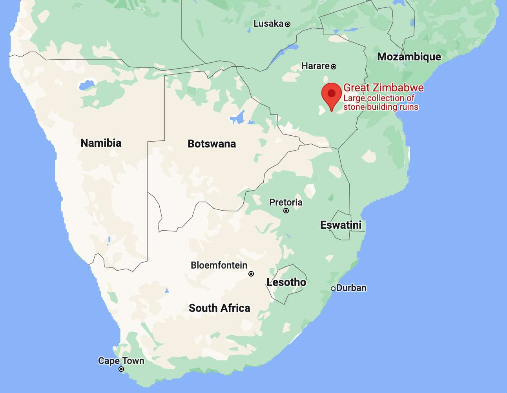
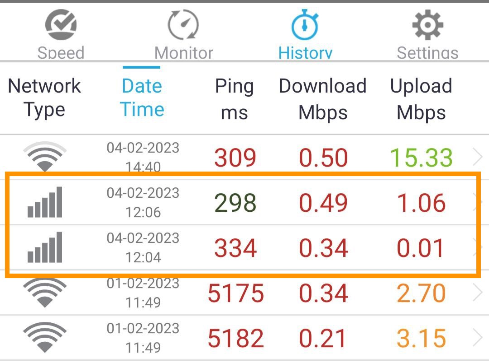
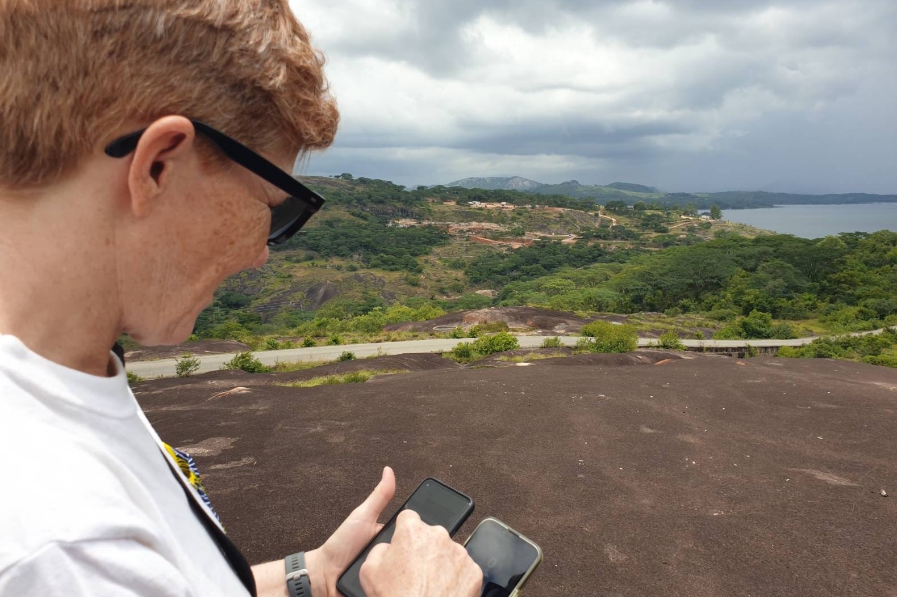
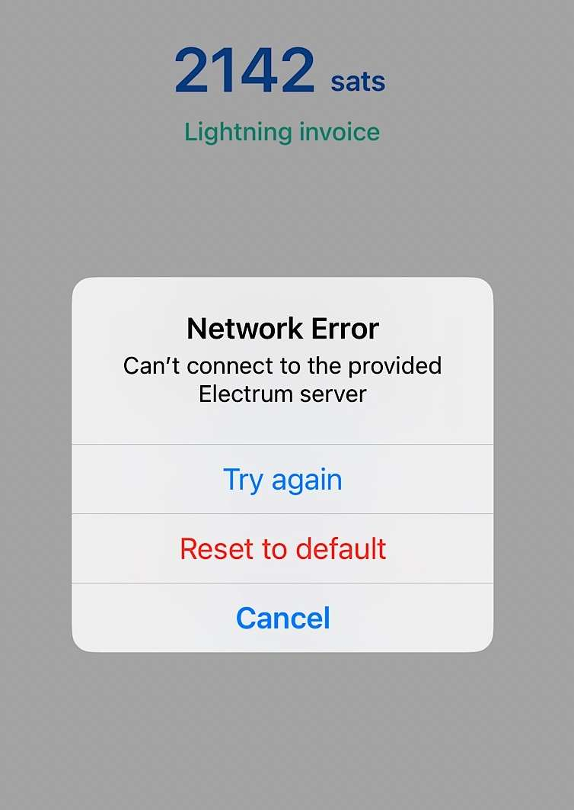
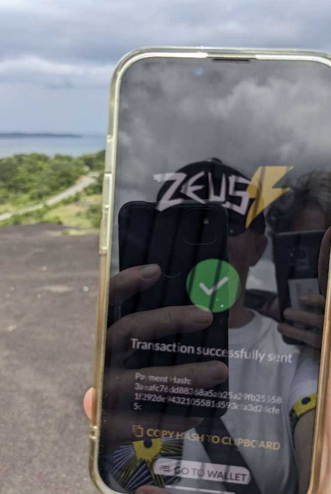
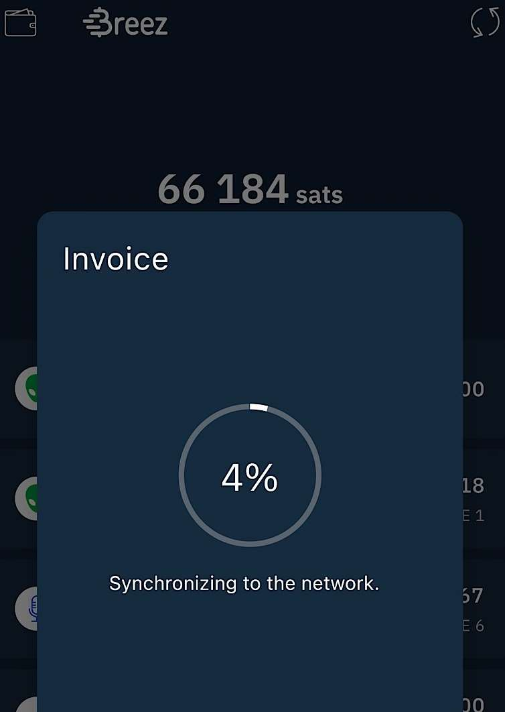
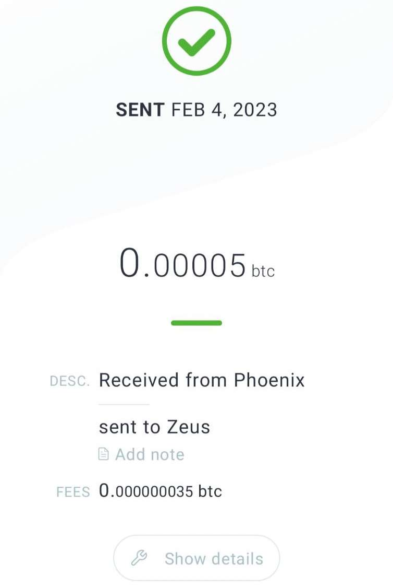
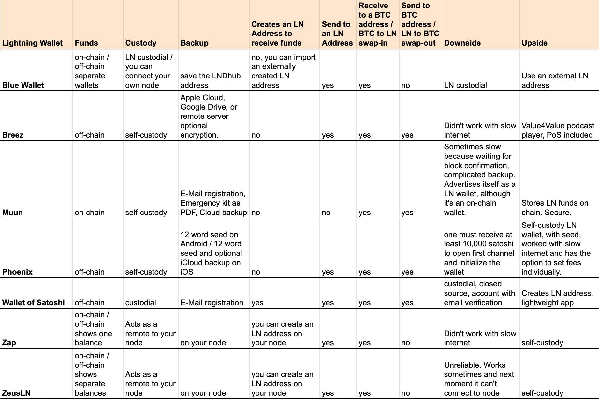

---
taxonomy:
    tags: [Blog, Lightning, Bitcoin in Africa, Wallets]
routes:
    default: '/lnw23'
date: 2023-02-23 12:40
dateformat: 'Y-m-d H:i'
summary: Why I'm opting for self-custodial Lightning wallets even in areas with low Internet speed. See my test results from a rural area in Zimbabwe.
thumbnail: _wallet-lake.jpg
---

# Review: The best Lightning wallets for slow internet 2023

In my work as a Bitcoin educator I help interested people to take their first steps into the space and gain the understanding why Bitcoin is important for them personally and the world. I also help Bitcoin community builders to become educators and share their knowledge with their peers. My focus lies on financial sovereignty, which can only be achieved with holding bitcoin in self-custody and using additional tools to reach a decent level of privacy.

To find out if it is time to onboard people onto a non-custodial Lightning wallet even in difficult settings, I set out to do a Lightning wallet test in rural Zimbabwe with low and erratic Internet connectivity on mobile data. I'm not talking about Bitcoin on-chain wallets: there is really no need at all to use a custodial Bitcoin wallet. I’m talking about Lightning wallets here. Non-custodial ones.

> This article was originally published on [Bitcoin Magazine](https://bitcoinmagazine.com/culture/top-bitcoin-lightning-wallets-in-slow-internet) by BTC Inc.

## The resistance to change a habit

Over and over I hear and read statements saying that newbies need convenient easy-to-use tools, otherwise they would be overwhelmed and won't use Bitcoin. I think this is wrong. People that are being onboarded onto custodial services are harder to convince to step up their game towards financial sovereignty and start using non-custodial tools. There is a big resistance to change habits. If a person starts using a custodial wallet, they very very often believe that they are using Bitcoin already. They will tell you that they never faced any problems and that they therefore don't see a need to change their setup.

As a Bitcoin educator it is my first duty to teach people about self-custody, why it is important and to make them aware of the risks they are taking. They need to understand the difference between custodial and non-custodial services. Only then I present different tools and make them familiar with the pros and cons of each one. Afterwards they need to decide themselves which route they want to take. That is the only way that people won't make me responsible for any losses and how they will understand that Bitcoin is all about ownership. If you're using a custodial service you're not financially sovereign. You're a pre-coiner, you're with one foot in the old world and can be rug-pulled any time. I think most people have already forgotten about Mt. Gox or even FTX. Fast money, fast access to (I believe I'm using) bitcoin, fast loss.

When we set out to show our friends how to use Bitcoin in the first place, why do we rush the onboarding by using convenient tools? Why not take a little more time and do some groundwork beforehand. It is almost the same effort for an educator to introduce a custodial wallet in comparison to a non-custodial wallet. I think showing a custodial wallet first is not even done to the convenience of the newbie, it is rather done to the convenience of the educator. More convenience, less explanations needed. That's short-sighted.

I'm convinced that everyone who is using Bitcoin today will need to change wallets and services in the future. Development is fast; I estimate I've been using around 15 different wallets in my Bitcoin journey so far. More to come. People need to know this too. it is not that you're using a wallet now and for the next 20 years, like maybe your bank account (if you have one). 

I feel a big discomfort, when people are rushed into using custodial wallets, receive a few satoshi and then they are sent off. All for the sake of fast adoption. I did it once too. I helped someone install Wallet of Satoshi. I regretted it later. Up until now I recommended using Blue Wallet on the [BFF Bitcoin flyer](https://bffbtc.org/flyer). Mainly because of its ease of use and the possibility to have a Bitcoin and Lightning wallet in one app. I was aware of the downside, the custodial Lightning wallet, but I thought that non-custodial Lightning node wallets like Breez or Phoenix won't work reliably in areas with slow or bad Internet connectivity.

## Goal: Identifying a non-custodial Lightning wallet that works in areas with low Internet speed

I have been asking myself in the last couple of months, if it wasn’t better to recommend a non-custodial Lightning wallet. I was unsure, though, if Phoenix or Breez would work in a setting of bad Internet connectivity. That's why I set out to do a test in the area of Great Zimbabwe about 300km south of the Zimbabwean capital Harare. I wrote a separate article about the [impressive historical importance of Great Zimbabwe](/great-zimbabwe).

## Test Setting

The mobile Internet speed at the time of testing in February 2023:

| Speedtest results           | Lake Mutirikwi        |
| --------------------------- | --------------------- |
|  |  |

I hadn't tested it, but I had the impression that Android is handling the low internet speed better than iOS. At the location where I tested I had 3G on the iPhone and H+ on the Android device. Now that I'm writing this article, I researched the difference and learned that H+ delivers much higher speeds than normal 3G.

I did two tests, one at Lake Mutirikwi and one in Great Zimbabwe. I announced on Twitter that I'm going to send bitcoin to the first three people sending me an invoice.

https://twitter.com/AnitaPosch/status/1621815009817788422

I did the first couple of tests at the dam of Lake Mutirikwi. I tested Breez, Zeus and Blue Wallet on an iPhone and Phoenix, Zap on an Android device. The following day I did some more tests.

https://twitter.com/AnitaPosch/status/1622213731970064385

## Lightning Wallets

### Machankura 8333
Machankura 8333 is a service that allows to send and receive Lightning bitcoin without an Internet connection. Millions of people on the African continent are using these phones. Machankura is using a technology called USSD code, just like the mobile money providers M-Pesa or EcoCash do. USSD stands for Unstructured Supplementary Service Data. You dial a code on the phone and a menu is opening, which you navigate through by typing numbers. I've [used Machankura to send and receive LN in Zambia](https://anitaposch.com/bitcoin-works-without-internet). It's important to note that Machankura 8333 is a custodial solution and very new. Because of its dependency on the permission by centralized mobile network providers its adoption is uncertain. Machankura is not available in Zimbabwe and therefore not a part of this test.

### Wallet of Satoshi 
One of the fastest and easiest to use Lightning wallets is Wallet of Satoshi. I've seen many people using it on their phones for instance in South Africa, Ghana or Zambia. it is always introduced as the most convenient and easiest solution for beginners. it is true: it works great even in remote areas with limited bandwidth and it is the only wallet as far as I know that gives you an LN address (alternatively you can use Alby & Blue Wallet). Wallet of Satoshi has big downsides though. 

First: it is a custodial solution. Your funds are being held by the company behind. You need to trust them. Second: it is not open source. Nobody except the wallet developers can read and revise the code, which is completely antithetical to Bitcoin, whose unique position stems from being decentralized and open source. For me it is: **stay away from Wallet of Satoshi**. That's why I didn't include it in the test.

### Blue Wallet
I really like the [Blue Wallet](https://bluewallet.io/). Mainly for its ease of use and the possibility to use Bitcoin on-chain and Lightning in the same app. But it has a downside: while on-chain funds are held non-custodial, so that you and only you have the seed words and are the owner of your bitcoin, the Lightning wallet is custodial. If you run your own Lightning node you can connect it as a remote for your node. Then Blue Wallet is a great solution. But if you have to use the wallet's default Lightning settings be careful and only store small amounts of bitcoin there. Everything else you should move over to your self-custodied on-chain wallet. 

Another upside of Blue Wallet is that you can integrate a Lightning address with a custodial wallet from [Alby](https://getalby.com). You set up an account at Alby, choose an LN address and import it into Blue Wallet. There you can see incoming funds and also send them.

**IMPORTANT UPDATE** Feb 24, 2023: 
> Blue Wallet announced to sunset its custodial Lightning wallet. You still can use it as a remote for your own node and import other wallets, but there will be no Blue Wallet hosted lndhub anymore. If you currently have funds in the Lightning wallet you should move it to another wallet by April 30 latest.

### Muun
The [Muun wallet](https://muun.com/) is a very user-friendly non-custodial Bitcoin wallet, which is being promoted as Lightning wallet even though all your coins are stored on-chain. Unlike Blue Wallet, where Lightning and on-chain Bitcoin are two wallets with two balances, Muun wallet shows one balance. Users don't need to decide if they should do a Lightning or an on-chain payment. The wallet selects the appropriate method automatically. 

Why is Muun not my favorite? Because of their backup method. The standard for self-custody is a seed phrase. This is what has been taught the last years and which I believe will be the standard in the foreseeable future. When I explain self-custody to participants of my meetups or workshops, securing the seed phrase is always the most important part. Suddenly, this works differently for Muun. As long as there are true self-custodial Lightning wallet alternatives that are working with the seed phrase or an easier backup mechanism, I will emphasize those. For instance Breez or Phoenix.

### Breez
The [Breez app](https://breez.technology/mobile/) brings a Lightning node to your smartphone. It stores your money in full self-custody. You will need a Google Drive, Apple iCloud or use a remote server to backup though. Since many people in African countries don't fulfill these requirements, it is not possible for them to use Breez. That's a pity because besides being a Lightning wallet, it serves as a Value4Value podcast player and a Point of Sale application for businesses.

### Phoenix
Like Breez, [Phoenix](https://phoenix.acinq.co/) is a self-contained Lightning node that gives you full access to your funds. It is non-custodial and offers a 12 word seed as backup. You can send your Lightning funds to an on-chain Bitcoin address (this is called swap-out). The only downside is, that you must receive at least 10,000 satoshis (USD 2.15 at the time of writing) to initialize a new wallet. This is the minimum amount for a new payment channel to be created. This requirement can be a problem for people with lower income. There is a little bit of trust involved while doing swaps and channel openings but in general it is a real, self-contained Lightning node that runs on your phone. You are in full control of your funds.

### Running your own node? ZeusLN and Zap

[ZeusLN](https://zeusln.app/) and [Zap](https://zaphq.io/) are wallets that you can use as a remote for your own node. You can also connect the Blue Wallet with your node, then it is a great Lightning wallet. 

I'm running a Lightning node on [Voltage](https://voltage.cloud/). it is not fully self-hosted, I need to trust Voltage, but as a nomad I can't run my own node at the moment. I have ZeusLN connected with my node on my iPhone and Zap on my Android phone. That's the configuration I did my first [Lightning test in rural Zimbabwe](/send-money-from-zimbabwe-to-south-africa-with-zero-fee) in September 2022.

## Test Results

As stated above I was under the impression that Android handled the low speed better than my iOS. I tested Muun, Blue Wallet, Zeus LN and Breez on iOS. Phoenix and Zap on Android.

### Muun
I sent one payment from Muun and had no issues.

### Blue Wallet
I had some connectivity issues as you can see on the photo, but **I was able to send and receive payments**.

### Zeus LN
I sent four payments. Sometimes the wallet timed out, because it lost connection to the node, but after re-opening the app **it worked**. 

| Blue Wallet (custodial) | ZeusLN (non-custodial / my Voltage node) | 
| ----------------------- | ---------------------------------------- |
|   |                  

### Zap
My Zap wallet never connected with my node.

### Breez
Was sadly **not working**. Loading the app started, but after a while I stopped, because it never finished. it is a fantastic app and the channel creation requires only a minimum amount of 2,000 sats (compared to 10,000 with Phoenix). In areas with **good internet connection I fully recommend it**.

### Phoenix
I **sent and received several payments successfully** without any problems.  

| Breez (non-custodial) | Phoenix (non-custodial) |
| --------------------- | ----------------------- |
|       |       |

## Wallet overview

## Fees

it is really difficult to make a fee comparison, because the functionalities under the hood of the wallets are different. The uncertainty of the underlying fees on the Bitcoin blockchain factor in as well, because when a channel is being opened or a swap-out to a Bitcoin address happens, they have to be paid for too. 

That's why I didn't even try to make a fee comparison. The possibility to own censorship resistant money, that one can send globally, that's settled instantly, works permissionless without any transaction limits, is priceless. Already now it is cheaper than any other form of international payment. 

Just recently someone sent me USD 2,500 from his bank account in another country to mine. I now have USD 2,466 in my account. The fee on his side was USD 20 on top of the USD 2,500. Additionally USD 4,14 on my side. That means in between someone (and we have no clue who) took 30 USD. He paid USD 2,520, I have USD 2,466 in my account - we paid USD 54 in fees. And yet the money is not even exchanged to EUR.

# Conclusion

In only 10 minutes (messaging on Twitter included) I had sent and received bitcoin in Zimbabwe from several countries like Benin, Nigeria, Bangladesh, Germany, UK and Italy. All that without the need for showing an ID or getting permission from anyone and without any transaction limits and very low fees. This is what financial sovereignty and inclusion is all about.

What’s the best solution for you? The best solution is the one that fits your personal needs best. As you can see in the above table, every wallet has different features, up- and downsides. it is on you to figure out your needs and possibilities and then to find the optimal solution for those. 

For new users, Phoenix and Breez are great solutions. Given the fact that I wanted to find the best wallet working in areas with weak internet connectivity, I recommend Phoenix. it is a non-custodial wallet, easy to use and swap-outs to on-chain are free (except for the mining fee) and it works with a seed backup. The only downside is, that you must receive at least 10,000 satoshis (USD 2.15 at the time of writing) as a first payment to initialize a new wallet. This requirement can be a problem for people with very low income.

I hear over and over again that Wallet of Satoshi is a great wallet to start with, because it is use is simple and convenient. Most of the invoices I received during my test were actually sent from Wallet of Satoshi. This freaks me out. The usual recommendation to use only a small amount of funds, because of the custodianship, can not be applied to lower income users. A loss of USD 2 can be huge for them. I don't see any reason anymore to recommend a closed source, custodial wallet like Wallet of Satoshi over a permissionless self-custodial wallet like Phoenix or Breez.

The requirement of Phoenix to receive a first time payment of 10,000 satoshi is a barrier to be acknowledged, but a person who doesn't have the funds to receive 10,000 satoshi, will suffer from the loss of the same amount in a custodial wallet even more. As I said above, it is every person’s own decision which route to take, but I find it important that people understand the risks of using custodial wallets at this early stage.

Non-custodial Lightning wallets might be a little less convenient to use and come with an initial cost when setting up the channels, but you are in full control over your own funds. You are financially sovereign. 

Furthermore, I am optimistic that Bitcoin developers and entrepreneurs will find solutions to make self-custody even more convenient and lower the barrier of entry in the coming years.

-----
Get a slice of Bitcoin wisdom delivered to your inbox weekly: https://anita.link/weekly
