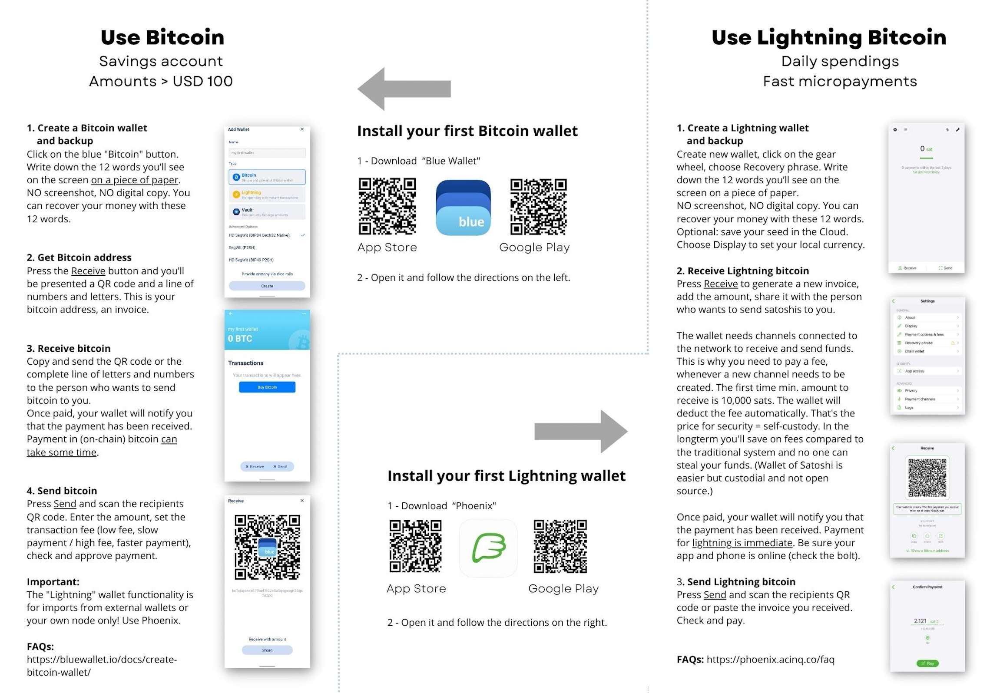
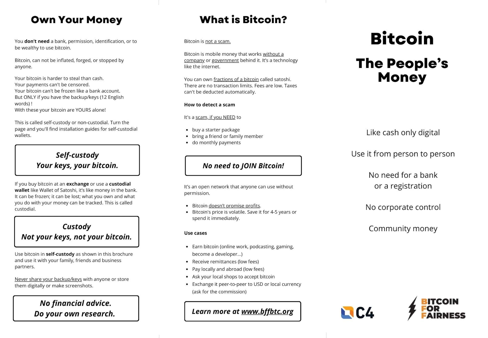

---
taxonomy:
    tags: [Blog, Learn Bitcoin, Earn Bitcoin]
routes:
    default: '/bff-flyer-23'
date: 2023-03-13 08:40
dateformat: 'Y-m-d H:i'
summary: The updated Bitcoin for Fairness flyer! Since Blue Wallet is sunsetting its custodial Lightning wallet I included Phoenix Wallet instead.
thumbnail: _Flyer-Phoenix-BW-1678694787401.jpeg
template: article 
---

# Bitcoin Flyer Update: moving to Phoenix Wallet for Lightning

Since Blue Wallet is sunsetting its custodial Lightning wallet end of April, I had to decide which Lightning wallet to recommend instead. If you have Lightning bitcoin in your Blue Wallet, please get yourself another Lightning wallet and move the funds out of Blue Wallet. This does NOT affect the on-chain Bitcoin part of Blue Wallet. As you can see I'm still recommending Blue Wallet for on-chain. 

I made a [test of Lightning wallets on mobile data](/lnw23) in Zimbabwe to find out a self-custody solution which also works with slow internet and Phoenix was the best. These recommendations can and will change over time. As a Bitcoin user you'll have to evaluate your needs and the existing wallets and their features from time to time. It's a fast moving space with constantly new developments. If you live in an area with good internet, you can for instance also use Breez, it's another great self-custody solution for Lightning.

Here you can [download the PDF](https://bffbtc.org/wp-content/uploads/2023/03/EN-Bitcoin-flyer-BW-Phoenix.pdf)

---
You like my work and efforts with [Bitcoin for Fairness](https://bffbtc.org) to foster Bitcoin adoption on the ground in the Global South? It's all community powered and funded by donations. Feel free to [support our campaign with a donation](https://anita.link/geyser), send sats to our lightning address bff@geyser.fund or send fiat money on [Patreon](https://patreon.com/anitaposch).