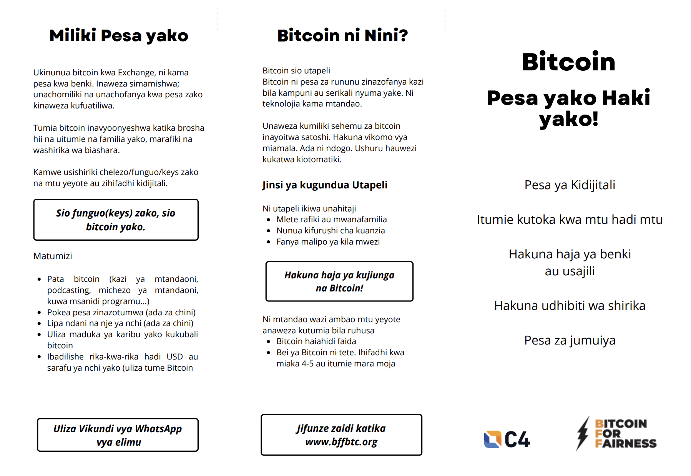

---
taxonomy:
    tags: [Blog]
routes:
    default: '/bff-flyer-volunteer'
date: 2023-02-24 11:00
dateformat: 'Y-m-d H:i'
summary: I'm looking for a volunteer for Bitcoin for Fairness. The task is to coordinate the translators for the Bitcoin flyer.
thumbnail: ../../articles-2022/221118-swahili-flyer/_swahili-flyer-2.png
---

# Looking for a BFF volunteer

With Bitcoin for Fairness I have been doing a lot of [educational work on the ground in Southern Africa](/bitcoin-africa-review-2022) in 2022. One of our projects is the [Bitcoin flyer](https://bffbtc.org/flyer), a short and concise intro to use Bitcoin that one can print and give away at meetups. 

The flyer has been translated to several languages already, now some amendments need to be done and also I'd like to motivate even more people to translate it to their language.

Our current volunteer who helped organize the translators had to resign. Are you up to do this? The requirement is taking care of our small database of translators, sending emails and explaining how and with which tool (Canva.com) the translators should do their work. You don't need to understand Bitcoin to do this, no proof-reading or such, it's a coordination task.

Would be great to hear from you! [Please apply here](https://anitaposch.com/contact)

If you want to [translate the flyer to your language please apply here](https://bffbtc.org/translate/).

---
You like my work and efforts with [Bitcoin for Fairness](https://bffbtc.org) to foster Bitcoin adoption on the ground in the Global South? It's all community powered and funded by donations. Feel free to [support our campaign with a donation](https://anita.link/geyser), send sats to our lightning address bff@geyser.fund or send fiat money on [Patreon](https://patreon.com/anitaposch).
