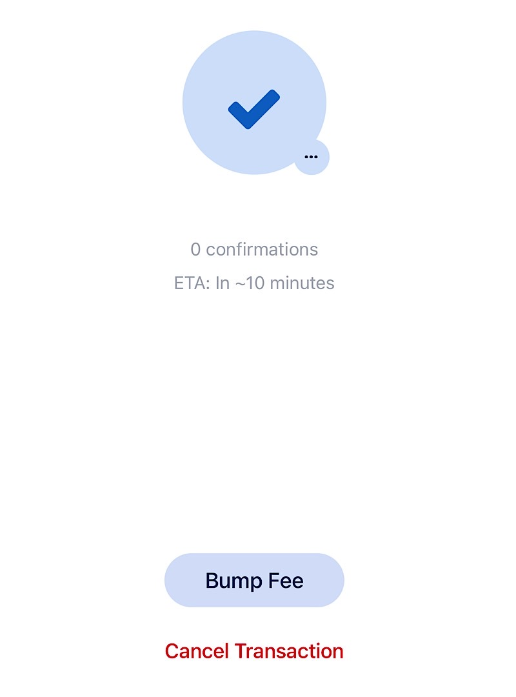
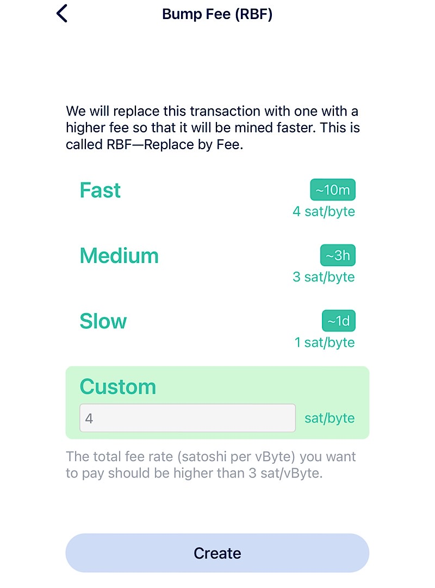
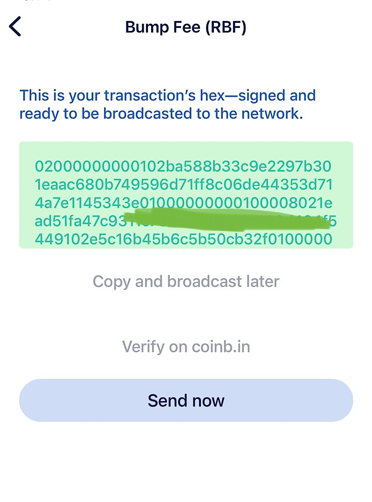
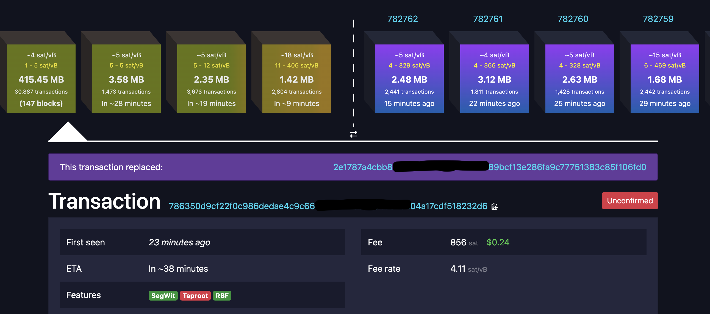

---
taxonomy:
    tags: [Blog, Learn Bitcoin, Wallets]
routes:
    default: '/rbf'
date: 2023-03-27 15:40
dateformat: 'Y-m-d H:i'
summary: In times of congestion on the Bitcoin blockchain, your transactions might get stuck and need days to confirm. Here's what you can do about it.
thumbnail: _RBF-2.JPG
---

# Bitcoin transaction is unconfirmed and pending - How to speed it up

## How to speed up a slow payment

In times of congestion on the Bitcoin blockchain, your transactions might get stuck and need days to confirm. I remember that being the case in the bull run of late 2017 and it's happening right now in March 2023, during a banking crises and a simultaneous run on storing images on the blockchain (Ordinals).

The reason for the stuck transaction is that the fees to get transactions into a block have been rising and you might have used a too low fee rate, so that your transaction has not been included by the miners to validate yet. Every Bitcoin user can set the transaction fee as high or low as they wish with 1 sat/vbyte being the lowest possible fee rate. The higher the fee, the faster the miners will include your transaction to be mined. By the way: you're paying for the data size, not for the amount you send like in the banking system.

### What you can do, when a Bitcoin transaction is stuck or slow

I had a transaction that was stuck for a week. I paid my dentist and used a low fee of 2 sat/vbyte.  The number of transactions in the mempool reached a new all-time high these days, which even kicked my transaction out of the list of transactions in my Blue Wallet. As the congestion eased, the transaction showed up in my wallet again. It can happen that the transaction falls out of the mempool completely. In that case the funds will reappear in the wallet and the money needs to be sent a second time. But before doing that, look up your transaction in a [blockexplorer](https://mempool.space/). I found mine there, by looking up the recipients Bitcoin address. Then I knew, that I didn't need to resend it. I had the option to use "Replace by fee". I just needed to wait until the transaction would show up in my wallet again.

### Replace by fee

Many wallets are offering a Replace by Fee option. Usually it's called something like "Bump Fee". Clicking on it enabled me to set the fee as I wished. Blue Wallet shows an estimate of the time that will be needed until the transaction will be confirmed. This can be an estimate only, because it can happen that a lot of new transactions with higher fees are sent and then my transaction would fall behind again. After setting the new fee, I confirmed and sent the transaction.

| Step 1          | Step 2          | Step 3          |
| --------------- | --------------- | --------------- |
|  |  |  |

Now I was able to see that the transaction status had changed in the blockexplorer. It showed my previous transaction as replaced and that my RBF transaction should be confirmed in an hour.

-----
Get a slice of Bitcoin wisdom delivered to your inbox weekly: https://anita.link/weekly
