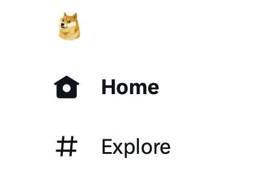
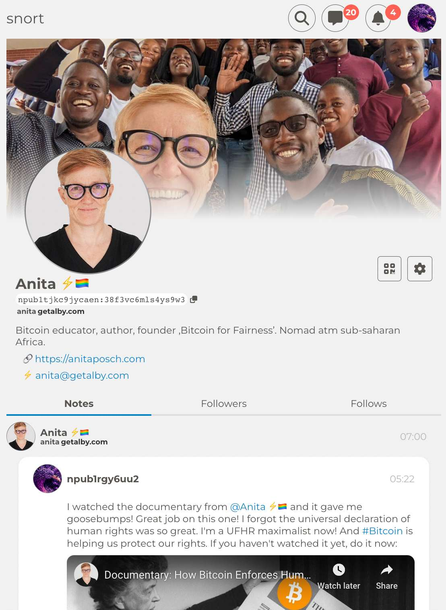

# The Future of the Internet Is Decentralized and  Nostr Could Play an Important Role

## My Nostr public key

> Follow me on [Nostr](https://iris.to/npub1tjkc9jycaenqzdc3j3wkslmaj4ylv3dqzxzx0khz7h38f3vc6mls4ys9w3) 

> This is my public key with which you can find me with any [Nostr client](https://nostr.how/en/clients) you choose: npub1tjkc9jycaenqzdc3j3wkslmaj4ylv3dqzxzx0khz7h38f3vc6mls4ys9w3

> Follow Bitcoin for Fairness: npub1fqqtc58rx9mslpydp9849pmlh4x8f5m8js399aqanlqjg6v6x9lq5qqzch

Just like Bitcoin more and more platforms are being built in a decentralized manner. Taking away the power from centralized entities back to the user. The main advantages are uncensorability - Twitter or Facebook can't shut down your account or censor your messages - and the ownership of data goes back into the hands of the creators like you and me and everyone who's using a decentralized platform or money like Bitcoin.

## The death of centralized platforms

Your data, stays your data. No Facebook, Google or Twitter can monetize it through advertising. That gives us a much higher level of privacy online. Centralized platforms will lose all their attraction over the coming years. Some company owners like Elon Musk actively destroy their platforms by their decisions.

In the quest for money, he decided that the blue legacy checkmarks will be replaced by Twitter Blue, a program that let's you buy a checkmark for 8 USD per month. A lot of people criticized the legacy checkmarks because it was a Twitter decision, who gets it and who not. I do understand that criticism basically, it's why Bitcoin is superior, because it has rules without rulers. But I think it made more sense, than what we have now. 

I haven't had any problems with imposters anymore, who on a regular basis had tried to defraud my followers and the checkmark gave my profile credibility for my work in Africa, which is full of scammers. It clearly showed I'm a trusted source on Twitter. I applied several times for it. After months of explaining what I do and sending links from trusted resources about my work I finally received the checkmark about 6 months ago. And now: available spending power is deciding on verification or not. Before every person (at least every one with an ID) could achieve verification through proof of work. 

This week suddenly the Dogecoin dog appeared as the logo of Twitter. It's clearly an ad for Elon Musk's favorite crypto project. He pumps the price again and then dumps it. Has happened before. Since then I haven't heard of any advancements in the software development of Doge.

## Nostr

At the same time we now have a decentralized alternative to Twitter. It's called NOSTR, which stands for "Notes and Other Stuff Transmitted by Relays". It's very new and under constant development. We'll see if it stands it's ground over the coming years, but it has a lot of potential due to the native integration of bitcoin. 

### Keys, Clients, Relays

Nostr is a decentralized protocol that allows to set up profiles with private and public keys. You have one private key and with this you own one profile, that you can use on all Nostr clients. It's not limited to Facebook or Twitter to the respective platform. The private key is like your seed phrase for Bitcoin. Clients are for instance Damus, Amethyst or snort.social. These are the apps, that you use to access your profile and the Nostr protocol. It's like your Twitter app or a Bitcoin wallet for the Bitcoin protocol. Relays are servers that store data and distribute it, comparable to Bitcoin nodes.

You can find Nostr accounts to follow on directories like [https://nostr.directory](https://nostr.directory) and advice on how to use Nostr on [https://nostr.how/](https://nostr.how/).

---
Get a slice of Bitcoin wisdom delivered to your inbox weekly: https://anita.link/weekly 