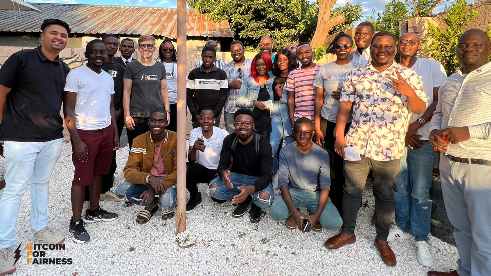
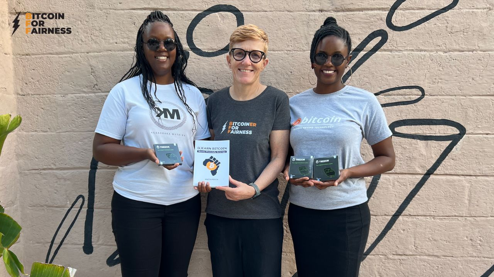
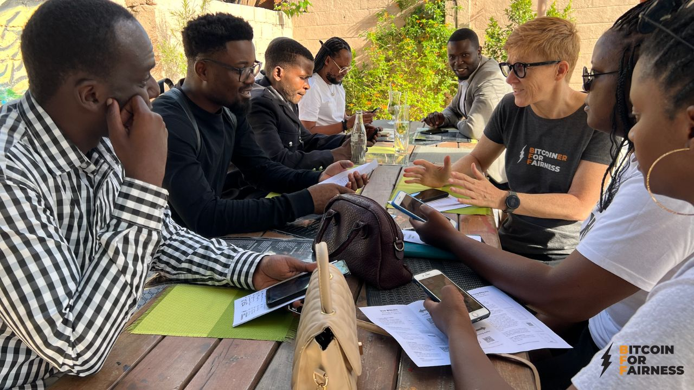

---
taxonomy:
    tags: [Blog, Bitcoin in Africa, Zambia]
routes:
    default: '/7th-bitcoin-meetup-zambia'
date: 2023-04-16 8:00
dateformat: 'Y-m-d H:i'
summary: I was attending the 7th Bitcoin for Fairness meetup in Lusaka, which was a great success, we installed self-custody LN wallets and a female focused community was founded. Here is my report.
thumbnail: _2.jpg
---

# The Bitcoin Community in Zambia is Growing 

## New educational initiative focusing on women was founded 

The 7th Bitcoin for Fairness meetup in Lusaka, Zambia was held on April 15, 2023. After spending half a year as a nomad in Zimbabwe, I came to Zambia to conduct a Bitcoin workshop for human rights activists. That was the perfect opportunity to stay a little bit longer and attend the community meetup.

It was awesome to see how the community has grown since I first came to Lusaka in March 2022. Back then neither a Bitcoin only meetup nor an educational WhatsApp group existed. Yesterday 25 people attended and the WhatsApp group has grown to 70 participants.

We spoke about the differences between Bitcoin and Altcoins, the importance of self-custody and privacy in regards to uncensorability and personal security. I was asked to share my experiences from other countries and circular Bitcoin economies I visited, so I told them about Bitcoin Ekasi in South Africa and how Bitcoin Beach in El Salvador started it all.

Tilo and Tamara, two young entrepreneurs who started to educate themselves about Bitcoin in 2022 presented their idea to found a women focused educational community with the goal to stimulate a circular bitcoin economy. The initiative's name is "Bitcoin Banamayo Community", Banamayo means women in Bemba. We will support the early stages of their endeavour, because [fostering grassroots education and adoption on the ground](https://bffbtc.org/mission/) is exactly the aim of BFF.

## Set up of self-custody Lightning wallets

A big part of the meetup was discussing the [Bitcoin flyer](https://bffbtc.org/flyer) and installing Phoenix wallets for Lightning. I explained what the differences between Bitcoin and Lightning are and why self-custody is such an important part while using Bitcoin. I used [BFF donations](https://geyser.fund/project/bff) to send 10,000 sats to each person who set up a Phoenix wallet to open a channel. Then we used the Lightning torch idea, so that each wallet user sent 10,000 satoshi to their neighbor. Finally everyone who wanted was set up with a connected Phoenix wallet.

I want to thank all donors who have supported my journey with Bitcoin for Fairness so far and especially the BFF team on the ground, who are contributing their free time to the growth of the Zambian community. I feel excited and honored to being a part of this important stage of spreading Bitcoin education. If you want to become a supporter too feel free to donate via https://geyser.fund/project/bff or send sats to our⚡️lightning address bff@geyser.fund.

---
Get a slice of Bitcoin wisdom delivered to your inbox weekly: https://anita.link/weekly 