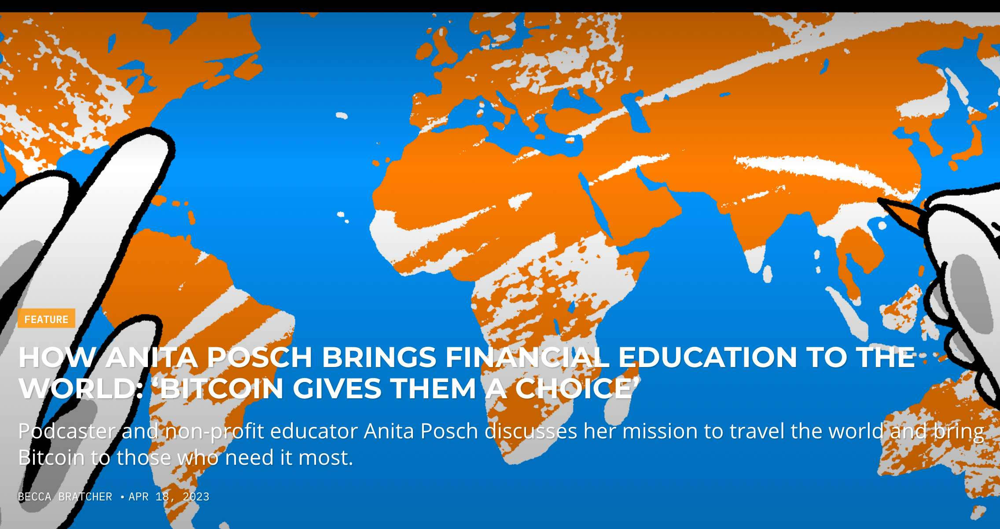

---
taxonomy:
    tags: [Blog, Bitcoin in Africa, Features]
routes:
    default: '/global-bitcoin-education'
date: 2023-04-29 8:00
dateformat: 'Y-m-d H:i'
summary: I was interviewed by Bitcoin Magazine about how I am bringing financial education to the world, especially to women in Africa and why it is important.
thumbnail: _Anita-Posch-BTC-Magazine.jpeg
template: article 
---

# Bitcoin Gives People A Choice

The article starts with an introduction by the editor and then I'm answering questions:

As an American who grew up in the South, I am ashamed of the lack of financial knowledge I had as a young adult. Bitcoin made zero sense to me until I understood the history of money and what it means to have a peer-to-peer, apolitical, monetary system. This knowledge has opened my mind to the many things that Bitcoin can accomplish in regards to elevating human rights around the world. 

Every single day more human rights violations are reported in the media. From the [Rohingya genocide](https://www.hrw.org/tag/rohingya) to the Russian invasion of [Ukraine](https://news.un.org/en/story/2023/03/1135012) and a thousand more in between. The world we live in is corrupted by greed and those who misuse their power. Oftentimes the power-hungry use fiat currency as a means of control. That being said, Bitcoin’s case for improving human rights is the number one reason why I care about Bitcoin. 

Enter, Anita Posch. [Podcast](https://btcpodcasting.com/@anitaposch) host, [author,](https://learnbitcoin.link/) non-profit [founder](https://bffbtc.org/) and Bitcoin educator. Anita has a background of over twenty years in web design and online entrepreneurship, and has made it her life mission to educate people who need Bitcoin the most. She has been on the ground working tirelessly, emphasizing the need for everyone, specifically women, to take control of their financial literacy through Bitcoin education and entrepreneurship. 

I’m confident you will be inspired as you read her responses. 

## How did you first learn about Bitcoin and what specifically drew you to it? 

The first time I heard about Bitcoin was in 2011, I tweeted about it, but didn't really get into it, because I read an article and concluded that it's just another PayPal. Well, it must have been a bad article. In April 2017 I heard a talk at a conference about Bitcoin and open blockchains and their future impact on society and technology. This time I was open and ready to learn something new. I had been an online entrepreneur and web designer for 20 years and was looking for new interesting topics as a basis for my work. I immediately understood that an uncensorable, collaborative, permissionless and open protocol to send value is a tool that can provide a level playing field for anyone globally. I was definitely not able to verbalize this back then, because I had no clue how Bitcoin works, but my life experiences and my insights as a builder of online shops and marketplaces acted as some sort of internal compass to sense the groundbreaking  importance of Bitcoin. This time I wanted to be part of the development and decided to put all my efforts into understanding and learning to become a Bitcoin educator myself.

## How do you see Bitcoin positively impacting youth in the countries you serve; Ghana, South Africa, Zambia and Zimbabwe? 

I have been working with my initiative Bitcoin for Fairness and from what I've learned, many young people realize how Bitcoin gives them a choice, an opportunity to participate in a global economy, to become free from financial oppression and lack of access to financial means in their home countries. Take the people who live in Bitcoin Ekasi for instance. I visited and worked with them in May 2022. Bitcoin Ekasi is a township in Mossel Bay, South Africa, where 11 shops and a taxi driver are accepting bitcoin now after being on-boarded by community members. Many of the 5,000 inhabitants have no access to bank accounts or chose to unbank themselves because of the high fees and bureaucracy ([source](https://anitaposch.com/bitcoin-enforces-human-rights)). Young people living in the township like Luthando and Mbasa are supporting their community with knowledge and practical education on how they can facilitate bitcoin. The coaches earn their salaries in bitcoin and spend it in the local shops. Recently another shop asked to be added to the Bitcoin economy, because of the high grade of security that Bitcoin offers compared to keeping cash. A few months ago the neighborhood's supermarket Pick'n'Pay started accepting bitcoin too. That means the shop owners can use their earned bitcoin to restock their shops without the need to convert to the national currency, which saves fees and hassle.

A growing number of young people see how they can earn bitcoin through content creation like on our [BTC Podcasting](https://btcpodcasting.com) platform. It's free to host a podcast without losing your copyright (like on Anchor) and at the same time anyone can start earning bitcoin via Value 4 Value podcasting without the need to run their own Lightning node. Value 4 Value means that the listeners can freely decide if and how many bitcoin they want to send to the host while listening to the podcast. As a podcaster myself I saw the need for a platform that is not charging around 10 USD per month for podcast hosting, because it excludes many people from sharing their voices from the ground. 

During my travels, especially to Ghana speaking at the first Pan-African Bitcoin conference it was amazing to meet and witness how many young people are starting educational groups, for instance the Bitcoin Cowries in Accra, Bitcoin Mountain in Cameroon or the women focused Bitcoin Dada in Kenya. I’m currently working on an online mentorship program called “Crack the Orange” for newbies and community leaders to gain a wider understanding of Bitcoin to share it with their community members. With my non-profit initiative [Bitcoin for Fairness](https://bffbtc.org) we’re supporting young women to create their own educational group in Zambia.

The four African founders of Qala, a program designed to train the next generation of African Bitcoin and Lightning developers, are inspiring, visionary young people themselves. All these initiatives contribute to job and wealth creation and will have a positive network effect on the ground.

## How do you typically respond to those who are dismissive of Bitcoin, especially those close to you? (close friends, etc.)

In the last years I have been trying to educate the naysayers on Twitter or other media with arguments, facts, and sharing experiences of African and South American Bitcoin users on my [podcast “The Anita Posch Show”](https://btcpodcasting.com/@anitaposch). I realized it's not easily possible to win an argument if the respondent has made up their mind already. Every answer you give will be opposed with opinions and their own perception. I never tried to convince anyone. If people show up and are interested in the topic I'll explain and support. If not, then I won't touch the topic. Same is true for my friends. Most of them have their own ideas about Bitcoin, don't take the time or interest to learn. A handful of my close friends seeked my guidance and did the work. I think they are very content today.

## In your opinion, why is it important to close the gender gap in Bitcoin interest and adoption?

At first let the numbers speak. Of the 1.7 billion unbanked people, [57% are women](https://anitaposch.com/bitcoin-enforces-human-rights).

"In the USA alone approximately 8.4 million US households are unbanked with an additional 24.2 million US households classified as underbanked. Black women are significantly more likely than Black men or any other group to be unbanked or to be underbanked. Further, we find limited wealth is more frequently cited by Black women as the main reason why they do not engage with the banking system." ([Source](https://www.aeaweb.org/articles?id=10.1257/pandp.20221016))

"There is a significant gender wealth gap between men and women at retirement. Upon retirement women globally are expected to accumulate only 74% of the wealth that men have" ([Source](https://www.wtwco.com/en-AE/insights/2022/11/2022-global-gender-wealth-equity-report#:~:text=New%20flagship%20research%20from%20WTW,to%20our%20Wealth%20Equity%20Index)).

Seventy-five economies globally still [limit women’s rights](https://blogs.worldbank.org/opendata/where-world-do-women-still-face-legal-barriers-own-and-administer-assets) to manage assets. There are countries in which women are not allowed to own property or inherit it — they never will be owners of land that could be used as a security to apply for a loan or support their informal businesses. This is occurring mostly in countries in the Middle East, North Africa, South Asia, Sub-Saharan Africa, East Asia and the Pacific.

While women have been getting the same rights in many societies in recent decades, in general women are still facing massive discrimination on the basis of gender. This inequality leads to exclusion from the financial system, because of a lack of wealth or because women can't produce an ID, which is necessary to be banked. 

Bitcoin is fair in so far as it does not discriminate. Anyone can use it without the need to show an ID or the need to be wealthy already. There is no minimum limit to use bitcoin. Anyone can earn bitcoin through their work. Earning bitcoin will become the standard. By educating women and girls about Bitcoin we can support them in closing the gender wealth gap, when we factor in that Bitcoin's value has only appreciated in the long term. Nonetheless Bitcoin can be only one tool, it won't magically close the wealth gap, because men have more resources now, that's why they can earn or buy more bitcoin as well. That's why it's imperative to educate women and girls as early as possible as long as bitcoin is in its infancy, hence bringing education to the Global South especially women, the queer community and human rights activists is a strong focus of Bitcoin for Fairness.

## With the recent closure of peer-to-peer platform Paxful, what other options for buying and selling bitcoin have you found to be successful in countries where there are no centralized exchanges? 

There are several other P2P options to buy and sell bitcoin without the need to show your ID, which is an important privacy protection. They may not be accessible globally, that's why the real on the ground peer to peer exchange is number one in African countries. Another option are Bitcoin vouchers or gift cards. The best is to earn bitcoin, by either asking your employer or clients to pay you in bitcoin or creating valuable online content like a podcast or other media.

P2P Exchanges:
+ Hodlhodl https://hodlhodl.com (account, centralized)
+ Bisq https://bisq.network/ (download and install Software, decentralized)
+ AgoraDesk https://agoradesk.com (Tor, centralized)
+ Robosats https://robosats.com (Tor, centralized)
+ Peach Bitcoin https://peachbitcoin.com/ (currently in Beta mode, centralized)
+ No Ones app (new app, centralized)

---

---
You like my work and my efforts with @BFFbtc to foster Bitcoin adoption on the ground in the Global South? It's all community powered and funded by donations. 

Feel free to support via https://geyser.fund/project/bff or send sats to our⚡️lightning address bff@geyser.fund
