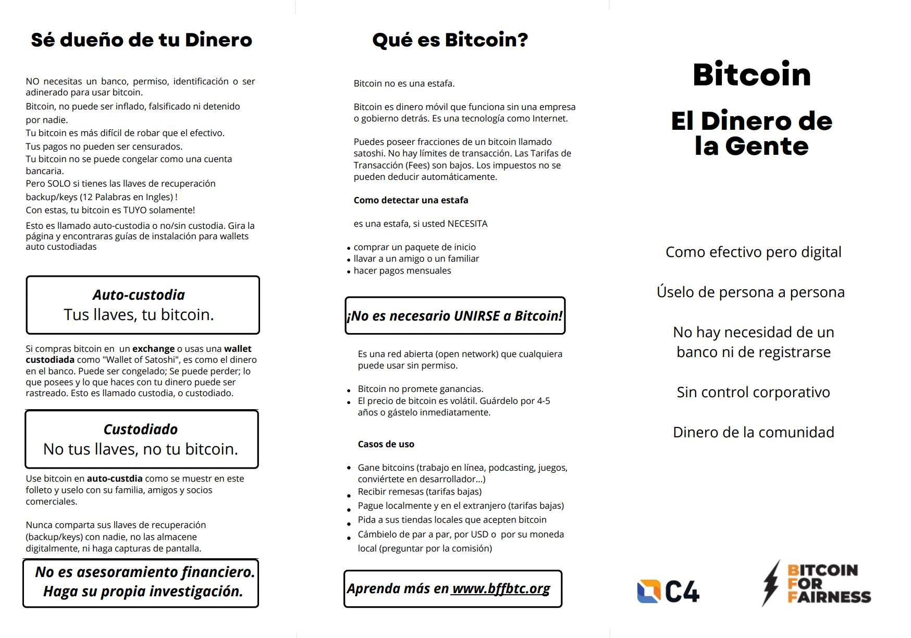
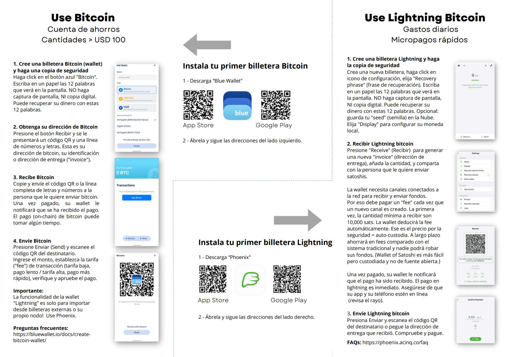

---
taxonomy:
    tags: [Blog, Learn Bitcoin, Earn bitcoin]
routes:
    default: '/bitcoin-flyer-spanish'
date: 2023-05-11, 14:00
dateformat: 'Y-m-d H:i'
summary: The Bitcoin flyer, a short intro to using Bitcoin for meetups and beginners is available in Spanish now.
thumbnail: _BFF-Flyer-in-Spanish-1.jpeg
---

# Bitcoin Flyer in Spanish

Thanks to one of our BFF volunteer translators the [Bitcoin flyer](https://bffbtc.org/flyer), a 2 page folder about the basic characteristics of Bitcoin and how one can use it, is available in Spanish now. 

You can download, print and use the [PDF](https://bffbtc.org/wp-content/uploads/2023/05/SHO-Bitcoin-flyer-BW-Phoenix.pdf.pdf) for free.

-----

-----
You like my work and my efforts with Bitcoin for Fairness to foster Bitcoin adoption on the ground in the Global South? It's all community powered and funded by donations. 

Feel free to support via https://geyser.fund/project/bff or send sats to our⚡️lightning address bff@geyser.fund 
