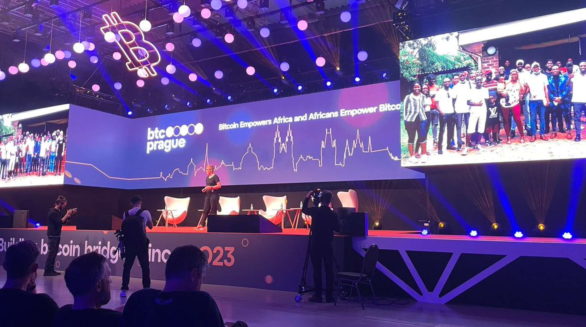

# Bitcoin Empowers Africa and Africans Empower Bitcoin

It was a pleasure to present my keynote at the first Bitcoin conference in Prague in June 2023. I'm talking about my experiences on the ground in Zambia, Zimbabwe, Ghana and South Africa and show the differences between the Global South and North, adoption rates, use cases for Bitcoin, challenges for the people on the ground, an explainer about inflation in Zimbabwe, future developments and how Bitcoin unites the world. Watch these **strong and important 15 minutes!**

<iframe width="560" height="315" src="https://www.youtube.com/embed/LY1UG1KSKew?si=KkWwBbdLUU9oQvCM" title="YouTube video player" frameborder="0" allow="accelerometer; autoplay; clipboard-write; encrypted-media; gyroscope; picture-in-picture; web-share" allowfullscreen></iframe>

