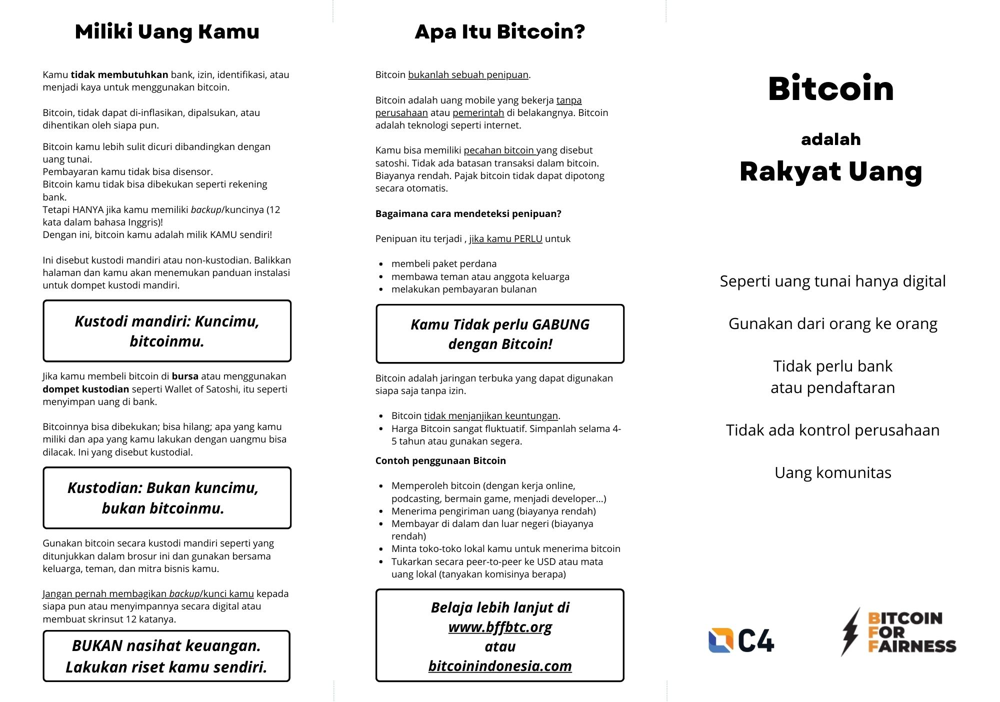
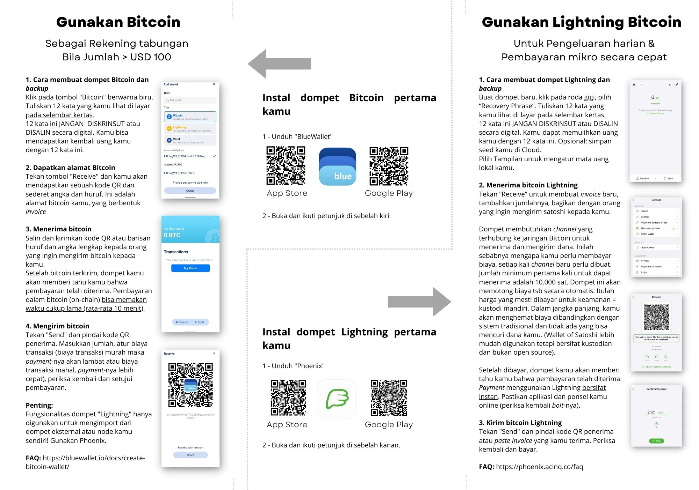

---
taxonomy:
    tags: [Blog, Learn Bitcoin]
routes:
    default: '/bitcoin-flyer-bahasa-indonesia'
date: 2023-12-14 11:00
dateformat: 'Y-m-d H:i'
summary: The Bitcoin flyer, a two page folder about the basics of Bitcoin and how to use it, is now available in Bahasa Indonesia.
thumbnail: _Thumbnail-INDONESIA-Bitcoin-flyer-BW-Phoenix2.jpeg
---

# Bitcoin Flyer in Bahasa Indonesia

Thanks to Bitcoin Indonesia the [Bitcoin flyer](https://bffbtc.org/flyer/), a 2 page folder about the basic characteristics of Bitcoin and how one can use it, is available in Bahasa Indonesia now.

You can download, print, and use the [Flyer PDF](https://bffbtc.org/wp-content/uploads/2023/12/INDONESIA-Bitcoin-flyer-BW-Phoenix.pdf) for free.

---

You like my work and my efforts with Bitcoin for Fairness to foster Bitcoin adoption on the ground in the Global South? It’s all community powered and funded by donations.

Feel free to support with a [donation](https://anitaposch.com/donate), via [https://geyser.fund/project/bff](https://geyser.fund/project/bff) or by [sponsoring a scholarship](https://my.cracktheorange.com/scholarship/) for aspiring educators and community builders.
