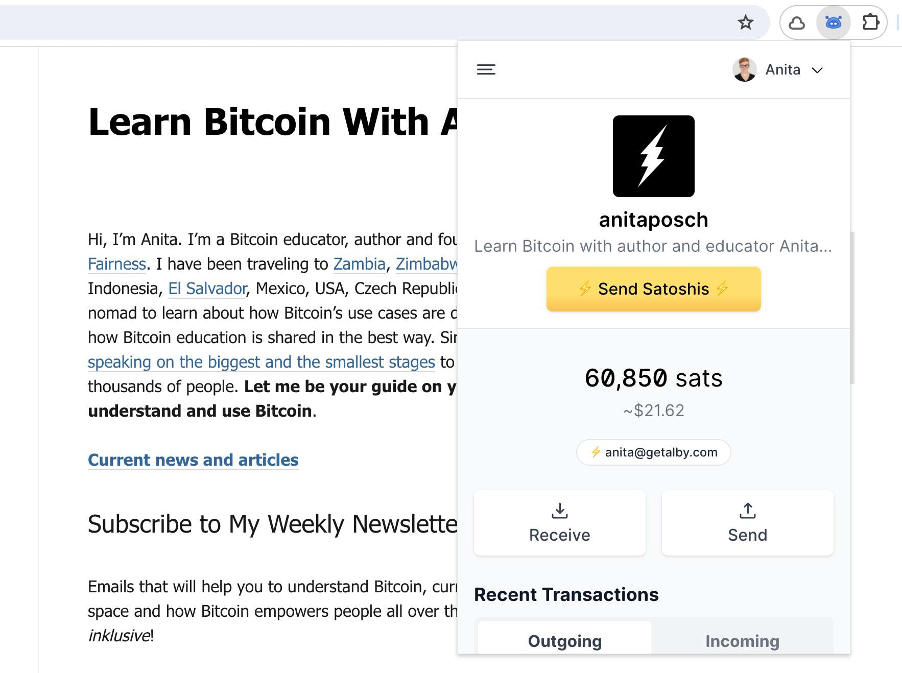

---
taxonomy:
    tags: [Blog, Learn Bitcoin, Lightning]
routes:
    default: '/send-sats-website'
date: 2023-12-18 07:00
dateformat: 'Y-m-d H:i'
summary: How to tip someone with bitcoin via a website using the GetAlby wallet extension. Here is how you can make it work on your website.
thumbnail: _Send-Sats-Website-Alby.jpeg
---

# Fast and easy payments with bitcoin - Let people send sats via your website

In the Bitcoin community the Value-for-Value ethos is a popular way to show appreciation for content creators. Basically, it means that when you receive value e.g. in the form of information or entertainment, you reciprocate by giving value back in monetary terms and, thus, support the work of the creator. Tipping in bitcoin makes this process simple and direct. 

So, if you like my work and my articles you can tip me directly on this website using the GetAlby wallet extension. In this guide I will show you how you can make it work on your website too.

Thanks to Nostr user "Coco_Ardo" for pointing out this feature.

## Incredible easy - pay online with bitcoin

<div style="padding:65.06% 0 0 0;position:relative;"><iframe src="https://player.vimeo.com/video/880399262?h=b2616c5fce&amp;badge=0&amp;autopause=0&amp;quality_selector=1&amp;player_id=0&amp;app_id=58479" frameborder="0" allow="autoplay; fullscreen; picture-in-picture" style="position:absolute;top:0;left:0;width:100%;height:100%;" title="Fast and easy payments online - Send bitcoin via website"></iframe></div><script src="https://player.vimeo.com/api/player.js"></script>

## As a website owner

1. You need a Lightning address to receive the funds
   Get it at getalby.com, geyser.fund or from your own Lightning node.

2. On your website you need to have the possibility to change the source code. Then add this meta tag to your HTML head:
```
<meta name="lightning" content="lnurlp:YourLNadress@example.tips"/>
```

3. Done! Your website visitors can send sats to you with the GetAlby extension.


## As website visitor

1. You need a [GetAlby account and wallet](https://getalby.com/#alby-account)
   
2. Install the [GetAlby extension](https://getalby.com/#alby-extension) in your browser
   
3. Visit and donate!

