# Bitcoin For Fairness Review 2023

In this article, I'm going to take you through the biggest achievements of each month. We'll also look at my highlights, [personal learnings](#learning) and what I'm [aiming for in the next year](#goals). So, let's recap this amazing and impactful year.

> This review is available as a podcast episode too. 

<iframe width="100%" height="112" frameborder="0" scrolling="no" style="width: 100%; height: 112px; overflow: hidden;" src="https://btcpodcasting.com/@anitaposch/episodes/bff-review-2023/embed"></iframe>

## Highlights of 2023

### Bitcoin Training for Human and Civil Rights Activists

One of my highlights this year was the Freedom Money workshop I conducted during the Freedom Academy in Lusaka, Zambia in April 2023. Together with the BFF Team Zambia we introduced 50 human rights activists from 23 African countries to Bitcoin. A one-time workshop like this is great for on-boarding and answering the first questions, but it’s not enough time to strengthen the knowledge needed. In a fast moving technology like Bitcoin it’s important to build a long term relationship with activists and educators. This was the reason why I thought it would be great to have some sort of online program to create a longer and sustainable connection with the people I met. This led to Crack The Orange.

### Launch of Crack The Orange

I ended 2022 with the commitment to [“build a community site with online courses and education around non-KYC bitcoin, privacy tools and, of course, self-custody in 2023”](https://anitaposch.com/bitcoin-africa-review-2022). And I did it. In January, I started gathering ideas for a name, creating a business model for online courses, and combined this with a scholarship program. In August, [Crack The Orange](https://cracktheorange.com) was launched - 3 months later than planned, because of my traveling and speaking engagements, and with high ambitions. Since the launch, we received over 70 scholarship applications from Bitcoin educators and community builders from African countries, but also from Latin America and Indonesia. The goal of the scholarship program is to build the next generation of educators to scale knowledge and adoption through peer to peer education.

### My work during 2023

#### **January**

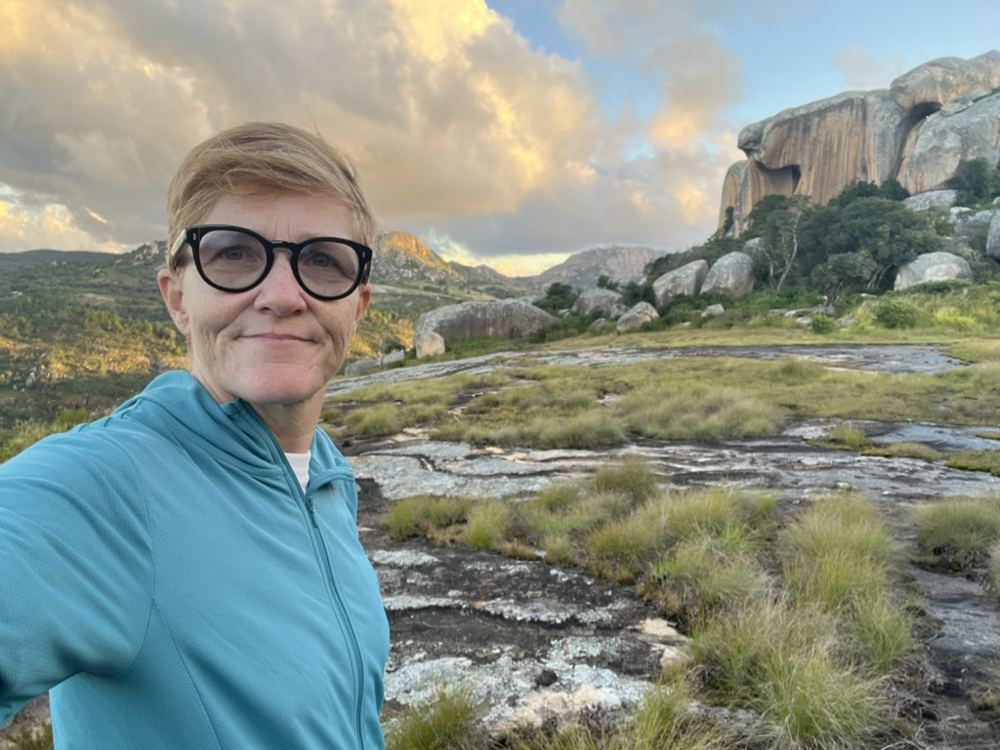
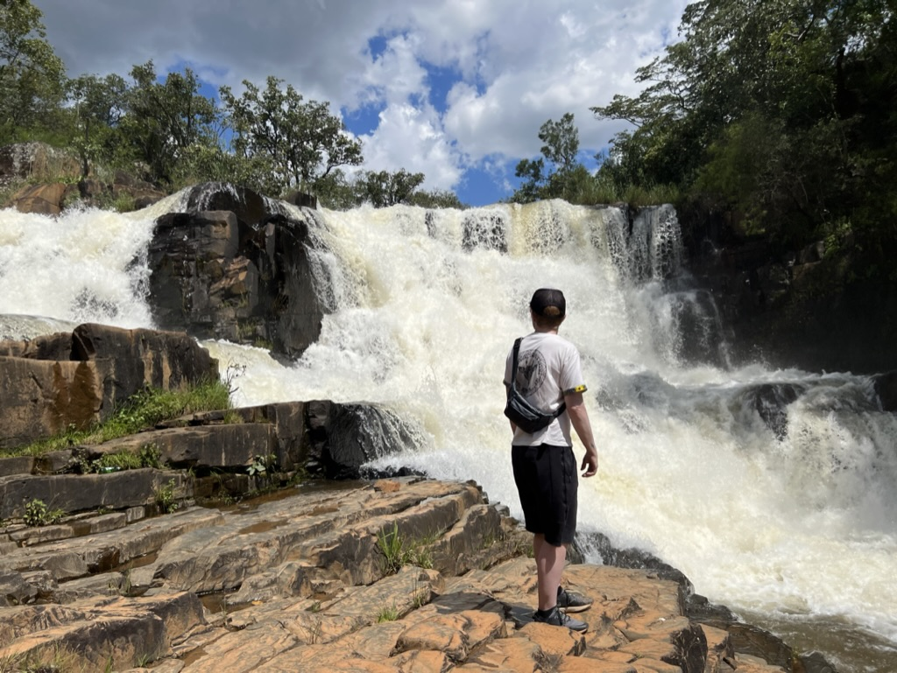

I was staying in Zimbabwe the first months of 2023, working on ideas and content for my online course and learning platform Crack The Orange. In that time, I also gave an [online lecture for Les Femmes Orange, a “women in Bitcoin community”](https://anitaposch.com/bitcoin-geld-menschen) in Germany. 

In the same month the [Lightning Node that we brought to Zambia](https://anitaposch.com/zambia-bitcoin-node) in October 2022 went online.

#### **February**

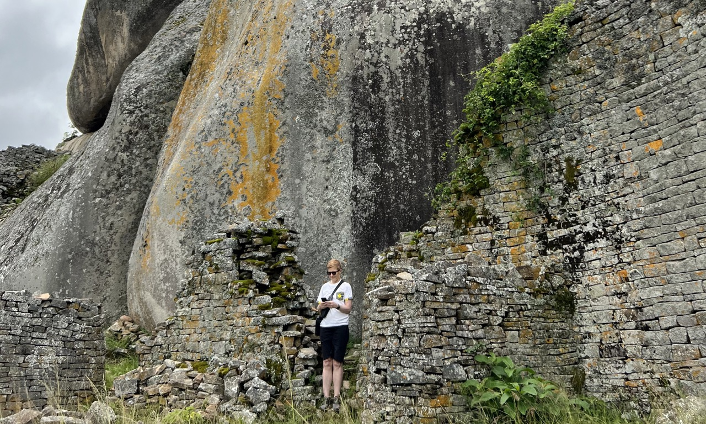

In February 2023 I dedicated a lot of time into testing Lightning wallets in rural Zimbabwe with minimal phone signal. My goal was to find out if it’s possible to self-custody Lightning with an easy to use wallet. The [results showed that it was possible to use Phoenix Wallet](https://bitcoinmagazine.com/culture/top-bitcoin-lightning-wallets-in-slow-internet). 

Furthermore, my [book (L)earn Bitcoin - read by a Zimbabwean, was published as an audio book](https://anitaposch.com/learn-bitcoin-audiobook).

#### **March**

In March, we updated the [BFF Flyer](https://bffbtc.org/flyer/), which is a Bitcoin explainer for beginners and a great give-away for Bitcoin meetups. 

Also, I started to create the content for the (L)earn Bitcoin Course.

#### **April**

In April, I conducted a hardware wallet workshop in Harare and BFF organized a Bitcoin meetup.

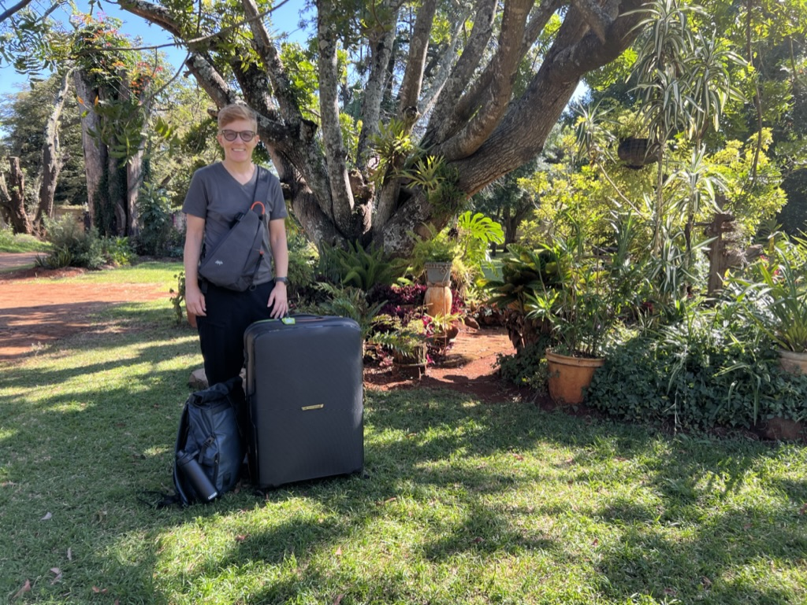

I left Zimbabwe to go to Zambia to attend the 7th BFF Zambia Meet-up in Lusaka, where I spoke about the importance of self-custody and where we onboarded participants to Phoenix wallet. 

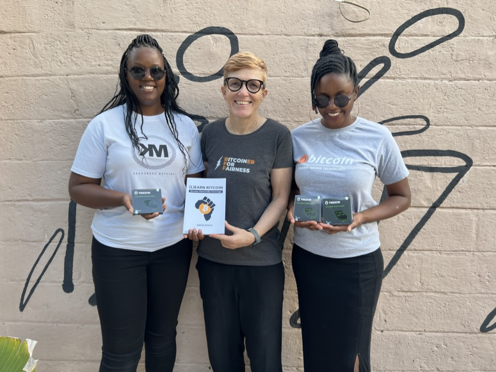

My journey also included a meeting with Bitcoin Banamayo, a group dedicated to educating female Bitcoiners. We supported them by providing learning materials and a Crack The Orange scholarship. 

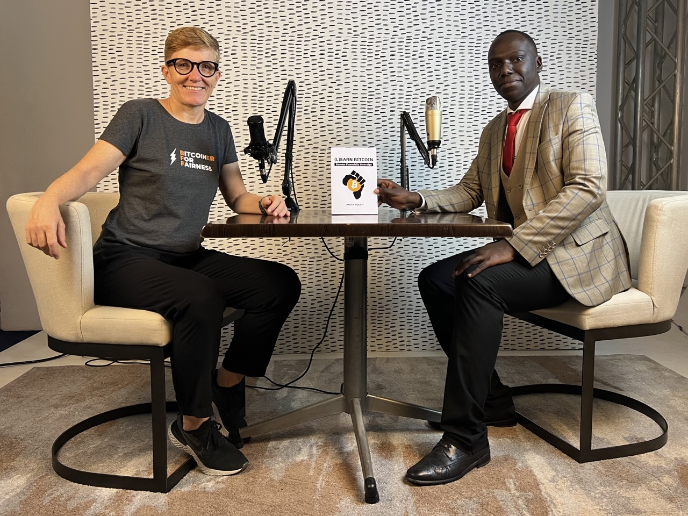

Furthermore, I was a guest in the Zambian online format [‘The FIZ Show’ - Financial insight Zambia](https://www.youtube.com/watch?v=FIJ-ZwaZTfg) and facilitated a Freedom Money workshop for Human Rights activists from 23 African countries. 

<iframe width="560" height="315" src="https://www.youtube.com/embed/FIJ-ZwaZTfg?si=KqbBg9IXRCd0MsH8" title="YouTube video player" frameborder="0" allow="accelerometer; autoplay; clipboard-write; encrypted-media; gyroscope; picture-in-picture; web-share" allowfullscreen></iframe>

During this month, my work with Bitcoin for Fairness was [featured in Bitcoin Magazine's 'Women in Bitcoin' series. This article highlighted my efforts in global Bitcoin education](https://bitcoinmagazine.com/culture/anita-posch-on-global-bitcoin-education) and can be accessed online for an in-depth view of my journey and contributions.

Additionally, the BFF Flyer was published in Portuguese, French, German, and Slovakian, broadening its reach significantly. This multilingual expansion - made possible by my open source approach and community support - was a key step in making Bitcoin education more accessible to diverse communities worldwide, aligning with my goal of inclusive financial empowerment. 

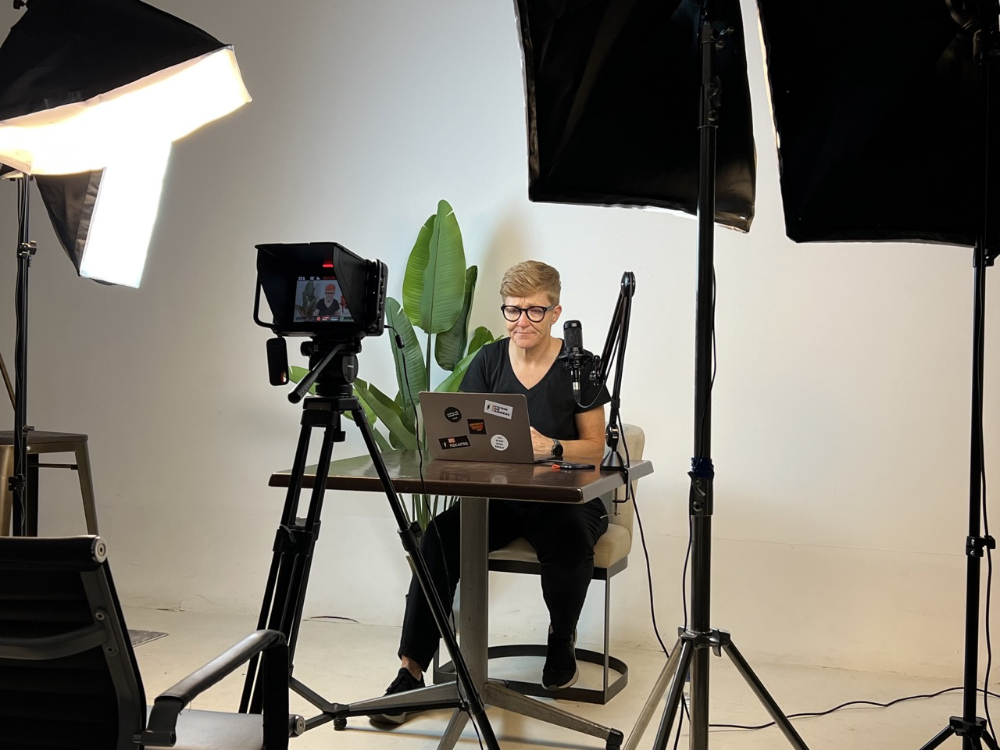

This busy month was rounded off with the beginning of video recordings for Crack The Orange in a Lusaka studio, marking a significant step in the project's development.

#### **May**

In May, the outreach of the BFF Flyer expanded even more with its translation into Shona, Greek, Catalan, and Spanish. Meanwhile, I was busy with the ongoing video production and editing for Crack The Orange. 

**Panel In Prague**

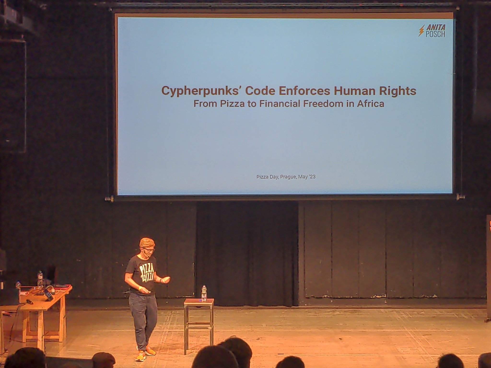
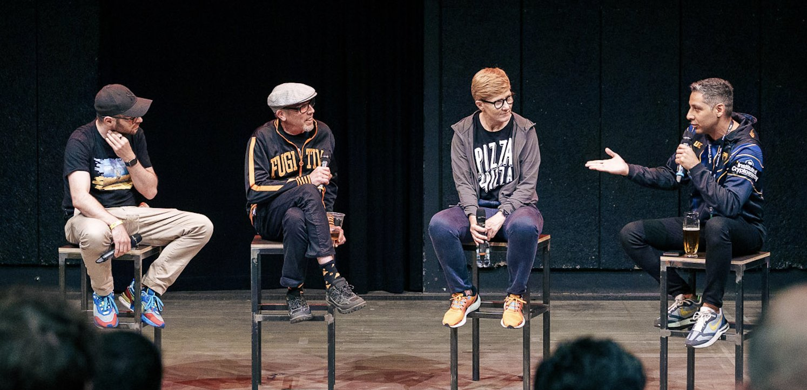

A highlight of the month was [presenting a keynote at Pizza Day Prague](https://anitaposch.com/cypherpunks-talk-prague-23) from May 18th to 19th. This event was a fantastic opportunity to share my perspectives about how Bitcoin represents human rights and acts as a tool for civil resistance and empowerment.

#### **June**

**Keynote in Prague**

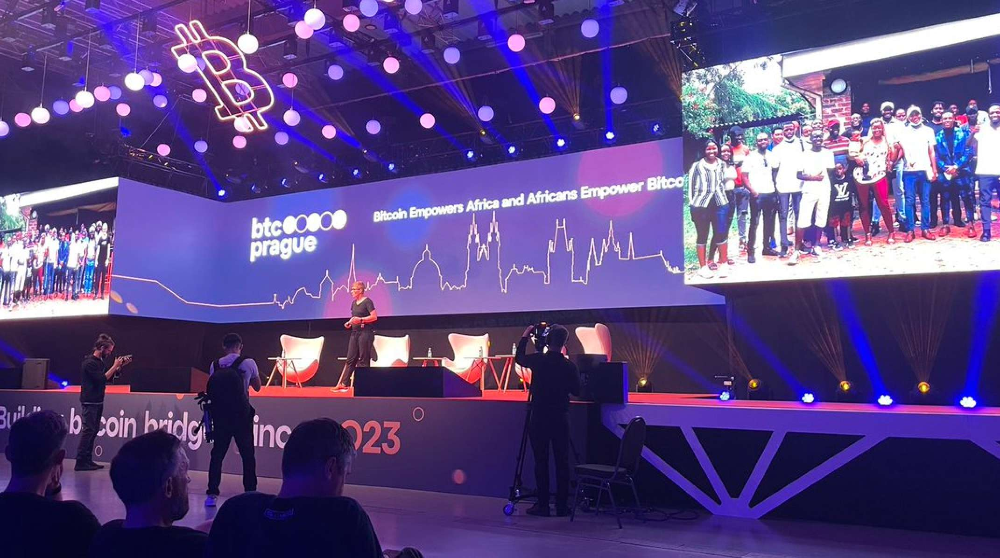

In June, I had the pleasure to attend BTC Prague, where I held a [keynote about ‘Bitcoin Empowers Africa and Africans empower Bitcoin’](https://www.youtube.com/watch?v=LY1UG1KSKew), sharing insights on the symbiotic relationship between a continent on the rise and fair money. 

<iframe width="560" height="315" src="https://www.youtube.com/embed/LY1UG1KSKew?si=7uqy5kxQCZpE0A3b" title="YouTube video player" frameborder="0" allow="accelerometer; autoplay; clipboard-write; encrypted-media; gyroscope; picture-in-picture; web-share" allowfullscreen></iframe>

**BFF Meetup in Prague**

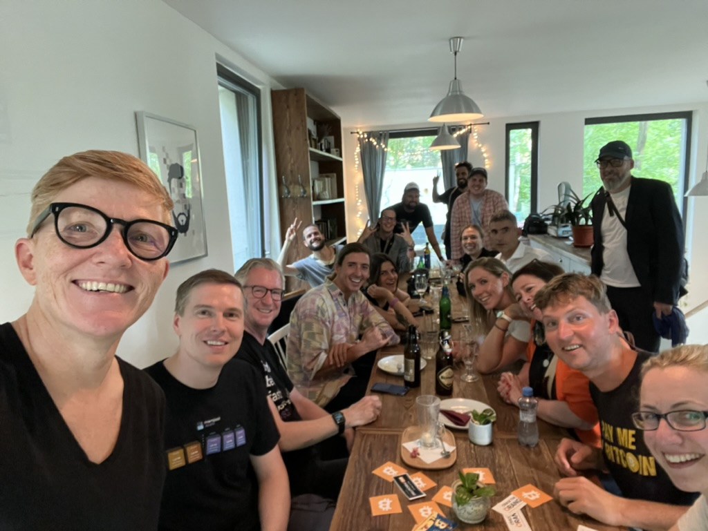

Later in the month, I participated in the Oslo Freedom Forum, hosted by the Human Rights Foundation and dedicated time to continue video production and editing for the Crack The Orange online course.

#### **July**

In July, I actively engaged in further creating content for Crack The Orange. This month was also important for testing and fine-tuning the course to ensure its high-quality and effectiveness. 

On July 19th, I [discussed the intersection of charity and Bitcoin with the C4's Certified Bitcoin Professional Committee](https://www.youtube.com/watch?v=lB0rkUM7ZHk).

<iframe width="560" height="315" src="https://www.youtube.com/embed/lB0rkUM7ZHk?si=XtyX7Og2PVJrWMIr" title="YouTube video player" frameborder="0" allow="accelerometer; autoplay; clipboard-write; encrypted-media; gyroscope; picture-in-picture; web-share" allowfullscreen></iframe>

#### **August**

In August, I had the opportunity to join Laura Shin on the [Unchained Podcast](https://www.youtube.com/watch?v=R1IV91XNYxU), explaining why Bitcoin is a tool for freedom. 
<iframe width="560" height="315" src="https://www.youtube.com/embed/R1IV91XNYxU?si=azqJ3wv3jY2Zqibb" title="YouTube video player" frameborder="0" allow="accelerometer; autoplay; clipboard-write; encrypted-media; gyroscope; picture-in-picture; web-share" allowfullscreen></iframe>

Then, finally, I officially launched Crack The Orange and granted the first scholarships to educators and community builders in the Global South. This was a big milestone for me in contributing positively to Bitcoin education and adoption in the (for me) most important areas.

#### **September**

In September, I engaged in several influential Bitcoin-related events, starting with attending Noob Day at Bitcoin Riga week. Here, [I was a panel guest](https://www.youtube.com/live/V3vvybsc1A4?si=kpeEZabsFF0n5LkA&t=25113) and also delivered a keynote at the Baltic Honeybadger Conference 2023.

<iframe width="560" height="315" src="https://www.youtube.com/embed/ZsPqVqX5VJc?si=S9VkQwuPk_0_mvRr&amp;start=4846" title="YouTube video player" frameborder="0" allow="accelerometer; autoplay; clipboard-write; encrypted-media; gyroscope; picture-in-picture; web-share" allowfullscreen></iframe>

This month also marked the very first live call with the scholars for the Crack The Orange course on September 9 - a big kick-off for this new program. 

After that, from September 13-16, I attended the Global Bitcoin Summit at Bitcoin Park in Nashville. My talk there highlighted the significant achievements Bitcoin For Fairness has made.

My travels then took me to Austin, Texas, to visit Bitcoin Commons and PlebLab, innovative coworking spaces dedicated to Bitcoin development. I ended the month with my participation in the [BTC Live-Sall Session 'WHY ARE WE BULLISH?'](https://www.youtube.com/watch?v=vWXihExEGRs) on September 30th, alongside noted experts Lyn Alden and Steve Lubka. 

<iframe width="560" height="315" src="https://www.youtube.com/embed/vWXihExEGRs?si=Ag57XtSz5wKttVMO" title="YouTube video player" frameborder="0" allow="accelerometer; autoplay; clipboard-write; encrypted-media; gyroscope; picture-in-picture; web-share" allowfullscreen></iframe>

#### **October**

In October, my schedule was filled with very diverse and impactful engagements in the Bitcoin community. I attended a “Bitcoin Halloween Special” with C4, this was a [live stream event where we talked about ‘Bitcoin - The Zombie of Cryptocurrencies’](https://www.youtube.com/watch?v=g8_ivBFIxdQ) and cleared up some common misconceptions and FUD.

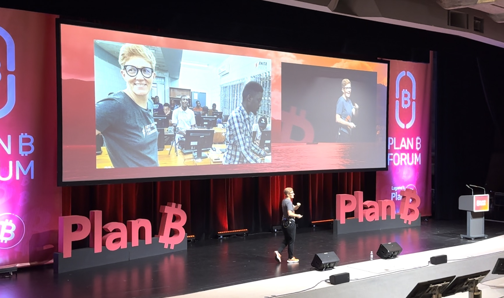

Following this, on October 20th, [I attended Lugano Plan B, where I had the honor of delivering a keynote speech](https://anitaposch.com/africans-empower-bitcoin), sharing why Bitcoin is a game-changer for Africa and how the enormous contributions of the African community are helping Bitcoin development and adoption globally.

<iframe width="560" height="315" src="https://www.youtube.com/embed/CExOwVQYHNg" title="Bitcoin Empowers Africa and Africans Empower Bitcoin | Plan ₿ Forum 2023 | Lugano" frameborder="0" allow="accelerometer; autoplay; clipboard-write; encrypted-media; gyroscope; picture-in-picture; web-share" allowfullscreen></iframe>

My journey continued with my participation in the Bitcoin Indonesia Conference between October 26th and 28th. There, [I gave a beginner-friendly 'Bitcoin 101 - Know Your Basics’' talk](https://anitaposch.com/bitcoin-know-your-basics), which offered a comprehensive introduction to Bitcoin and provided the necessary knowledge to safely navigate the Bitcoin ecosystem. 

<iframe width="560" height="315" src="https://www.youtube.com/embed/HAeGSSIhdqs?si=6pDiIeIqnutROGax" title="YouTube video player" frameborder="0" allow="accelerometer; autoplay; clipboard-write; encrypted-media; gyroscope; picture-in-picture; web-share" allowfullscreen></iframe>

The month concluded with [my guest appearance on the German 'Fast & Curious' podcast](https://anitaposch.com/bitcoin-hype-oder-wert) on October 30th, where I had the opportunity to discuss various aspects of Bitcoin and its impact in a more financial context. This format was a great chance to reach out to a German-speaking audience of people that are usually not so much involved in the Bitcoin community.  

#### **November**

In November, I focused on both educational content and community engagement. [I produced and published a Green Wallet Tutorial](https://youtu.be/1vdpmPGBG_8), which aimed to provide comprehensive guidance on this user-friendly, self-custody Bitcoin wallet.

<iframe width="560" height="315" src="https://www.youtube.com/embed/1vdpmPGBG_8?si=7njbE26ky7AvEHH5" title="YouTube video player" frameborder="0" allow="accelerometer; autoplay; clipboard-write; encrypted-media; gyroscope; picture-in-picture; web-share" allowfullscreen></iframe>

I ended the month with a [Bitcoin for Fairness meetup in Accra, Ghana](https://bffbtc.org/recap-bitcoin-fo…etup-accra-ghana/), a successful social event, bringing together about 30 Bitcoin enthusiasts from around the world and local Ghanaians at the One Corner Garden. The meetup was enriched by guests like Peter McCormack, Erik Hersman, and representatives from Fedi, offering diverse perspectives on Bitcoin's potential. My personal highlight of the evening was the participation of Bitcoin DADA from Kenya with four women from their education program, showcasing the real-world impact of our initiatives.

#### **December**

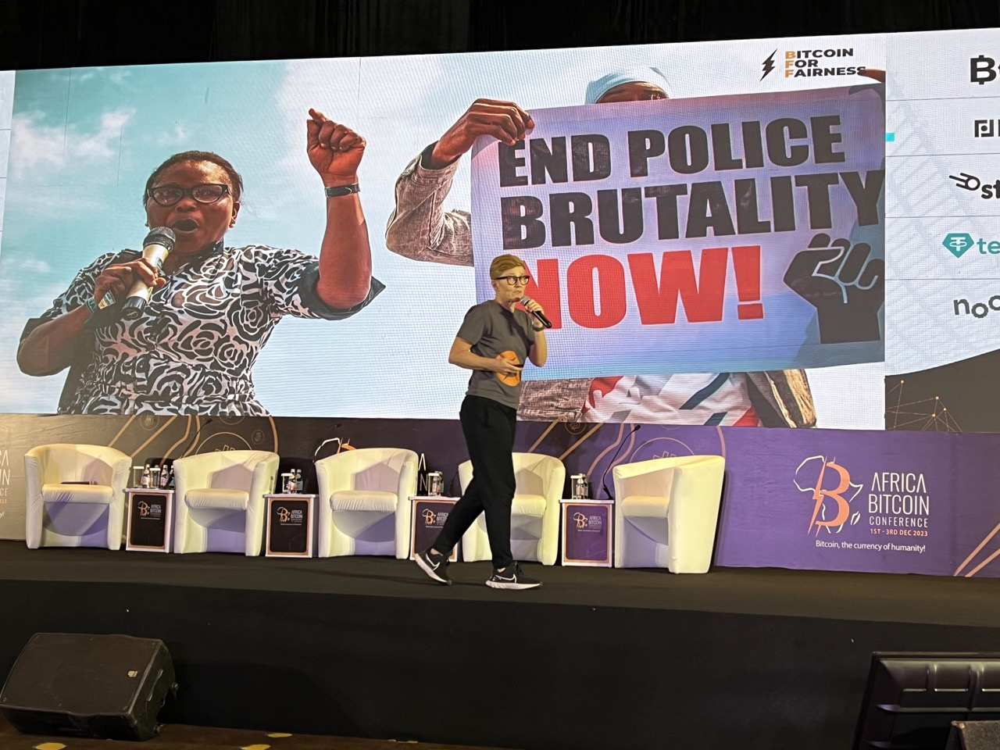

In December, I attended the Africa Bitcoin Conference in Accra, Ghana. In my keynote, I focused on how Africa is empowering Bitcoin and the important role Bitcoin plays in African countries struggling with inflation and authoritarian government control. I emphasized the growing adoption of Bitcoin across the continent and its thriving community - also thanks to the work and support from our Bitcoin For Fairness initiative. Additionally, I facilitated a beginners workshop as part of the program in Accra. After that I traveled to Zimbabwe to continue my efforts to share knowledge about financial sovereignty. 

A personal highlight of the month was being recognized as the [7th most impactful African Bitcoiner of the year](https://anitaposch.com/impactful-african-bitcoiner-2023), an honor that is humbling and underscores my commitment to the Bitcoin community.

## My Biggest Learnings This Year

Traveling all these countries I have been learning and confirming my own thesis on how Bitcoin can contribute to the greater good. The challenges might be different from country to country, but the need to solve these issues is the same. Foreign exchange controls, KYC requirements excluding people from economic interactions, exclusion of millions of people through nation state sanctions that only hurt regular people and not those who it should, high banking costs, freezing bank accounts of human rights activists or political opponents, rising wealth gaps and living costs through inflation, the hidden repression of many countries in Africa, Asia or Latin America through the IMF and World Bank (see Alex Gladstein’s book) - every single one of these challenges can be taken on by using Bitcoin.

We are on the brink of a bigger conflict between those who want to maintain the current status - see Elizabeth Warren who wants to fight crypto and even ban self-custody and peer-to-peer use of Bitcoin in the USA, ironically with the help of big banks or representatives of the European Union, who want to ban Proof-of-Work - and people who are fed up with centralized control in the hands of human beings deciding over their money and freedom. 

Bitcoin is a defense technology and a tool to participate in the dialogue and more and more people will experience this, because in the face of real adversaries one needs an uncensorable, permissionless money that can’t be shut down, influenced or censored by actors who are threatening you with violence. No other form of payment and money like CBDCs, Tether, credit cards, PayPal and so on can be this tool.

2023 was the year of BRC-20 tokens, Inscriptions and Stamps on Bitcoin. The issuance of these tokens led to increased transaction fees, sometimes as high as 40 USD. This turned into a wide discussion and dispute on Twitter and within developers what the real use case of Bitcoin is and how to proceed. There is also the suspicion that it could be a social attack on the network. My stance is this: Bitcoin is money and a savings technology. NFTs, tokens and other forms of using Bitcoin like with smart contracts etc. should be issued on Bitcoin sidechains or other blockchains. Securing .jpegs with the help of Bitcoin is not a life changing necessity, having a censorship resistant, non-inflatable money is. On a side note, the interesting part is this: some of the other blockchains saw a lot of inscriptions as well this year, but they went down, the blockchains couldn’t handle the amount of data, whereas Bitcoin has been producing blocks like clockwork, every ten minutes. 

Bitcoin would have reached higher transaction fees in a few years organically anyhow. More demand for transactions raises the fees, but without Ordinals & Co. we’d still see lower fees, giving developers time to build second and third layer technologies and improve the usability of Bitcoin and Lightning as well as giving educators like me the chance to on-board all kinds of individuals to Bitcoin before the BlackRock’s of the world start their ETFs.

Now things have changed and I’ll adapt. I’m still very optimistic for Bitcoin. 2024 will be a crazy year with the Halving around April, the launch of many new wallets and eCash systems like Fedi’s. I was able to test the Fedi App already. It has great usability and combines sending and receiving money with a chat. My work won’t become less exciting.

Adding to the bright side, it was great to see how BFF’s work in the years before has paid off. For instance, a BFF donor helped to fund the travel costs for Lorraine Marcel, founder of Bitcoin DADA, a Bitcoin education program for women in Kenya, to attend the inaugural AfroBitcoin Conference in Ghana in December 2022. This year for the second edition [Lorraine attended with three of her education graduates, covering their costs from her own budget](https://x.com/AnitaPosch/status/1731222004810850363?s=20). 

Another example is how BFF connected Gridless from Kenya with someone from a Malawian hydropower station, now they are mining Bitcoin there together. BFF connected two members of the BFF community in Zambia with a new initiative in Victoria Falls to become their Bitcoin teachers. Through my work in Zimbabwe I hooked up with an activist, on-boarded him, offered a scholarship for Crack The Orange and now he is going to start a training initiative himself.

These are all small things in itself, but they add up and I’m very lucky to be able to contribute in this way.

## My Goals for 2024

One of my goals is to raise donations to be able to give 100-200 scholarships away to build the next generation of Bitcoin educators and advocates in the Global South within my online learning platform Crack The Orange. I want to support the scholars who successfully complete the course to pass the exam to become a Certified Bitcoin Professional. That gives them a business certificate proving their knowledge about Bitcoin. With this Certificate they can apply for remote jobs in international Bitcoin companies and don’t have to leave their home countries. 

At the same time Crack The Orange is open for anyone to learn more about Bitcoin. Next year I will constantly produce new learning material, especially how to manage the fee market, how to navigate between Bitcoin on-chain, Lightning, Liquid and new eCash systems like Fedimint or Cashu. UTXO management will become a hot topic in the next few years too. Crack The Orange members will have exclusive access to the material and to me in my monthly live calls, before the new content is published to the world.

Finally, I want to keep on traveling the world as an educator and nomad, but I need to scale down a little bit to take the stress out of it. This year I traveled to eleven countries on three continents as a digital nomad and educator. From Zimbabwe to Zambia, Malta, Czech Republic, Norway, Latvia, USA, UK, Switzerland, Indonesia, Ghana, and back to Zimbabwe. I appeared fourteen times on stage giving keynotes and workshops, my team and I organized five meetups, I was fifteen times interviewed or contributed to an online event and published five podcast episodes on the Anita Posch Show. In total I estimate that my work reached 1,500 people in person and many more with hundreds of content pieces on social media and different websites - I don’t really know how many.

I love this lifestyle combining nomading with work that makes sense to me and I hope it contributes to the greater good. I’m grateful that I found my Ikigai in Bitcoin and that all my talents and experiences I gathered over the years fit so perfectly together that I’m enabled to be an educator. 

I want to thank YOU for supporting my work as well as the Human Rights Foundation and OpenSats for their gifts to enable the efforts of Bitcoin for Fairness and the Crack The Orange scholarship program! Not to forget my wonderful team of BFF volunteers, who donate their spare time to support the work we do - Thank you all!

Together we have the power to carry the torch of financial freedom forward!
> Learn & Support
> * Subscribe to my weekly newsletter: [The Orange Journal](https://anita.link/news)
> * Become a member on my learning platform [Crack The Orange](https://cracktheorange.com) and learn more about Bitcoin.
> *If you would like to support me and my work in the Global South, I appreciate [donations to Bitcoin for Fairness](https://anitaposch.com/donate).
