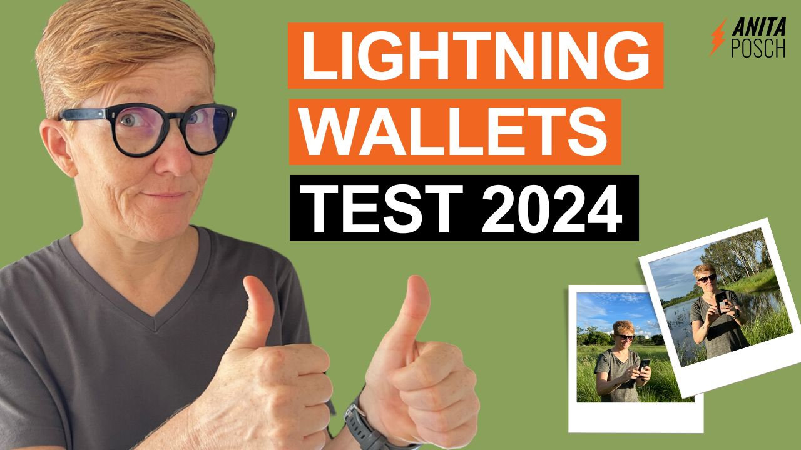
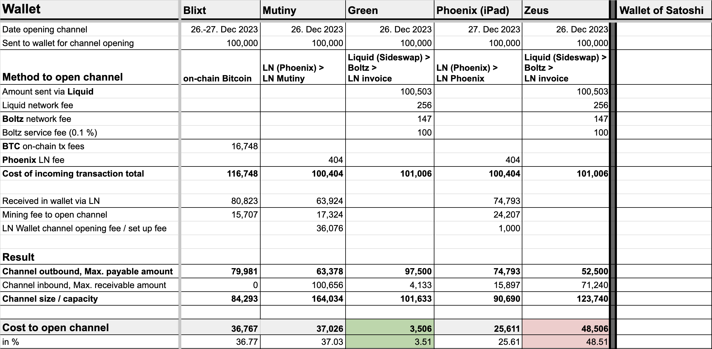
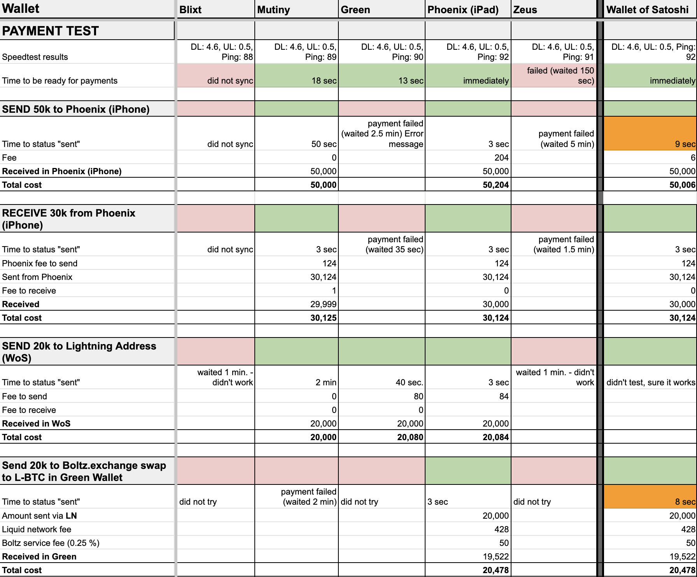
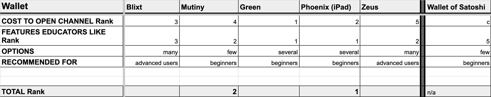
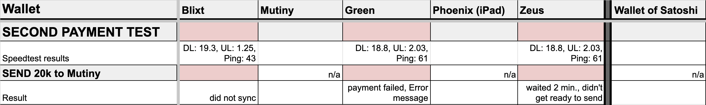

---
taxonomy:
    tags: [Blog, Learn Bitcoin, Lightning, Wallets, Liquid, E-Cash, Bitcoin in Africa]
routes:
    default: '/lightning-wallet-test-2024'
date: 2024-01-26 19:00
dateformat: 'Y-m-d H:i'
summary: Testing self-custodial Lightning wallets with results on their payment reliability, speed, user-friendliness, fees and security features.
thumbnail: _Lightning-Wallet-Test-2024.jpeg
template: article 
---

# Lightning Wallets: Self-Custody Despite Poor Network Connection - Best Apps Tested in Zimbabwe 2024

## Review of Blixt, Green, Mutiny, Phoenix and Zeus

I'm conducting the second [test of self-custodial Lightning wallets in a rural area of Zimbabwe after 2023](https://anitaposch.com/lnw23). Given that none of the available self-custodial wallets are developed by Africans, they are rarely used or tested here. On top of that, Lightning is still new and complex, building mobile apps that are running a node of the network on your phone is challenging. I was here to find out what works and what does not. As an educator, I recommend tools for everyday users, who want to send small payments. These tools have to be reliable; otherwise, people might conclude that Bitcoin isn't for them. 

> This article was originally published on [CoinDesk](https://www.coindesk.com/consensus-magazine/2024/01/26/which-is-the-best-self-custody-lightning-wallet/).

I opened my first Lightning channel on an app called BLW in Jan 2019. I’m used to testing new developed tools, that’s why I have no problem with challenges and bugs. But regular users may not be as forgiving, that’s why **I aim to only recommend tools I’ve personally tested**. 

## Lightning Wallets Tested and Goal

In 2023, the only two self-custody Lightning wallets available were Breez and Phoenix. 
This time I had more choices and tested: Blixt, Mutiny, Green, Zeus, and Phoenix. I also included the Wallet of Satoshi, a custodial wallet just to see how it performs in comparison. I was familiar with Phoenix and used Zeus connected to my Voltage node earlier. Mutiny, Blixt, and the Lightning integration in the Green wallet just popped up in the last months, so using them was new for me too. All of the wallets have been undergoing huge changes and will evolve constantly. I had to download Mutiny manually and install the .apk file on my Android phone, within Green I had to ask for the experimental feature to be unlocked to test it.

My **goal was to find out which of the wallets are the best in sending and receiving bitcoin** in a reliable, fast, easy to use manner and to compare the costs involved.

> **Subscribe to my newsletter. It's free!**

## The Initial Set-Up

Before heading to the rural areas, I set up the wallets and opened a channel in Harare as I anticipated low internet signal challenges. Based on my year-long experience in Zimbabwe, I’ve learned that even with decent internet speed, the upload and download of files as small as 2 MB can be problematic. I used the internet at a friend’s house to use the fastest internet provider in Harare called Liquid, which is also the most expensive with a monthly cost of USD 300 for unlimited usage. My speed test results for download were 92.7 Mbps and upload 14.6 Mbps. Even with that fast internet it took me some time to install the apps, secure the private keys and open a Lightning channel to be a part of the network. 

## Opening a Channel

To ensure consistency, I followed a test protocol for each wallet. On December 26 and 27, I installed the wallets and sent 100,000 sats to open a Lightning channel. A channel on the Lightning Network needs two transactions on the Bitcoin blockchain to be set up. That way the channel is constantly connected to the blockchain, which is why the **bitcoin on the Bitcoin blockchain and bitcoin on the Lightning network are the same. There is no difference in the value, it’s the same unit, not another token or asset**. 

### Most Economical Way to Open a Channel: Bitcoin, Lightning or Liquid

There are several ways to open a channel: sending on-chain bitcoin, transferring Lightning directly from another wallet or through a swap from Liquid or some wallets are offering buying inbound liquidity. I **tried them all to send the first bitcoin to the wallets, affecting set-up speed and fees I had to pay**. 

#### Bitcoin on-chain
I used a Lightning payment to open a channel on all wallets, except for Blixt, as I only found the on-chain option there (except for liquidity providers). Seemingly, Blixt is opening the channel with a second on-chain transaction while the other wallets conceal that second transaction somehow, because the channel opened immediately after the first transaction confirmation. Not with Blixt: I sent the first transaction and the confirmation took some hours, it was evening already, so I had to leave the friend's house. As soon as it was confirmed, Blixt carried out the second on-chain transaction, which took again several hours because the mempools were full. When the second transaction was confirmed I was back in the house where I'm living, with internet speed only around 3 Mbps download, 0.26 upload and a Ping over 300ms. Blixt [wasn't able to open the channel in these circumstances](https://x.com/AnitaPosch/status/1740039967022158279). I needed to go back to my friend's house to finish the channel opening. It's hard to say how other wallets would have performed under these conditions.

#### Lightning and Liquid
For the channel openings on Green and Zeus, I used Liquid, swapped via Boltz.exchange to Lightning, due to high transaction fees at the time. Opening a channel from Liquid is far more economical in that situation. Liquid is a sidechain of Bitcoin, its unit is called L-BTC. [Learn the differences between Bitcoin, Lightning, Liquid, and E-Cash in this non-technical explainer](https://anitaposch.com/difference-bitcoin-lightning-liquid-ecash). 

One BTC is pegged to one L-BTC. This means if you peg-in 0.1 BTC to Liquid, the resulting 0.1 L-BTC are of the same value as BTC. **Compared to self-custodial Lightning there is more trust involved in using Liquid**, because you have to go through intermediaries for the peg-in and peg-out and trust a federation of 15 companies, who are the signers for Liquid transactions, whereas in Bitcoin and Lightning you don‘t have to trust any intermediaries. The **upside of the Liquid** blockchain is that the **transaction speed, privacy are higher and currently the fees are lower than on the Bitcoin blockchain**.

### Cost to Open a Channel

I compared all network fees, transaction, and service fees that applied with the different methods of opening a channel.

> Here is the [sheet with all test results](https://docs.google.com/spreadsheets/d/1XqBIhpWnd5zp_s_JNO8hSzSERunywv-qckL2hD9FHZE/edit?usp=sharing)

The cost of the incoming transaction to open the channel was the highest with Blixt as I used bitcoin on-chain at a time when the average fee rate was 110 sat/vByte. Channel opening was the cheapest when using Lightning directly from another LN wallet. The route using Liquid and Boltz was a little bit more expensive than using Lightning.

The available balance after opening the channel varied significantly. Zeus had the lowest balance of 52,500 sats, while Green had the highest at 97,500 sats. This difference was surprising, especially since I used Liquid for both. Green was the clear winner with a cost of 3.5 percent, whereas Zeus was by far the most expensive wallet with 48.5% of the funds spent in opening the channel.

Mutiny offered the biggest channel capacity and the highest receivable amount with 100,000 sats, while at the same time it was the second most expensive. However, a drawback of Green was its limited incoming capacity of only 4,133 sats.

## Choosing the Test Location

After the initial set-up, I set out to do the payment test on January 1, 2024. 30 km out of the capitaI Harare, I strolled through the scorching heat, making my way up to the kopje, navigating through rocks, grass, bushes, and trees. My friends were captivated by the beautiful flowers that bloom as soon as the rainy season begins. My focus, however, was on finding a decent internet signal for my two phones. Having prepared the test back in Harare, I was eager to carry it out in this setting.

After 30 minutes of searching, I realized that the network coverage was inconsistent, regardless of whether I used NetOne or Econet. I was able to send WhatsApp messages, but as soon as I wanted to download an image with 0.5 MB, I had to wait or turn airplane mode on and off to be back in the game. Finally, I settled on a shaded spot with a stable NetOne signal to set up a hotspot for my other devices. I prepared my devices – my Google Pixel 4, iPhone 13 Pro, and my iPad Air (3rd generation). The iPad was included because I already had Phoenix wallets on my other two devices, and for this test, I wanted to start with a fresh installation.

## The Testing Process

Now seated on some rocks, surrounded by trees and bushes, as I fend off large ants attempting to crawl up under my trousers I found 4.21 Mbps download and 0.36 Mbps upload. Glad that I set up the apps already a few days earlier.

My speed test results showed a ping of 90 and a download speed of 4.6 Mbps and an upload speed 0.5 Mbps. When I started testing the wallets, the Phoenix wallet opened immediately. The Green wallet took 13 seconds to open and the Mutiny wallet needed 18 seconds. However, Zeus didn't open at all, even after a 150-second wait. Similarly, Blixt opened but failed to sync the channels and wallet, so I couldn't use it. As expected, the custodial Wallet of Satoshi opened immediately.  

### Sending 50k Sats from the Wallets
 
My first test was to send 50,000 sats from the different wallets to my Phoenix wallet on my iPhone. So, the Phoenix wallet on the iPhone was on the receiving end. Unfortunately, I could not send from Blixt because, as I said before, it did not sync at all. Zeus was also unusable since it wouldn't even start up. When I attempted a payment with Zeus, it failed after a 5-minute wait. The Green wallet's payment attempt was unsuccessful too, displaying an error message after I waited for 2.5 minutes. With the Mutiny wallet, I almost wanted to stop but after 50 seconds, I was able to send the payment successfully. The Phoenix wallet was the quickest, completing the transfer in just 3 seconds. And interestingly, the **custodial Wallet of Satoshi was slower than Phoenix, taking 9 seconds for the payment** to go through. I didn't anticipate this result, but I found it amusing.

### Receiving 30k Sats
 
The next test focused on receiving 30,000 sats from the Phoenix wallet on my iPhone, which had previously served as the receiving wallet. The results were somewhat similar to the previous test. The time until the payment was sent from Phoenix was 3 seconds and it showed up in Mutiny, Phoenix, and the Wallet of Satoshi immediately. Blixt did not work. With Green, the payment failed after I waited for 35 seconds. Similarly, Zeus also failed to receive the payment after I waited for 1.5 minutes. 

### Sending 20k Sats to a Lightning Address
 
For this test, I sent 20,000 sats to a Lightning address, using the Wallet of Satoshi as the recipient since I had access to its Lightning address. The results were somewhat consistent with previous tests but with a notable exception. Surprisingly, the Green wallet managed to send to a Lightning address this time, completing the payment in 40 seconds. This was unexpected given its previous failures in other tests. Blixt and Zeus didn't work. Mutiny, Phoenix, and Wallet of Satoshi, as anticipated, successfully completed the payments to a Lightning address.
 
### Is Swapping to Liquid Possible?

I wanted to test whether I could exchange 20,000 sats for Liquid in these conditions, just to be confident in recommending it to my followers. For the Lightning to Liquid swap I was using the Boltz.exchange website, with the Green wallet set as the recipient. I didn't attempt the swap with Blixt, Green, and Zeus since their earlier payment attempts had failed. Surprisingly Mutiny failed in this swap; the payment did not go through even after I waited for 2 minutes. Both Phoenix and the Wallet of Satoshi successfully completed the swap from Lightning to Liquid Bitcoin. Also here the **custodial Wallet of Satoshi was slower compared to the self-custodial Phoenix wallet**.

### Payment Costs Analysis
 
The differences in fees for the payments were marginal, just around 100 to 200 sats, which is negligible. The costs for sending and receiving were roughly the same across different wallets.

However, the costs associated with opening a channel varied significantly. Notably, the Green wallet was the cheapest option, requiring only 3% of the transferred amount as fees. On the other hand, Zeus was the most expensive in these terms.

### Payment Reliability Assessment

In terms of payment reliability, Phoenix and the Wallet of Satoshi stood out as the most dependable. This isn't surprising for the Wallet of Satoshi, given its custodial nature. Following closely was Mutiny, which successfully completed three out of four payment attempts. Green, however, managed only one successful payment out of four.

Phoenix showed remarkable reliability, successfully processing all four payments. I even managed to send 11 sats from my Phoenix wallet to my Alby Lightning address under very challenging conditions with a download rate of only 0.15 Mbps, upload speed of 0.05 Mbps, and a ping of 185.

### Payment Speed 

Phoenix stands out as the clear winner in terms of payment speed. It was even faster than the custodial Wallet of Satoshi. Green and Mutiny also show satisfactory performance, provided they functioned correctly.

## Features and Differences From My Educators Perspective

From an educational standpoint, I evaluated the wallets' features, focusing on their user-friendliness and security aspects. How easy is it to do a backup? Is the wallet open source? How well are the wallet users guided to ensure highest security standards are applied without their actions compromising them?

### Wallet Backup

I focused on the backup process, particularly favoring 12-word seed phrases, because this results in acceptable security and randomness for the private keys and it's easier to store 12 words than 24. Green, Mutiny and Phoenix use 12-word seeds, while Blixt and Zeus opt for 24-word seeds.

A key aspect of product design is encouraging users to adopt high-security measures seamlessly. Being forced to write down the backup while opening the wallet is one of these good design features. I call it ‘forced backup’ and only Green offers it. All the other wallets show a call to action only.

Conversely, permitting the seed phrase to be copied to the device's clipboard for convenience may compromise the security of the funds. Uninformed users and newbies might copy it, send their seed per email to themselves, store it as a screenshot or in a Word document. I have seen it all. **Convenience is the enemy of security**. While it's true that users should only store small amounts in a Lightning wallet, it's also a fact that users will apply the same unsafe behavior to an on-chain wallet, because why not? 

Blixt allows copying the seed. Mutiny and Zeus too, but they at least warn their users. Phoenix and Green are doing it the right way and prevent copying the seed, aligning with best security practices.

### Cloud Backup Considerations

I think cloud backups on the user side are not desirable. They can be a double-edged sword, offering convenience but also presenting potential security risks and accessibility issues. Many people in African countries don't have a Google Drive or iCloud account to secure their channels.

* Blixt: Offers cloud backup for channels, in addition to the 24-word seed phrase.
* Mutiny: Does not provide cloud backup.
* Green: Has an additional recovery phrase for the Greenlight node, though their support team suggests it's not essential to store.
* Zeus: I didn't see a cloud backup functionality, although I was told that Zeus has automatic cloud backup of channels (SCB) encrypted with your 24 words, so Zeus cannot read them.
* Phoenix: Provides an optional iCloud backup for channels.

### App Lock Preferences

For added security, I prefer to use a PIN, password, or pattern lock to secure a Bitcoin wallet. Otherwise, for example in case a security officer at an airport or a thief wants me to open my wallet, I can be forced to use my fingerprint or my Face ID. Blixt, Mutiny, Green, and Zeus offer password or PIN-based security. Phoenix provided biometric options such as Face ID or fingerprint recognition only, but I hope they consider making changes to this feature.

### Availability of Separate Bitcoin On-Chain Wallet 

A significant feature I value is whether the wallets offer a separate on-chain Bitcoin wallet. This is a great feature as users only need to install one app for Bitcoin and Lightning. Blixt, Mutiny, Green, and Zeus provide a separate on-chain Bitcoin wallet. Phoenix does not. While it allows for swapping in and out, the functionality is integrated and not separated as a distinct Bitcoin wallet. 

### Coin Control and UTXO Management

Coin control is going to be more and more important as transaction fees are rising. We need Bitcoin mobile wallets allowing us to do coin control and choose different UTXOs for a transaction. Sadly, none of the tested wallets allows that. This limitation impacts users' ability to manage transaction costs effectively. While Green does offer coin control, it's only available in their desktop version, not on mobile.

### Lightning Address Functionality

A Lightning address, similar in format to an email address, is a convenient feature that allows you to receive Lightning payments asynchronously without requiring the wallet to be actively open. Blixt offers a LN address in their experimental feature called "Lightning Box". Zeus is using hodl invoices, a solution that has been criticized by a few developers because of the complexity and the fact that holding invoices could affect the performance of the Lightning Network overall. The other self-custody wallets do not offer Lightning addresses. 

Given this, it might be a better option to use custodial services like getalby.com or the Wallet of Satoshi for a Lightning address and to send the sats to a Bitcoin, Lightning or Liquid self-custody wallet from time to time. All the wallets allow payments to Lightning addresses.

### Channel Features

Only Phoenix offers auto channels at the moment. This means Phoenix is more convenient than other wallets, because you only have to set up one channel. The channel then dynamically adjusts its size if you send more funds to it than its liquidity allows. To keep your channel size consistent, you should not swap out to on-chain Bitcoin as it reduces the size of the channel.

In terms of fee settings, all wallets except Mutiny allow you to define the maximum Lightning fee you're willing to pay. This gives users some control over their payment costs. Regarding channel management, all wallets allow you to force close the channels. Additionally, Blixt, Zeus, and Phoenix allow you to purchase inbound liquidity.

## Second Test in Urban Area with LTE Connection

After returning to town I tested the payments that failed a second time. I realized that Green’s experimental mode is really **very experimental, because I could not send a single Lightning payment with Green** and other people reported the same in the Blockstream Telegram group.

**Blixt was still not able to sync to the top of the blockchain** and after 5 minutes of waiting I stopped the process.

Zeus was able to sync and started the node, but then **LND was taking a long time to get Zeus “ready to make payments” and after 3 minutes of waiting I closed the app**.

## Overall Rankings for Lightning Self-Custody

From my **educator's perspective, my top choices are the Phoenix and Mutiny wallet**. Everything works with Phoenix, you don’t need to worry about channel management and payments are even faster than with the custodial Wallet of Satoshi. The fees for payments in Phoenix might be off-putting, from that perspective one might look into Mutiny as it is convincing due to its user-friendliness, making it ideal for beginners. Mutiny’s channel opening was more expensive though and it doesn’t offer auto channels. Part of their business model is the optional Mutiny+ subscription for 16,000 sats per month.

Green would be a strong recommendation, particularly for those who value additional options like Liquid and on-chain transactions in a single wallet with one seed. As long as their Lightning payments aren’t working, it’s a No-go obviously. Blixt and Zeus are more suited for advanced users due to their range of options, but they did not work in my tests.

To choose the optimal wallet, it’s important to ask yourself what are the main goals and the features you’ll need. [Getting a deeper understanding through my online learning program](https://cracktheorange.com) will guide you in that endeavour.

##  Conclusion

In summary, the evaluation of self-custodial Lightning wallets in rural Zimbabwe in 2024 revealed important insights. Wallets like Phoenix, Mutiny, Green, Zeus, and Blixt were tested for their performance, reliability, and user-friendliness.

Opening channels with these wallets varied in cost and balance. Phoenix and the Wallet of Satoshi exhibited high reliability and speed, with Phoenix performing better than the custodial Wallet of Satoshi.

From an educational standpoint, the wallets' features were assessed, emphasizing user-friendliness and security. Green, Mutiny and Phoenix offered user-friendly 12-word seed phrases, while Blixt and Zeus provided 24-word seeds. Green's "forced backup" was a notable security feature.

Cloud backups raised concerns about user data security, as some wallets offered this option. App lock preferences and the availability of separate on-chain Bitcoin wallets were also considered.

Phoenix topped the rankings for its overall performance and reliability, followed by Mutiny for its user-friendliness. 

## Do you want to learn more about Bitcoin? 

> * Subscribe to my weekly newsletter: [The Orange Journal](https://anita.link/news)
> * Join my Bitcoin learning platform [Crack The Orange](https://cracktheorange.com) and I'll give you all the tools and knowledge you need to use Bitcoin in a secure way.
> * Read my book [(L)EARN BITCOIN](https://learnbitcoin.link/)
