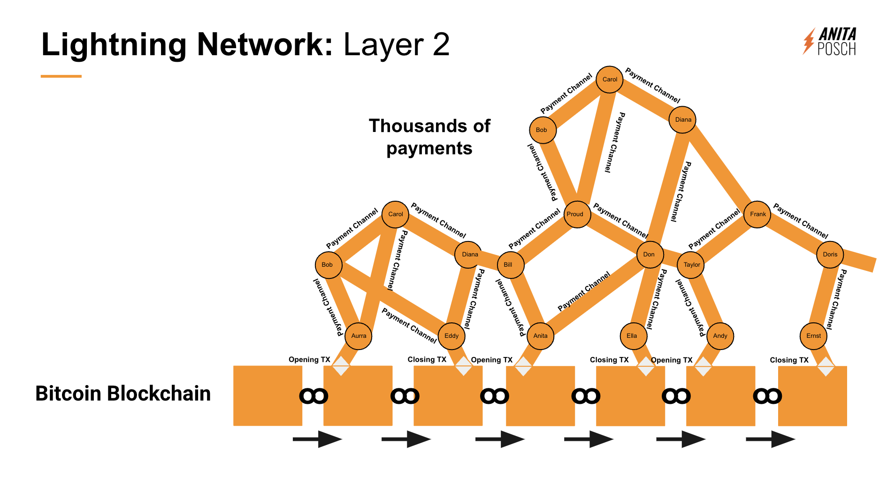

# A Non-Technical Explainer of Bitcoin, Lightning, Liquid, and E-Cash

If you've ever been puzzled by terms like Bitcoin, Lightning, Liquid, and E-Cash, you're not alone. In this non-technical explainer, I'll use simple analogies to break down these complex concepts.

The following descriptions are definitely not technically correct. I'm painting a picture so that everyone, even beginners and those without a tech-background can understand what a sidechain is and what the differences between Bitcoin, Liquid, Lightning, and E-Cash tokens are. 

<iframe width="560" height="315" src="https://www.youtube.com/embed/3E12dUnYh90?si=YcE28Z4JHSTUTkfH" title="YouTube video player" frameborder="0" allow="accelerometer; autoplay; clipboard-write; encrypted-media; gyroscope; picture-in-picture; web-share" allowfullscreen></iframe>

## Bitcoin: The Secure Foundation
The Bitcoin blockchain is a database consisting of connected blocks which are filled with transactions and each of these transactions has an end point, where your bitcoin, your money sits. 

Imagine the Bitcoin blockchain as a wall of transparent, hollow bricks connected by cement, their holes are filled with orange sand. Each grain of that orange sand represents a satoshi, the smallest unit of bitcoin. In such a wall of bricks, your satoshi, your grain of sand is in a brick and you can not easily move the ownership of that grain as it is stuck inside the brick. You can access the grain of sand by unlocking it with your private keys, basically digging a hole into the brick wall and sending the grain to someone else and that end point is within a new brick. It’s a lot of work, that’s why it’s secure and why you need to pay transaction fees to move the orange sand grains. You can use Bitcoin without permission and there is no trust in an intermediary involved.

## Lightning: Fast and Cheap Payments
Let’s go on with our example of a house made of bricks with orange sand in them. To move the sand faster, you could drill a hole into a brick and stick a tube into it. Others do the same, connecting these tubes to a network. Now the grains of orange sand can float freely inside the tubes from one person to the other. Each grain is a satoshi and now they can move faster and cheaper without the need for a blockchain. That’s an analogy for the Lightning Network, it is bitcoin, it is the exact same asset - an orange grain of sand that’s fungible. Just like the bitcoin in the brickwall, you can hold, send and receive the satoshis without permission or the need to trust someone.

## Liquid: A Sidechain of Bitcoin
Liquid is a sidechain of Bitcoin; t's like the bricks for the Bitcoin blockchain but with different characteristics: 

* New blocks, in our example bricks, are **connected every minute** as opposed to Bitcoin where it is around every 10 minutes. 
* The size of the bricks is the same, but **more transactions can be done**, because Liquid produces 60 blocks per hour and Bitcoin only 6. 
* The Liquid *bricks are not transparent*, you can’t look up the amount or type of grain that has been sent as transactions are confidential. 
* There is less demand for Liquid and as such the *transaction fees are much lower*. (Of course if more people start using Liquid, the transaction fees will rise too. I assume this is some years ahead of us.)
* You can **secure your Liquid satoshis with a hardware wallet** the same way you do it with Bitcoin - that’s something you can’t do with Lightning. There is no cold storage for the grains in the tubes that’s why I would not store very large amounts in Lightning.

In our picture the Liquid chain of bricks is being filled with blue grains of sand. They are not fungible, they are not the same grains of sand as in Bitcoin, but they are 1:1 backed by orange grains. 

> An example: You own some orange grains and want to pay less transaction fees over time. You swap your orange grains from the Bitcoin wall and exchange them for the exact same amount of blue grains, which have the same value as your bitcoin had. If you owned 1 BTC, you now own 1 L-BTC. The price of L-BTC is always the same as the price of Bitcoin. Meaning, if your 1 BTC had a value of 40,000 USD, your 1 L-BTC has the same value. If the Bitcoin price goes up to 60,000 USD, your Liquid bitcoin is also worth 60,000 USD.

Bitcoin and Liquid use blockchains. They are operating with a database with transactions in their blocks. So if you own L-BTC, it represents BTC, but in a different way than if you own Lightning bitcoin. In the Lightning Network you really own the original orange grains of Bitcoin, on the Liquid blockchain you own blue grains. 

The big difference is that Liquid is not fully permissionless like Bitcoin or Lightning, because the lock up of the orange grains and the issuance of the blue grains is done by a federation of 15 signers, which are independent and geographically distributed companies. 11 out of 15 signers would need to collude to stop you from using Liquid. As long as nothing dramatically happens you can [swap your L-BTC back to BTC](/liquid-bitcoin-sideswap-boltz) or swap them to Lightning via a tool called boltz.exchange or with wallets called [Sideswap](/liquid-bitcoin-sideswap-boltz) and AQUA ([learn more about AQUA here](https://youtu.be/kzBawGXwxZ8)).

## E-Cash: Anonymous Digital Money
E-Cash tokens are for example used by Fedimints or Cashu, which are different E-Cash protocols. Imagine that E-Cash tokens are also grains of sand, but they don’t need a blockchain to work. They need mints, which issue tokens from bitcoin that have been sent to the mint. A Fedimint is a federation that can be made up by companies or individuals who share collaborative custody over the bitcoin held in their federation. E-Cash tokens are neither orange nor blue, let’s assume they are black.

> An example: Let’s imagine there is a community in a village of 100 people. 7 of those are guarding the federation by safeguarding the community mint. If you are one of the villagers you can take your orange grains, send it to the mint, which locks them up and issues the same amount of black grains as an IOU for you (IOU stands for “I owe you”). The federation owes you the orange grains that you’ve locked up in their custody. To use the black grains, you don’t need a wall of bricks, nor tubes, you can use them even without an internet connection as they are only a representation of your orange grains. 

The federation knows nothing about how many grains you have spent or to whom. If you want to redeem your orange grains, you send back the black grains to the federation and receive orange grains. The mint does not know if you redeem the grains personally or if you send them to someone else. E-Cash tokens are fully custodial. You need to trust the mint that it gives you back your bitcoin.

## Conclusion
In summary, Bitcoin, Lightning, Liquid, and E-Cash represent different use cases. Each technology has unique features to serve various needs. Hopefully, this analogy has helped demystify these concepts, making the digital currency landscape a bit more navigable for you.

## Do you want to learn more about Bitcoin? 

> * Subscribe to my weekly newsletter: [The Orange Journal](https://anita.link/news)
> * Join my Bitcoin learning platform [Crack The Orange](https://cracktheorange.com) and I'll give you all the tools and knowledge you need to use Bitcoin in a secure way.
> * Read my book [(L)EARN BITCOIN](https://learnbitcoin.link/)