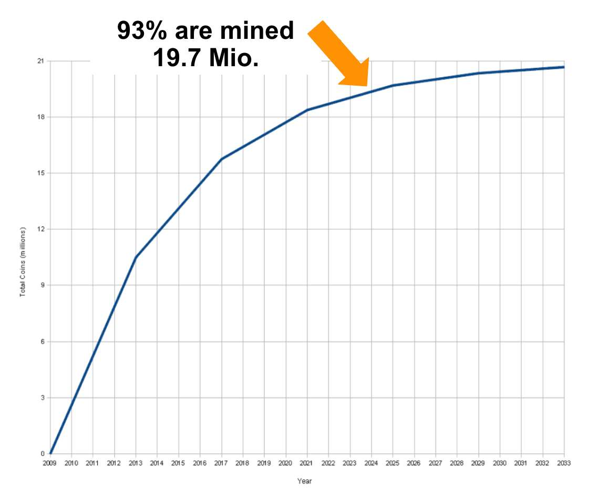
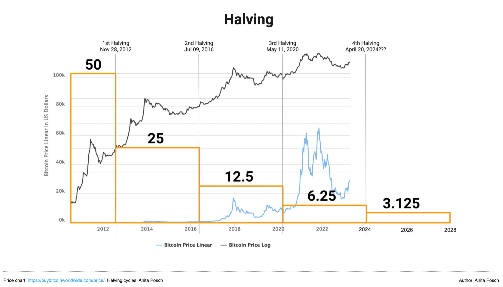
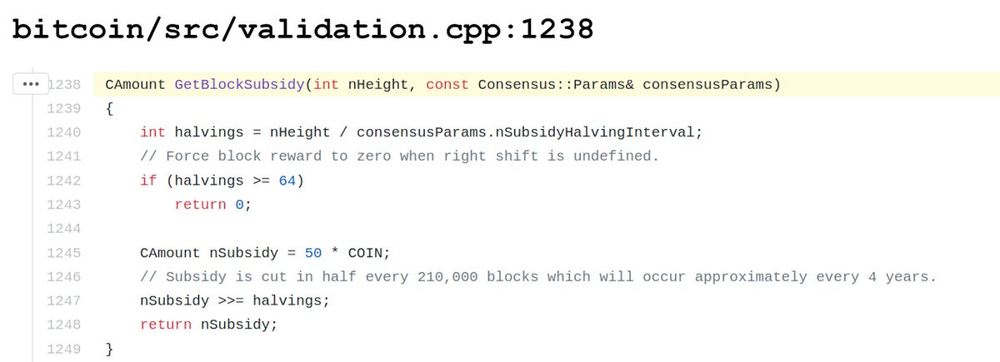

# Bitcoin Halving 2024: What You Need to Know
The Bitcoin community is buzzing with anticipation as the next halving is happening very soon, on April 20 (you can check the [countdown here](https://www.bitcoinblockhalf.com/)). But what exactly is the Bitcoin halving, and does it matter? 

<iframe width="560" height="315" src="https://www.youtube.com/embed/9WrgW3EuvR4?si=3MLnx8N9q9rRhFev" title="YouTube video player" frameborder="0" allow="accelerometer; autoplay; clipboard-write; encrypted-media; gyroscope; picture-in-picture; web-share" referrerpolicy="strict-origin-when-cross-origin" allowfullscreen></iframe>

## What Is The Bitcoin Halving?

Every 210,000 blocks, or roughly every four years the reward given to miners for processing transactions and securing the blockchain is reduced by half. Originally, when the Bitcoin network was launched in 2009 the miners received 50 bitcoin per mined block. In 2012 the first halving cut the reward down to 25 bitcoin. In 2016 it was halved again and as of May 2020, the block reward stands at 6.25 bitcoin. With the upcoming 2024 halving, it will drop to 3.125 bitcoin.

## Why Does It Matter? Supply Control

The halving is a crucial mechanism for controlling Bitcoin's inflation. By reducing the rate at which new coins are created, the halving ensures that Bitcoin's supply grows at a predictably slow pace.

Currently, [around 19.7 million bitcoin are in circulation](https://buybitcoinworldwide.com/how-many-bitcoins-are-there/). By 2140, all 21 million bitcoin will have been mined. Mining will continue and the miners will be rewarded solely with transaction fees. 

Here you can see the total bitcoin supply over time:

## Halving and the Price of Bitcoin

Historically, the halving has led to significant fluctuations in Bitcoin's price. The reduced supply of new bitcoin tends to create upward pressure on the price, as demand remains steady or increases. Past cycles have seen price increases leading up to and following the halving, though the market can be influenced by numerous factors beyond the halving itself.

## Historical Halving Dates

The first halving happened on November 28, 2012. In 2024 the halving will take place the fourth time. 

1. Nov 28, 2012 
2. July 9, 2016 
3. May 11, 2020 
4. exp. April 20, 2024 

## Why Is There No Exact Date for the Halving?

The time between mined blocks is aimed to be 10 min. In case the processing power of all miners is going up, blocks will be found sooner, which reduces the time span and the other way round. As the halving time is defined by an amount of 210,000 blocks mined, it's not possible to know the exact date and time in advance. That's why over the years the halving has been becoming a social event where Bitcoiners gather all around the world to wait together for it to occur just like a football game.

## How does the Halving work?

Nothing has to be done to make the halving happen. As Bitcoin is a software written in C++ code Satoshi Nakamoto defined the code for the halving of the block reward like this and added a comment to the code, saying “Subsidy is cut in half every 210,000 blocks which will occur approximately every four years.” 

The halving interval code in the Bitcoin Core software in C++

## Do You Want To Learn More About Bitcoin? 

> * Subscribe to my weekly newsletter: [The Orange Journal](https://anita.link/news)
> * Join my Bitcoin learning platform [Crack The Orange](https://cracktheorange.com) and I'll give you all the tools and knowledge you need to use Bitcoin in a secure way.
> * Read my book [(L)EARN BITCOIN](https://learnbitcoin.link/)

