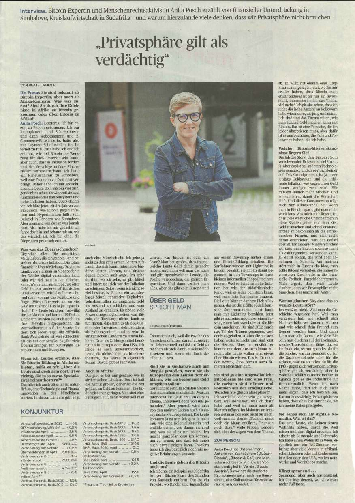

---
taxonomy:
    tags: [Blog, Deutsch, Features, Bitcoin in Africa]
routes:
    default: '/einblicke-bitcoin-afrika'
date: 2024-07-18 15:00
dateformat: 'Y-m-d H:i'
summary: Überraschende Aspekte von Bitcoin im Zusammenhang mit finanzieller Unterdrückung, Kreislaufwirtschaft und Privatsphäre in Afrika.
thumbnail: _finanzielle-unterdrueckung-afrika.jpeg
---

# Überraschende Einblicke - Bitcoins Rolle in Afrika - Interview

In [meinem Interview mit der österreichischen Tageszeitung "Die Presse"](https://www.diepresse.com/18509999/bitcoin-expertin-anita-posch-es-gibt-viele-ueberraschungen-fuer-blauaeugige-europaeer) spreche ich über finanzielle Unterdrückung in Simbabwe, eine Bitcoin-Kreislaufwirtschaft in Südafrika und die Bedeutung der Privatsphäre. 

### Sie sind bekannt als Bitcoin-Expertin, aber auch als Afrika-Kennerin. Was war zuerst? Sind Sie durch Ihre Erlebnisse in Afrika zu Bitcoin gekommen oder über Bitcoin zu Afrika?

Letzteres. Ich bin zuerst zu Bitcoin gekommen aufgrund meiner beruflichen Tätigkeit. Ich war Raumplanerin und Stadtplanerin und dann Web-Designerin und E-Commerce-Entwicklerin, hatte also mit Payment-Schnittstellen im Internet zu tun. 2017 habe ich endlich erkannt, wie toll Bitcoin als Werkzeug für diese Zwecke sein kann, aber auch, dass es Inklusion fördert und das derzeitige unfaire Finanzsystem verbessern kann. Ich hatte ein Naheverhältnis zu Simbabwe, weil eine Freundin viel Zeit dort verbringt. Daher habe ich mir gedacht, dass die Leute dort Bitcoin viel dringender brauchen als wir, weil sie kein funktionierendes Bankensystem und hohe Inflation haben. 2020 dachte ich, ich höre jetzt seit drei Jahren von Bitcoinern, wie Bitcoin gegen Inflation und Hyperinflation hilft, zum Beispiel in Ländern wie Simbabwe. Aber niemand von denen war jemals dort. Also habe ich mir gedacht, ich fahre dorthin und schaue mir an, wie das wirklich ist. Ich bin eine, die Dinge gern praktisch erfährt.

### Und was war das Überraschendste dort?

Eigentlich alles. Man kann es sich nicht vorstellen. Die autoritären Machthaber, die ein ganzes Land und eine ganze Bevölkerung bestehlen durch die Inflation. Es besteht eine totale finanzielle Unterdrückung. Da gibt es Limits, wie viel man im Monat oder in der Woche digital versenden kann oder wie viel man in bar abheben kann. Wenn man aus Simbabwe öfter Geld in ein anderes afrikanisches Land versendet, wird das überwacht, und dann kommt das Politbüro und fragt, "Wieso überweist du so viel Geld ins Ausland, das ist ja unpatriotisch”. Die Leute kündigen freiwillig ihr Bankkonto und horten US-Dollar. Und dann werden sie auch noch um ihre US-Dollar ausgequetscht. Die Wechselkursrate auf der Straße ändert sich jeden Tag. Und dann gibt es die offizielle Bank-Wechselrate, die immer viel schlechter ist als die auf der Straße. Es gibt viele Überraschungen für blauäugige Europäerinnen und Europäer dort. 
### Wenn ich Leuten erzähle, dass Sie Bitcoin-Bildung in Afrika anbieten, dann kommt oft der Einwand: Aber die Leute sind doch arm dort. Ist es richtig, die in so etwas Spekulatives wie Bitcoin reinzutheatern?

Das höre ich auch öfter. Es ist natürlich so, dass Technologie und Finanzinnovation in der Mittelklasse starten. Das ist bei uns so, und das ist auch in diesen Ländern es. Dort gibt es ja auch eine Mittelschicht. Ich gehe ja nicht zu den ganz armen Leuten aufs Land, die sich kaum Internetverbindung leisten können, und drücke denen Bitcoin aufs Auge. Ich gehe dorthin, wo ich sehe, es gibt Mittel und Interesse, sich vor der Inflation zu schützen. Selbst wenn ich nicht so viel besitze, ist Bitcoin ein wunderbares Mittel, repressive Kapitalverkehrskontrollen zu umgehen, Geld ins Ausland zu schicken und vom Ausland zu erhalten. Es gibt so viele Anwendungsmöglichkeiten von Bitcoin, die überhaupt nichts damit zu tun haben, dass man es als Spekulation oder Investment sieht, sondern als Zahlungsmittel, und es wird in afrikanischen Ländern zu einem höheren Grad als Zahlungsmittel benötigt als in Europa oder den USA. Ich fände es auch unverantwortlich, Leute, die nichts haben, da hineinzutheatern, das wären ja eigentlich Scams. Davon gibt es sehr viele. 

### Auch in Afrika? 

Das gibt es bei uns genauso wie bei afrikanischen Ländern. Dort ist halt die Armut größer, daher ist die Not größer, an Geld zu kommen. Die Bildung ist eher geringer. Man sitzt eher Betrügern auf, denn woher soll man wissen, was Bitcoin ist oder ein Scam? Man hat gehört, dass irgendwelche Leute Geld damit gemacht haben, und dann will man das auch und gibt irgendwelchen Leuten, die Profite versprechen, die ganzen Ersparnisse. Und dann verliert man alles. Aber das gibt es in Europa und Österreich auch, weil die Psyche des Menschen offenbar darauf ausgelegt ist, lieber schnell und riskant Geld zu machen, als sich damit auseinanderzusetzen und zuerst ein Buch darüber zu lesen. 

### Sind Sie in Simbabwe auch auf Skepsis gestoßen, wenn Sie als Europäerin dorthin gehen und den Leuten erklären, wie sie besser mit Geld umgehen sollen?

Gar nicht so sehr. In sozialen Medien liest man schon manchmal: Warum interviewt ihr diese Frau zu diesem Thema, interviewt doch von uns jemanden. Aber generell wird man von den meisten Leuten auch als europäische Frau respektiert. Die Leute kommen ja zu mir. Ich gehe ja nicht raus wie eine Kolonialisiererin und erzähle denen, wie dumm sie sind und was sie alles tun sollen. Ich mache ganz klar, dass ich komme, um zu lernen, und dass ich ihnen auch etwas zeigen kann. Insofern habe ich diesbezüglich noch nie negative Erfahrungen gemacht. 

### Und die Leute geben die Bitcoin auch aus?

Ich möchte ein Beispiel aus Südafrika bringen: Bitcoin Ekasi, das ist eine Kreislaufwirtschaft, die es seit 2021 gibt, drei Stunden von Kapstadt entfernt. Das ist ein Projekt, wo Kinder und Jugendliche aus einem Township surfen lernen und Bitcoin-Bildung erhalten. Die Surflehrer werden mit Lightning Bitcoin bezahlt. Die haben damit begonnen, in den Townships in ihren kleinen informellen Shops Bitcoin zu nutzen. Weil es eben langfristig seinen Wert hält und nicht so hohe Inflation hat wie der südafrikanische Rand, weil es jeder benutzen kann, weil man kein Bankkonto braucht. Die Leute können dann zu Pick n Pay gehen, das ist die größte südafrikanische Supermarktkette, dort kann man mit Lightning bezahlen. Jetzt gibt es auch eine Apotheke, einen Friseur, einen Autowaschdienst, die Bitcoin annehmen. Und die sind 2023 durch das Tal der Tränen gegangen, weil der Kurs gefallen ist, aber die meisten haben weitergemacht und sind jetzt die Heroes. Einer hat erzählt, er kommt mit dem Ansturm kaum zurecht, die Leute wollen jetzt alle etwas über Bitcoin wissen. Das ist für mich der Beweis, dass Bitcoin auch ärmeren Menschen hilft. 

### Sie sind ja eine ungewöhnliche Bitcoinerin: Sie sind eine Frau, die meisten sind Männer und kommen aus der Trading-Ecke. Wurden Sie gleich akzeptiert?

Ich werde bei vielen sehr gut akzeptiert, weil sie wissen, was ich drauf habe und dass ich mich gut auskenne und weil sie mich auch als Mensch mögen. Im Mainstream interessiert man sich eher nicht für mich, weil man da denkt, Technik muss doch ein Mann erklären, Finanzen noch dazu. Viele Frauen wenden sich deswegen ab. Ich habe einmal eine junge Frau in Wien kennengelernt, die hat gesagt, „jetzt, wo Sie mir erklärt haben, dass Bitcoin auch etwas anderes ist als nur ein Investment, interessiert mich das Thema viel mehr“. Ich glaube schon, dass ich nicht die hohe Anzahl an Followern habe wie andere, die jung und männlich sind und das Thema reiten, wie man schnell Geld machen kann mit Bitcoin. Das ist eine Tatsache, die ich leider akzeptieren muss, aber dafür ist es umso schöner, die Fans und Follower zu haben, die ich habe.

### Was sind die größten Bitcoin-Missverständnisse, die Sie ärgern?

Diese falsche Story, dass Bitcoin Strom verschwendet – es benutzt viel Strom, ja, das ist aber bei anderen Technologien genauso, und da regt sich keiner auf. Das Grundproblem ist ja unser jetziges Geldsystem und die inhärente Inflation, weswegen unser Geld immer weniger wert wird und wir immer mehr arbeiten müssen. Wie müssen konsumieren, damit die Wirtschaft läuft. Und dieser Konsumwahn trägt auch zum Klimawandel bei. Wenn man in Bitcoin spart, gibt man nicht so viel aus. Was mich auch ärgert – und das wird in den nächsten Jahren schlimmer werden – ist, dass viele westliche Unternehmen schon in diese Staaten gehen mit dem Ziel, Geld zu machen und schneller Marktanteile zu bekommen als die einheimischen Unternehmen, und sich nicht daran orientieren, was der Bedarf dort ist. Ein anderes Missverständnis ist, dass man Bitcoin sowieso nicht als Zahlungsmittel verwenden kann. Ja, es ist volatil, das wird aber abnehmen in Zukunft. Am meisten stört mich in Europa die Idee, man sollte Bitcoin verbieten, die immer rigoroseren Einschnitte in die finanzielle Freiheit, Bargeldobergrenzen. Was mich ärgert ist, dass viele Leute glauben, dass wir Privatsphäre nicht brauchen. Das macht mir Angst. 

### Warum glauben Sie, dass das so wenige Leute stört?

Ich weiß es nicht. Weil man die Geschichte vergessen hat? Weil man vergessen hat, wie schnell sich Machtverhältnisse ändern können und wie schnell dein Freund zum Gegner werden kann. Wie dann alle Daten, die man über dich weiß – wie viele Bitcoin hast du denn auf der Exchange, welche Transaktionen tätigst du, wo kaufst du ein, warum spendest du für die Kirche, warum spendest du für die Sozialdemokratie oder für die Grünen, warum spendest du für die FPÖ – weil man das alles gegen dich verwenden kann. Privatsphäre gilt als verdächtig, aber in Wahrheit schützt es meine Rechte. In Uganda gibt es die Todesstrafe für Homosexualität. Wenn ich nach Ghana fahre, darf ich auch nicht mehr sagen, dass ich lesbisch bin. Darum ist es wichtig, Privatsphäre zu haben, dass ich selbst entscheide, wo ich meine Daten preisgebe. Die Leute bedenken das nicht. Sie denken, es ist bequem, so wie es ist, und man kann eh nichts machen. Da hilft es nur, ständig mit Leuten darüber zu reden und ihnen das zu erklären. Interessanterweise sagen viele, ich bin auch dagegen, aber so sind halt die Regeln. 

### Sie sehen sich als digitale Nomadin. Was ist das?

Das sind Leute, die keinen festen Wohnsitz haben, durch die Welt reisen und dort digital arbeiten. Ich arbeite als Beratende und Lehrende. Ich habe einen Wohnsitz in Wien, eigentlich nur ein WG-Zimmer, verbringe aber viele Monate in afrikanischen Ländern oder auf Konferenzen in Asien oder den USA, wo ich netzwerke und Workshops mache.
 
### Klingt spannend. 

Spannend, aber auch anstrengend. Ich überlege derzeit, wo ich wieder mehr Fuß fasse.

## Du möchtest mehr über Bitcoin erfahren? 

> * Abonniere meinen kostenlosen, wöchentlichen Newsletter: [The Orange Journal](https://anita.link/news)
> * Melde dich bei meiner Online-Lernplattform an [Crack The Orange](https://cracktheorange.com) und ich gebe dir alle nötigen Tools und das Wissen, das du brauchst, um Bitcoin auf sichere Weise zu nutzen.
> * Lies mein Buch [(L)EARN BITCOIN](https://learnbitcoin.link/)

