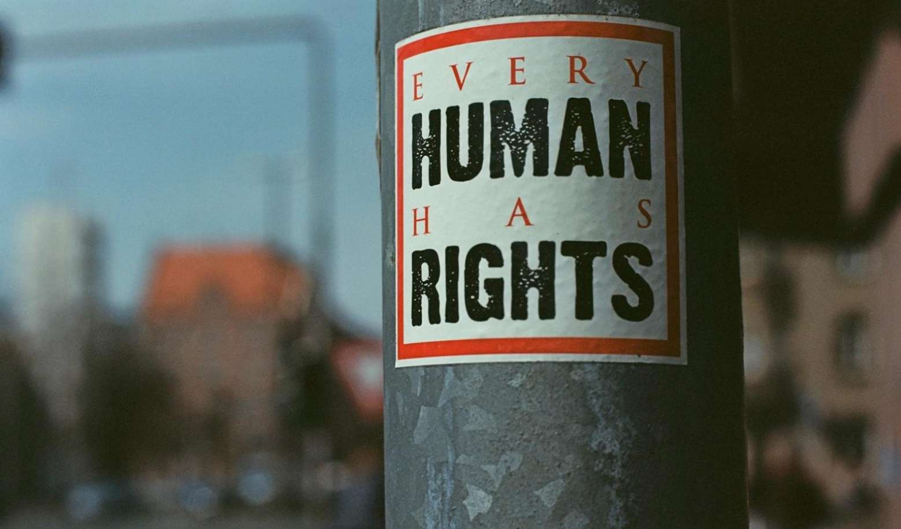

# Bitcoin: A Revolutionary Force for Human Rights in the Digital Age

## Why is Bitcoin Good for Humanity?

Bitcoin is far more than a speculative asset or a medium of exchange. It’s a powerful tool for enforcing human rights, offering financial inclusion, privacy, and economic stability to those who need it most. As adoption grows, particularly among the young populations of African countries, Bitcoin’s role in supporting human rights is likely to expand. This impact is not limited to Africa but extends to other countries worldwide with human rights and democracy deficits.

While Bitcoin alone cannot solve all human rights issues, it provides a powerful tool for individuals to resist oppression, preserve wealth, and participate in the global economy on their own terms. As we move further into the digital age, Bitcoin stands as a beacon of hope for a more equitable and free world, embodying the principles of human rights in its very design and function.

[Read the full article](https://h17n.com/human-rights/)

