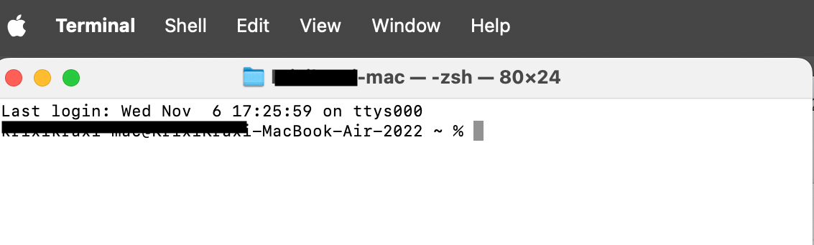
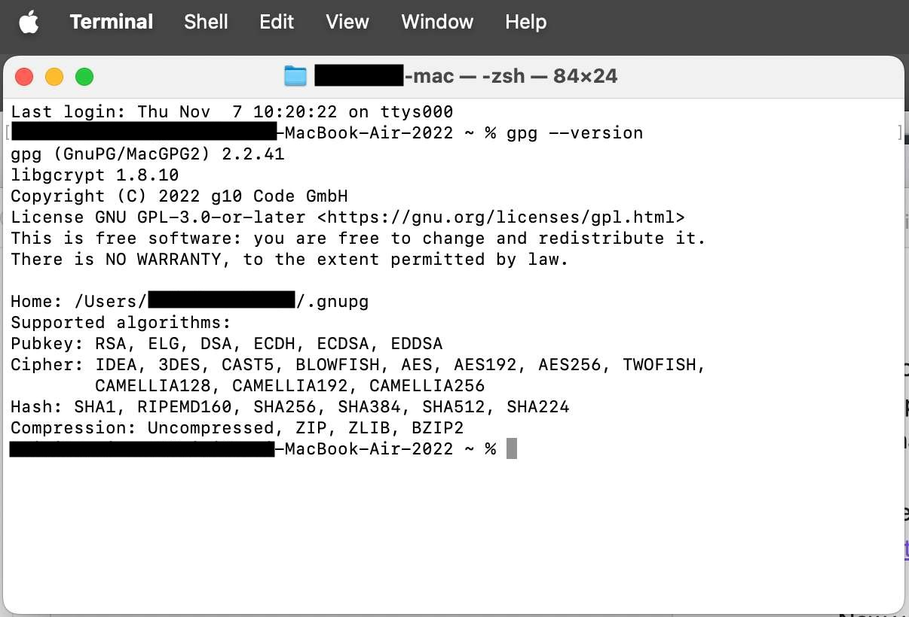
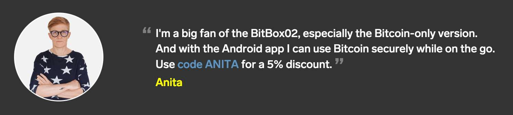
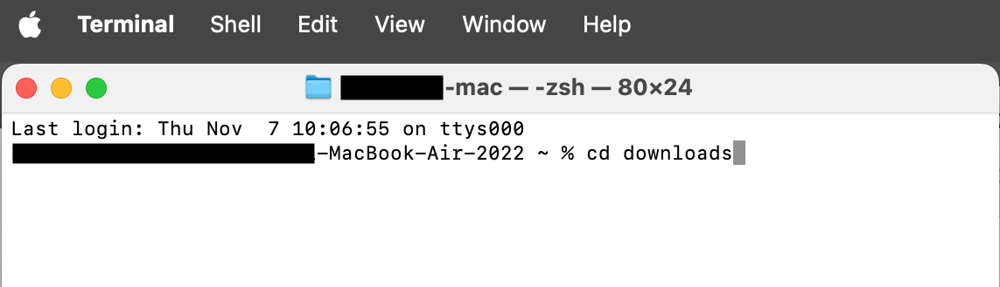
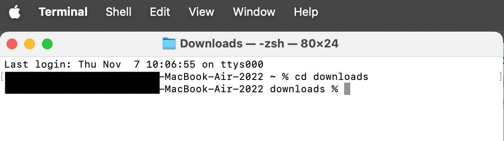
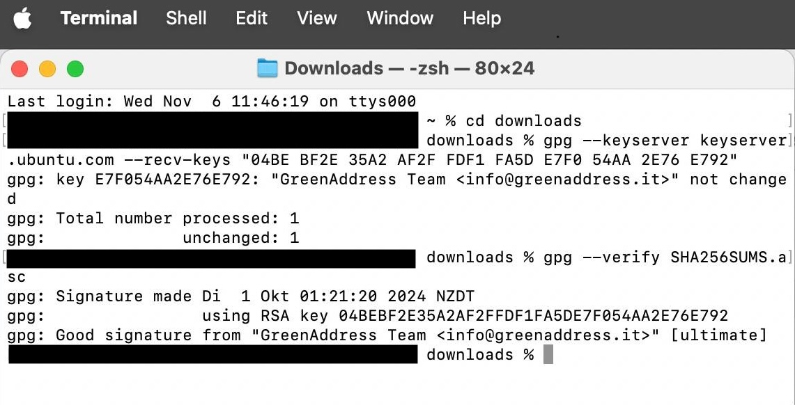
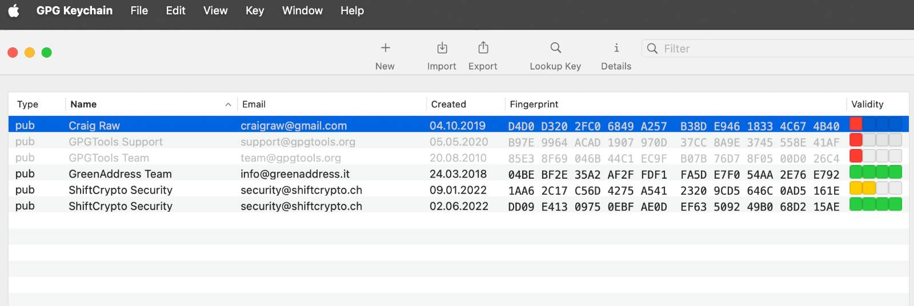

# How to Verify Bitcoin Wallet Software: A Security Guide for Mac and Windows Users | 2024

## Complete Guide: How to Verify Bitcoin Wallet Software and Protect Your Cryptocurrency

An important security step for all Bitcoin wallet software is to verify the code each time you install or upgrade it. This is done to ensure that the installation file you downloaded has not been compromised and no one can steal your bitcoin.

It’s important to use wallet software that is open source so that there is no backdoor or code included that can exploit and steal your bitcoin. Open source code that has been used for years  is usually screened by a lot of eyes, which is also the reason why it's a good idea to only trust manufacturers whose products have been tested and used for years and have built great reputation.

For instance the software for Ledger's hardware wallets is closed source! So no one can check their code; which is anti-ethical to Bitcoin's principle of transparency.

<iframe width="100%" height="473" src="https://www.youtube-nocookie.com/embed/fEOHqi9eZYQ?si=Hsm43sirLVTE8rFK" title="YouTube video player" frameborder="0" allow="accelerometer; autoplay; clipboard-write; encrypted-media; gyroscope; picture-in-picture; web-share" referrerpolicy="strict-origin-when-cross-origin" allowfullscreen></iframe>

## Verify Desktop Software

In general you **don't need to verify mobile wallets that you download from PlayStore or Apple's App Store** as Google and Apple are doing this for you, but other wallet software for Mac or Windows users is not verified. It could be that someone interfered and injected malicious code. That's why it's very important to verify software that you use to manage your life savings or on a hardware device.

I explain how to verify the software for **Blockstream Green** wallet, the **BitBox App** and **Sparrow wallet**. The screenshots are taken from a Mac, but the principles on Mac and Windows and for all Bitcoin wallets are very similar.

## Main Steps

Software developers sign the code that they produced and made available for download with their private key, so that users can verify with the developers public key that what they downloaded is from the original source.

> Public and private key pairs are also extensively used in the Bitcoin software. Without them Bitcoin wouldn't exist. I explain how this works in the [(L)earn Bitcoin online course](https://my.cracktheorange.com/learn-bitcoin-course/).

## Step 1: Install GPG and look it up in Command Prompt or Terminal.app

Make sure GPG is installed on your system. You can download and install the Windows version [Gpg4win here](https://www.gpg4win.org) and the Mac version is called [GPG Keychain download here](https://gpgtools.org/keychain/). The free versions are sufficient.

Then open the standard Windows Command Prompt by Start > Run > `cmd` and press "enter". Or open it by searching "cmd" in the search bar or by entering "cmd.exe" after pressing Windows + R.

On a Mac open the Terminal.app by pressing "command" and "space" at the same time and enter terminal.app into the search field and open the app.

Now you want to make sure that GPG is installed on your computer, you do that by entering `gpg --version` in that window (or in the black Windows Command Prompt).

How do you do that? By copying the text above by marking it and then pressing"control" and "c" at the same time and then go into the Terminal window and paste it by pressing "control" and "v" at the same time. Then press "enter".

If you see the installed version in that window you can proceed with the verification steps below. In case you received an error the installation didn't work.

## Step 2: Download the software and the signature file

All credible software developers make their code available on their websites and on GitHub. Search for their main website and then find their GitHub repositories. 

* For Blockstream's Green wallet go to https://blockstream.com/green/ and there look for "Releases", which takes you to their GitHub page https://github.com/Blockstream/green_qt/releases. 

* Same for Sparrow wallet https://www.sparrowwallet.com/download/ the releases are listed on their website and hosted on GitHub.

* The companion app for the BitBox02 is to be found on https://bitbox.swiss/download/, and is also hosted on GitHub  https://github.com/BitBoxSwiss/bitbox-wallet-app/releases

> By the way: I'm an affiliate for the BitBox02, if you [purchase it via this link](https://anita.link/bitbox02) and add the code ANITA, then you'll receive 5% discount. 
> 

### Download the software 
See "latest" releases, which is the top of the list and under "Assets" download the software file (depending on your system the files have names like: "BlockstreamGreen-universal.dmg" or "BitBox-4.45.0-win64-installer.exe" or "Sparrow-2.0.0.zip". 
Download the file to your computer into the downloads folder.

### Download the signature file
Usually on the same page you find the developer's signature files that you need to verify its originality. The signature files from the developers usually look something like this  "SHA256SUMS.asc" or "sparrow-2.0.0-manifest.txt.asc" or "BitBox-4.45.0-x86_64.AppImage.asc". Basically look out for a file ending with .asc.
Download it into the "downloads" folder.

## Step 3: Go back to open Terminal or Command Prompt

 In the Terminal window or the Command Prompt navigate to the downloads folder by entering: 
   
`cd downloads`

Then press "enter"

Looks like this

After pressing enter it will look like this:

## Step 4: Import the Public Key

Next you need to find and import the developers public key into your GPG program. 

Credible developers publish information on how to verify their software. Always look up the original instructions before you verify to find the public key as they might change over time. Those for [Blockstream Green are here](https://help.blockstream.com/hc/en-us/articles/900002174043-How-do-I-verify-the-Blockstream-Green-binaries), [Sparrow's key information is here](https://www.sparrowwallet.com/download/) and [BitBox explains their keys and everything here](https://support.bitbox.swiss/en_US/how-to-verify-the-app-release-on-windows).

As example: This is the public key for Blockstream Green. Import it by copying and pasting the following into the Terminal app or Command Prompt and press "enter":

`gpg --keyserver keyserver.ubuntu.com --recv-keys "04BE BF2E 35A2 AF2F FDF1 FA5D E7F0 54AA 2E76 E792"`

The result will say: Key imported and show you the developers email address.

## Step 5: Verify the signature

Then verify the signed hashes of the downloaded binaries by copying and pasting this in terminal and then press "enter":

`gpg --verify SHA256SUMS.asc`

The RESULT should say: 

`gpg: using RSA key 04BEBF2E35A2AF2FFDF1FA5DE7F054AA2E76E792`
`gpg: Good signature from "GreenAddress Team <info@greenaddress.it>" [ultimate]`

### Result in Terminal

### Result in GPG4win or GPG Keychain

> Note: 
> Your results might say something different than "Ultimate" or you will likely see the warning "This key is not certified with a trusted signature!". This is to be expected, since your GPG installation just learned about this key and you haven't told it to explicitly trust it. You can therefore ignore this warning. I edited the public key in my GPG program and trusted it manually, that's why it says "Ultimate" on my screenshot. Important is that the **RSA key is the same as on the developers page** and that you see **"Good signature"**.

## Use Sparrow Wallet to verify other Bitcoin software

Actually Craig Raw the developer of the Sparrow wallet has a [great explainer on how to verify the software on his Sparrow wallet website](https://www.sparrowwallet.com/download/). It's very easy since version 1.8.3. You just need to drag and drop some files onto Sparrow and his tool verifies the software for you. You can even use Sparrow's functionality to verify other Bitcoin software.

## Regularly Update the Software

Bitcoin wallets are being updated regularly. You might see a notification inside the software telling you that there is an update. Check the release pages and follow the developers official channels and upgrade the software. If you don't do this, the software might not work in a couple of years.

## Do you want to learn more about Bitcoin? 

> * Subscribe to my weekly newsletter: [The Orange Journal](https://anita.link/news)
> * Join my Bitcoin learning platform [Crack The Orange](https://cracktheorange.com) and I'll give you all the tools and knowledge you need to use Bitcoin in a secure way.
> * Read my book [(L)EARN BITCOIN](https://learnbitcoin.link/)