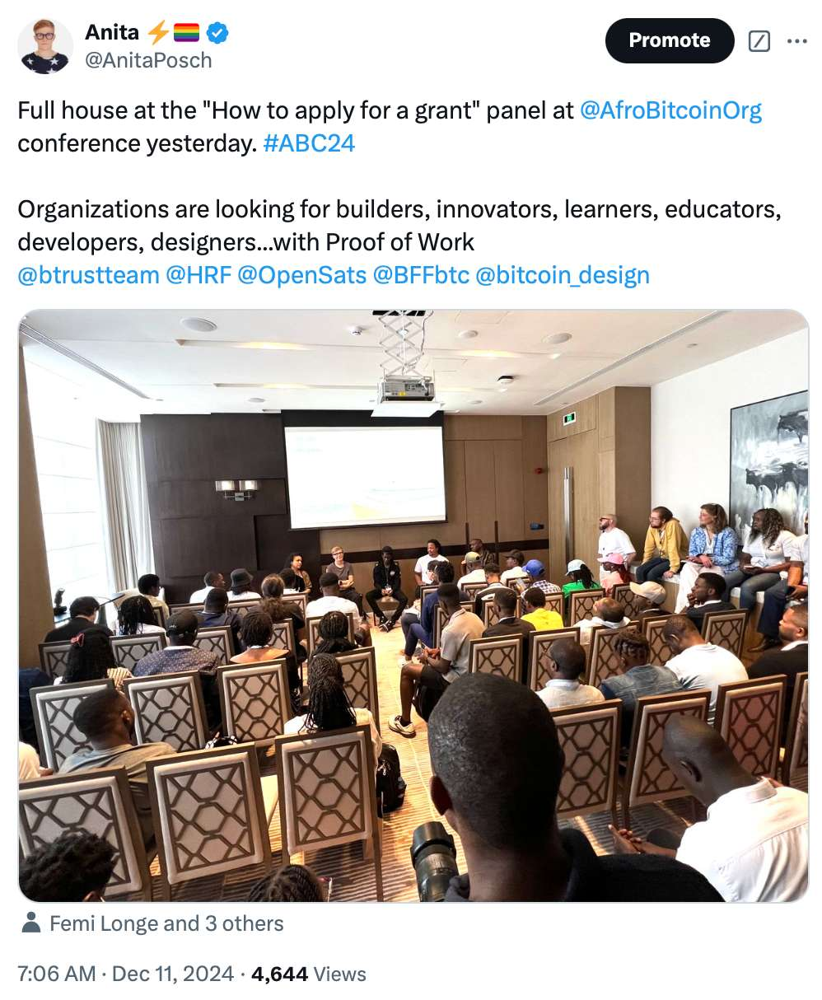

# Bitcoin For Fairness Review 2024

In this article, I’ll walk you through the biggest milestones from each month, share my personal highlights, and give you a glimpse of my goals for the coming year. Let’s dive in and reflect!

## Highlights of 2024

### Receiving Bitcoin in Less Than an Hour in Lebanon

To me, the most special event of the year was the donation demo at the Human Rights Foundation Global BTC Summit in October. From opposite sides of the world, I guided the boss of a Lebanese human rights organization through setting up a Bitcoin wallet via messenger. Within an hour, they were ready to receive emergency relief donations - a powerful moment that showed Bitcoin's borderless potential. It reminded me why I’m so passionate about the work I do.

### African Bitcoin Conference Nairobi

For the third time Farida Nabourema organized the African Bitcoin conference, the biggest Bitcoin-only event on the African continent. It has been the most diverse and inclusive Bitcoin conference I have ever been to, bringing technical knowledge and at the same time being open for newbies. Farida's programming makes a huge difference, she deliberately puts at least one woman on each panel or every other speaking slot and focuses on workshops and conversations. Through this great mix speakers, audience and the program are far more diverse than on other Bitcoin events. A joy to be a part of.

### Crack the Orange Educators Program

Another highlight this year was seeing the growth and success of the Crack the Orange educators program. Two graduates from the program received a grant from the Human Rights Foundation to expand Bitcoin education and build infrastructure in Africa. Nothing could be more meaningful than seeing our program empower local leaders to share knowledge and drive adoption in their communities.

### My work during 2024

#### **January**

I started the year with an exciting journey into rural Zimbabwe to [test Bitcoin Lightning wallets](https://youtu.be/3sFQ-fSY94A). Traveling 40 km from the capital, I explored how wallets like Blixt, Green, Mutiny, Phoenix, Zeus, and Wallet of Satoshi work in less connected areas. Opening channels, managing transactions, and comparing costs gave me firsthand insights into what really works for self-custody in remote settings. It was interesting to see the challenges and opportunities for true Bitcoin ownership outside urban areas and gave me a deeper understanding of the practical realities of Bitcoin. My research was meant to help wallet developers build more inclusive products, ensuring future Bitcoin wallets serve users of all backgrounds effectively. Back in Harare, I hosted two workshops on how to use Bitcoin, one of those with human rights activists.

<iframe width="100%" height="473" src="https://www.youtube.com/embed/3sFQ-fSY94A" title="YouTube video player" frameborder="0" allow="accelerometer; autoplay; clipboard-write; encrypted-media; gyroscope; picture-in-picture; web-share" allowfullscreen></iframe>

A major highlight was delivering my keynote, ["Own Your Future - Self-Sovereignty Through Ownership"](https://youtu.be/TSkEpcalmyQ) at the inaugural Adopting Bitcoin conference in Cape Town. I was sharing how Bitcoin can protect against inflation, enhance financial privacy, and empower individuals to take control of their future. The goal was to inspire Africans to develop their own specific solutions on top of Bitcoin and take charge of their economic destiny.

<iframe width="100%" height="473" src="https://www.youtube.com/embed/TSkEpcalmyQ" title="YouTube video player" frameborder="0" allow="accelerometer; autoplay; clipboard-write; encrypted-media; gyroscope; picture-in-picture; web-share" allowfullscreen></iframe>

#### **February**

In February, I traveled across South Africa and Namibia, exploring how Bitcoin is making an impact. Together with Peter Todd I visited Bitcoin Witsand and [used my BoltRing to make Lightning payments without internet connection](https://youtu.be/Q4jRCVIrN2M) - it felt like the future was here. Visiting Bitcoin Ubuntu was another highlight, meeting people working hard to bring financial freedom to their communities.

In South Africa, [I visited PicknPay, one of the biggest retailers in Africa, with Carel van Wyk](https://youtu.be/ZhRFqXwA9BE). Carel showed me how he implemented Bitcoin Lightning payments there. It was fascinating to hear about the challenges he faced and the progress he has made to bring Bitcoin to everyday payments.

<iframe width="100%" height="473" src="https://www.youtube.com/embed/ZhRFqXwA9BE" title="YouTube video player" frameborder="0" allow="accelerometer; autoplay; clipboard-write; encrypted-media; gyroscope; picture-in-picture; web-share" allowfullscreen></iframe>

In Namibia, I met Nikolai Tjongarero, the founder of EasySats, a platform that helps vendors and individuals get paid in bitcoin for their goods and services. It was inspiring to see how EasySats is making Bitcoin more accessible and practical in everyday life. 

I also [joined the Access Tribe podcast](https://x.com/AnitaPosch/status/1761044072834159029), where I shared my own Bitcoin journey, stories from the Global South, and the ideas behind [Crack the Orange](https://cracktheorange.com). The Q&A at the end was a great way to connect with the audience. 

#### **March**

In March, I published an article titled ["Unjust Systems Prevail, Social Change is Rare"](https://anitaposch.com/unjust), where I explored the surprising reality that those most disadvantaged by the status quo are often the last to embrace social change and new technologies. Writing this piece was a chance to reflect on the challenges of my work where I try to break through systemic barriers through education.

[I also appeared on Dale Warburton’s "Why Bitcoin Show"](https://anitaposch.com/podcast-why-bitcoin-show), discussing my Bitcoin education efforts in Africa, specifically how it empowers communities in Zimbabwe and Zambia. In this episode, we explored Bitcoin’s role in financial freedom, shared real stories of impact and change, and talked about Bitcoin’s global use and perception differences.

<iframe src="https://www.vodio.fr/frameplay.php?idref=25745&urlref=1" style="border: 0px none; box-shadow: rgba(0, 0, 0, 0.28) 0px 0px 10px; width: calc(100% - 10px); height: 180px; margin-left: 5px; padding: 0;" scrolling="no"></iframe>

Another highlight was creating the [Meetup Guide](https://github.com/bitcoinindo21/bitcoin-meetup-guide) together with [Bitcoin Indonesia](https://bitcoinindonesia.xyz/). This guide became a key resource for growing local communities, helping them expand from a single meetup to over 30 Bitcoin-only meetups across the country each month. Seeing this kind of grassroots growth was very rewarding and showed how powerful collaboration and open-source resources can be. 

#### **April**

April was an exciting month because the Bitcoin Halving happened on April 19, 2024. The block reward was reduced to 3.125 BTC, reminding everyone of Bitcoin’s unique design and how its built-in scarcity helps drive its value.

<iframe width="100%" height="473" src="https://www.youtube.com/embed/9WrgW3EuvR4" title="YouTube video player" frameborder="0" allow="accelerometer; autoplay; clipboard-write; encrypted-media; gyroscope; picture-in-picture; web-share" allowfullscreen></iframe>

I attended the Lightning Conference in Tuscany, an amazing chance to explore the latest advancements in Bitcoin and Lightning technology. The discussions were insightful, and I was happy to hear from some developers that my Lightning wallet test was helpful for their work.

I also did an [interview with Atlas21](https://x.com/AnitaPosch/status/1784602349442314486), where I shared my perspectives on Lightning’s development and Bitcoin’s potential to create a more inclusive financial system. 

<iframe width="100%" height="473" src="https://www.youtube.com/embed/kPTM6UOJgLo" title="YouTube video player" frameborder="0" allow="accelerometer; autoplay; clipboard-write; encrypted-media; gyroscope; picture-in-picture; web-share" allowfullscreen></iframe>

#### **May**

May was a busy month. I gave a talk in Graz, Austria about [“Bitcoin & Menschenrechte auf Deutsch”](https://x.com/AnitaPosch/status/1792222000913539536), where I shared how Bitcoin can support freedom and financial independence. 

<iframe width="100%" height="473" src="https://www.youtube.com/embed/ZHVy_MhKz3s" title="YouTube video player" frameborder="0" allow="accelerometer; autoplay; clipboard-write; encrypted-media; gyroscope; picture-in-picture; web-share" allowfullscreen></iframe>

[I also spoke at Adopting Bitcoin in Arnhem](https://www.youtube.com/live/T0vJ4uEsCwc?t=2166s), continuing to explore how Bitcoin can drive positive change around the world. 

<iframe width="100%" height="473" src="https://www.youtube.com/embed/T0vJ4uEsCwc?si=xXhIe6pgtDU-kAIU&amp;start=2166" title="YouTube video player" frameborder="0" allow="accelerometer; autoplay; clipboard-write; encrypted-media; gyroscope; picture-in-picture; web-share" referrerpolicy="strict-origin-when-cross-origin" allowfullscreen></iframe>

Then, Atlas21 published an article based on my interview titled [“Governments control people through the traditional financial system”](https://atlas21.com/anita-posch-governments-control-people-through-the-traditional-financial-system/), explaining how Bitcoin and the Lightning Network offer a way to achieve financial freedom outside of centralized control. 

[Coinfinity interviewed me about my work](https://coinfinity.co/blog/coinfinity-interview-mit-anita-posch) with [Bitcoin for Fairness](bffbtc.org) and [Crack the Orange](https://cracktheorange.com), and I shared my views on self-custody, privacy, and the connection between Bitcoin and human rights.

[I celebrated Bitcoin Pizza Day](https://x.com/AnitaPosch/status/1793339399104495981) with the community and, of course, pizza! 

I also appeared on the Connect the World Show, where [I talked about my journey in Bitcoin, finding my purpose (Ikigai), and why supporting human rights through Bitcoin matters so much to me](https://youtu.be/MWxIhisUBAg). 

<iframe width="100%" height="473" src="https://www.youtube.com/embed/IojClxiPKHk" title="YouTube video player" frameborder="0" allow="accelerometer; autoplay; clipboard-write; encrypted-media; gyroscope; picture-in-picture; web-share" allowfullscreen></iframe>

#### **June**

June was packed with big events. I led two workshops on "Bitcoin in Challenging Environments" at the Oslo Freedom Forum, focusing on how Bitcoin can empower people in restrictive and oppressive regimes. Together with Ben from BTC Sessions I conducted two Q&A sessions, where we answered questions from the audience. 

At BTC Prague, I participated in multiple sessions. I spoke at the Developer Day panel on “Open Source Activism”, gave a keynote on [“Bitcoin & Human Rights: What 99% Are Getting Wrong”](https://youtu.be/klk13ahO2yo), and was part on stage of the panel [“Onboarding the Next 1 Billion to Bitcoin”](https://youtu.be/ZVsjaUPehdA). Each session was a chance to share insights and learn from others about the challenges and opportunities in driving Bitcoin adoption around the world.

<iframe width="100%" height="473" src="https://www.youtube.com/embed/klk13ahO2yo" title="YouTube video player" frameborder="0" allow="accelerometer; autoplay; clipboard-write; encrypted-media; gyroscope; picture-in-picture; web-share" allowfullscreen></iframe>

<iframe width="100%" height="473" src="https://www.youtube.com/embed/ZVsjaUPehdA" title="YouTube video player" frameborder="0" allow="accelerometer; autoplay; clipboard-write; encrypted-media; gyroscope; picture-in-picture; web-share" allowfullscreen></iframe>

[I was also featured in Austria's daily newspaper "Die Presse"](https://www.diepresse.com/18509999/bitcoin-expertin-anita-posch-es-gibt-viele-ueberraschungen-fuer-blauaeugige-europaeer) discussing Bitcoin’s potential and challenges, particularly for newcomers from Europe. I highlighted how Bitcoin can surprise those who underestimate its transformative power in real-world applications.

On a personal note, [I decided to leave Telegram](https://x.com/AnitaPosch/status/1799044214137004451), because it’s unencrypted and infringing our privacy. Better use messengers like Signal and SimpleX Chat, which allow you to hide your phone number.

#### **July**

In July, I made a conscious decision to step back from traditional "anti-social media" and started posting more on Nostr [(PS: Nostr is a bit like X but without Elon Musk)](https://youtu.be/X-uRVoMkof8). It felt refreshing to explore this new platform that doesn't cater to advertisers and has no centrally controlled algorithms that prioritize enraging posts to increase engagement. This social media detox was a great way to refocus on more meaningful interactions and regain control over my online presence. 

If you don’t follow me yet, this is the link to my Nostr profile: [npub1tjkc9jycaenqzdc3j3wkslmaj4ylv3dqzxzx0khz7h38f3vc6mls4ys9w3](https://njump.me/npub1tjkc9jycaenqzdc3j3wkslmaj4ylv3dqzxzx0khz7h38f3vc6mls4ys9w3)

#### **August**

In August, I published my article ["Bitcoin: A Revolutionary Force for Human Rights in the Digital Age"](https://anitaposch.com/human-rights-bitcoin). In it, I highlighted how Bitcoin is more than just a speculative asset or a medium of exchange - it’s a powerful tool for advancing human rights. By offering financial inclusion, privacy, and economic stability, Bitcoin is empowering people, especially in regions where traditional systems fail to protect individual freedoms.

#### **September**
In September, [I was happy to see that two graduates from our Crack the Orange educators program received a grant from the Human Rights Foundation for their "African Bitcoiners" initiative](https://x.com/AnitaPosch/status/1836059821134520533). This grant will support their efforts to create more Bitcoin education and build infrastructure for Africans, marking a significant step toward Bitcoin adoption on the continent. Congratulations to them on this well-deserved achievement!

I was also featured in German weekly "WirtschaftsWoche" in an [article about Bitcoin in El Salvador](https://www.wiwo.de/finanzen/geldanlage/kryptowaehrungen-el-salvador-und-der-traum-vom-bitcoin-wunder/29991624.html) highlighting my advocacy for Bitcoin as "the money of the people." I emphasized its potential to empower those without access to traditional banking systems, particularly in regions like Africa.I also shared the pros and cons about the rollout of Bitcoin in El Salvador.

#### **October**
At the Human Rights Foundations Global BTC Summit, I led a workshop titled “Adoption Pain Points,” where we explored the challenges people face when adopting Bitcoin and how to overcome them.
[A special moment was when we set up a Bitcoin wallet from continents apart within an hour and used it to send donations to a Lebanese human rights organization for emergency relief](https://njump.me/nevent1qqsvqlhnxjnk4pdej0hdhk04n5mav8jgt84ljgggv6a5v2dsnnmjp7czypw2mqkgnrhxvqfhzx2966rl0k25naj95qgcge76ut67yax9nrt07p5le7t). It was a powerful demonstration of Bitcoin’s potential for fast, borderless support in critical situations. 

#### **November**
November was all about getting to know New Zealand, traveling the North and South island with a camper van. On the way I attended Bitcoin meetups in Auckland and Tauranga, connecting with local communities.

I also launched a Bitcoin reward program for Crack the Orange Scholars, where students earn sats for correctly answering exam questions—the more they get right, the more sats they earn. Using [TipCards.io](https://tipcards.io) for payouts keeps it simple, and it’s exciting to see learners getting started with really using Bitcoin.

#### **December**

I ended this amazing year on a high note with my travels to Nairobi. I joined the Bitcoin Dada group for a Bitcoin for Fairness Meetup, connecting with inspiring women driving Bitcoin adoption in their communities. At the [BitDevsNairobi Meetup](https://njump.me/nevent1qqsv9h277tknnmx7r95xv9ldf6f0plk3pe8r2h6q44yqtzle3teq42cprpmhxue69uhkzapwdehhxarjwahhy6mn9e3k7mf0qgs9etvzezvwuespxugeghtg0a7e2j0kgksprpr8mt30tcn5ckvddlcrqsqqqqqphqtxkk), I hosted a session on “Privacy and Responsibilities as a Developer”, fostering important conversations about ethical and secure development in the Bitcoin space.

At the third edition of the African Bitcoin conference ABC2024, [I led a workshop for Bitcoin beginners](https://njump.me/nevent1qqs0ttfdmu8pyw8e6mk2z0pdgvg0gjjfn4h29vyfp7lqm5ddtt7jkvqprpmhxue69uhkzapwdehhxarjwahhy6mn9e3k7mf0qgs9etvzezvwuespxugeghtg0a7e2j0kgksprpr8mt30tcn5ckvddlcrqsqqqqqp2srzjd), introducing newbies to the basics of Bitcoin and installing a wallet. 

There was full house at our panel where OpenSats, BTrust, HRF, Bitcoin Design Community and BFF discussed how projects and individuals can unlock funding and support from their programs. I presented the Crack the Orange scholarship program.

A highlight of the event was being named 1st runner-up for the ABC Social Impact Award, a recognition of the work I’ve been doing with Bitcoin for Fairness on the continent. Many thanks to everyone who voted for us! We donated the prize money of 1 Mio. sats to our independent BFF organization in Zambia.

I also visited the BITSACCO meetup and conducted interviews with [the founders of Tando](https://youtu.be/7fFnAnbZBUU), [BITSACCO](https://youtu.be/KwgaWqL08LA), and [Dada Devs](https://youtu.be/4YFIWdvecZ8), hearing diverse perspectives on Bitcoin’s impact and innovation. 

**Tando**
<iframe width="100%" height="473" src="https://www.youtube.com/embed/7fFnAnbZBUU" title="YouTube video player" frameborder="0" allow="accelerometer; autoplay; clipboard-write; encrypted-media; gyroscope; picture-in-picture; web-share" allowfullscreen></iframe>

**BITSACCO**
<iframe width="100%" height="473" src="https://www.youtube.com/embed/KwgaWqL08LA" title="YouTube video player" frameborder="0" allow="accelerometer; autoplay; clipboard-write; encrypted-media; gyroscope; picture-in-picture; web-share" allowfullscreen></iframe>

**Dada Devs**
<iframe width="100%" height="473" src="https://www.youtube.com/embed/4YFIWdvecZ8" title="YouTube video player" frameborder="0" allow="accelerometer; autoplay; clipboard-write; encrypted-media; gyroscope; picture-in-picture; web-share" allowfullscreen></iframe>

A visit to the [Bitcoin Babies project](https://x.com/BtcBabies/status/1867153014605173108) rounded up my trip, showing the tangible ways Bitcoin supports grassroots efforts. December was a fulfilling end to a year of progress and purpose!

## Crack the Orange Scholarship Program 

Bitcoin for Fairness is running a 12-month scholarship program for aspiring educators and community builders, who otherwise can’t afford that sort of guided education. 

Since the launch of Crack The Orange on Aug 21, 2023 we received and reviewed 141 applications from 31 countries. We granted 111 scholarships and sent an invitation to sign-up. 76 students signed up and started their 12 month scholarship.

37 of the 76 participants finished the course with a certificate of completion by CTO and are sharing the knowledge in their communities The graduates are from Argentina, Benin, Burundi, Cameroon, Ghana, Kenya, Liberia, Nigeria, South Africa, Tanzania, Togo, Uganda, Zambia and Zimbabwe. 

## Statistics

During the year I hosted 10 live calls via Crack the Orange, our team published 63 videos and 41 shorts on YouTube. We published 397 posts on X and additional ones on Nostr, BlueSky, LinkedIn as well as 83 YouTube posts. We sent out 53 newsletters to our subscribers.

## My Biggest Learnings This Year

Knowing something, doesn’t mean someone really knows something. This is not new for me, but it was never so clear as through the reactions to [a post that I wrote on X in Dec 2024](https://x.com/AnitaPosch/status/1866543761406488655). 

Surprisingly to me the post went viral, has become my most viewed post of all time and [caused this article about the risks of big stakeholders owning vast amounts of bitcoin](https://bitcoinmagazine.com/takes/governments-and-large-institutions-can-buy-all-the-bitcoin-they-want-except-yours). Imagine the US government became the biggest holder of bitcoin. With their power they could pass laws that make Bitcoin developers and maintainers indictable for their work. As a lot of them live and work in the US, the government could force developers to change the code to their liking. Same is true for big corporations like BlackRock or the Michael Saylor’s of the world. All together they could influence the Bitcoin consensus rules to impose censorship on transactions or raise the limit of maximal 21 mio bitcoin.

The majority of people answered with “Proof of Work prevents this”, “the amount of bitcoin you own gives you no privileges, this is not Proof of Stake”, “every node can vote on it”. [L0la L33tz makes great points on how this is wrong](https://x.com/L0laL33tz/status/1866799589094785421) and how Memes are no shortcuts for deep understanding.

It makes me sad to see that even in areas like Zimbabwe, Zambia, Kenya, or South Africa with a rich culture, history and their own specific opportunities many people are parroting and retweeting memes and what their heroes like Elon Musk and Michael Saylor are tweeting. But these are not their friends. In fact, the earlier powerful corporations and investors are purchasing bitcoin the less wealth increase will be happening for late comers. 

That’s why innovative solutions to spend and save bitcoin like Tando and BITSACCO in Kenya, payments at PicknPay in South Africa, Nostr and eCash make Bitcoin practical to use and accessible in daily life. Change starts at the ground level, with people who see Bitcoin as a tool to solve real problems. 

Rich investors from the West are the minority, but act as if they are the majority. The latest trend is to say that self-custody is not scalable and too difficult for the average person and that’s why ETFs are the best way of making bitcoin accessible to the masses. While it’s true that Bitcoin can’t be scaled to 8 billion people who have full ownership via private keys currently, it is definitely misleading to say ETFs are the solution. Self-custody and censorship resistance is at the core of what Bitcoin is. Without it, there is no need for Bitcoin. Then we can stick to the traditional banking system and trad-fi like ETFs and stocks.

Anytime colleagues or myself are noticing these trends and warn about it we are confronted with disbelief and are a little bit prerogatory called [“idealistic Bitcoiners”](https://x.com/ralphbuttigieg/status/1867664128317313487).

Guess what, Satoshi Nakamoto was the first and most idealistic Bitcoiner! Let that spirit come to new life in 2025.

## Goals for Next Year

From January until April I will be in South Africa, Zambia, and Zimbabwe to visit local projects and support educational efforts on the ground. With BFF I will also share knowledge with several human rights activists to show them how bitcoin can help in their work.

I’m planning on building a censorship resistant video platform as an archive for all educational videos we have done so far. We will add new mini-courses to the scholarship program and aim to translate the [(L)earn Bitcoin course](https://my.cracktheorange.com/learn-bitcoin-course/) to Swahili or another widely spoken African language.

I will update my [(L)earn Bitcoin book](https://learnbitcoin.link) for it to be an outstanding learning resource for educators and individuals who really want to understand Bitcoin. Given enough resources and translators I hope that the book will be translated to more languages.

In terms of conference engagements I will cut down on Bitcoin events and increase my presence at “regular” conferences to reach more no-coiners. 

Other than that after living for three years as a nomad without my own apartment and seven years in the Bitcoin space I need to focus on my health and spend less hours on planes or behind the computer. Health is of the utmost importance especially when you want to reap the rewards of your work in the coming years. In that sense, I wish you a successful and happy year 2025!

