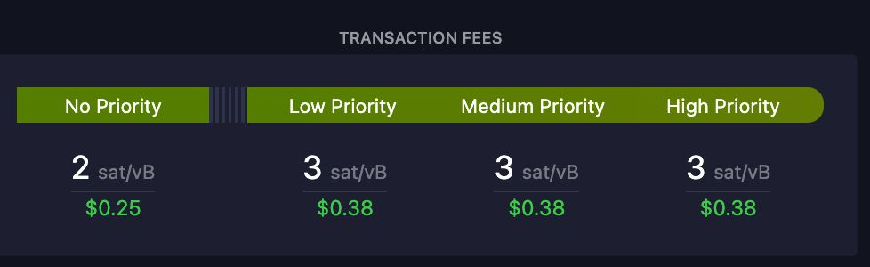
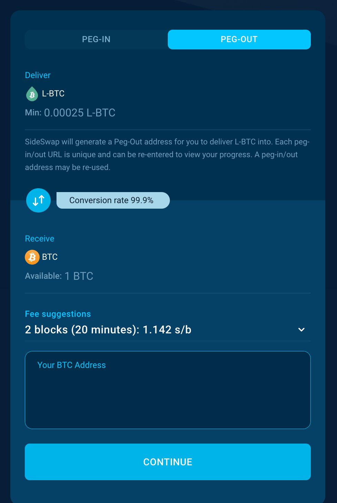
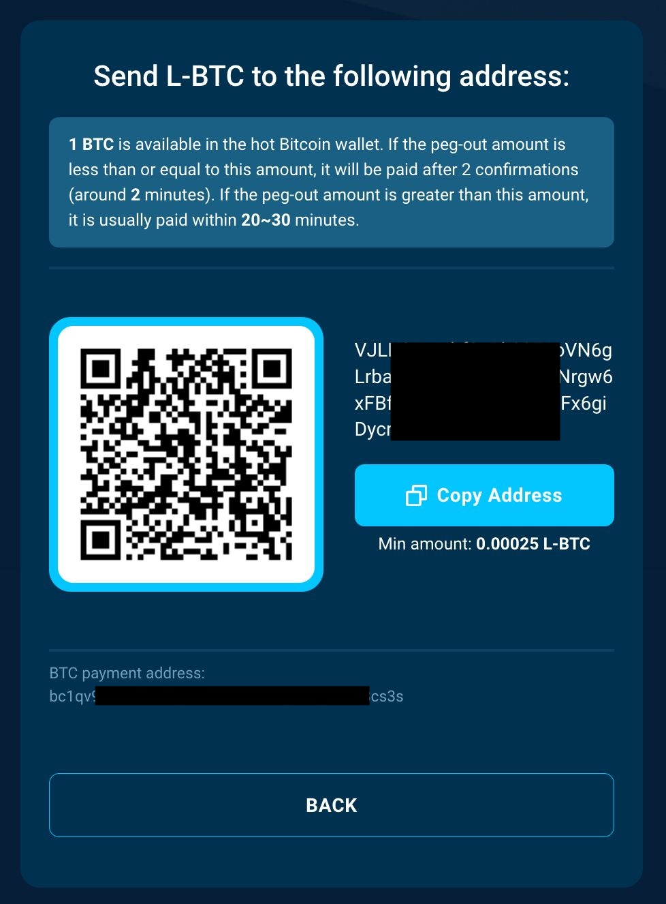
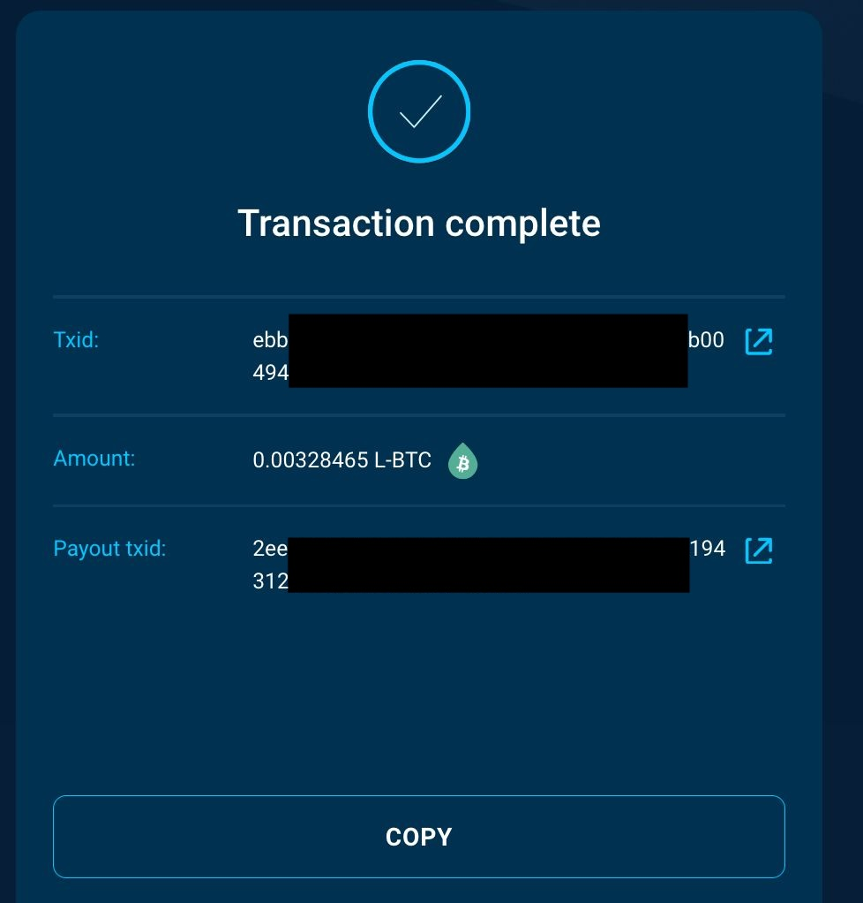
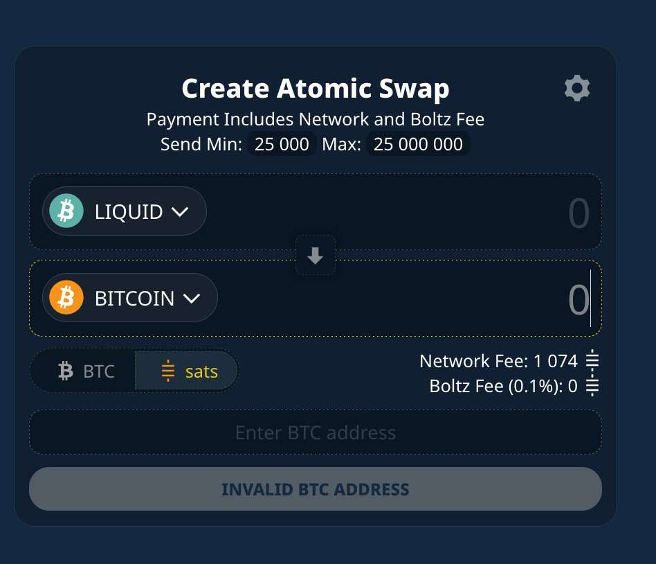
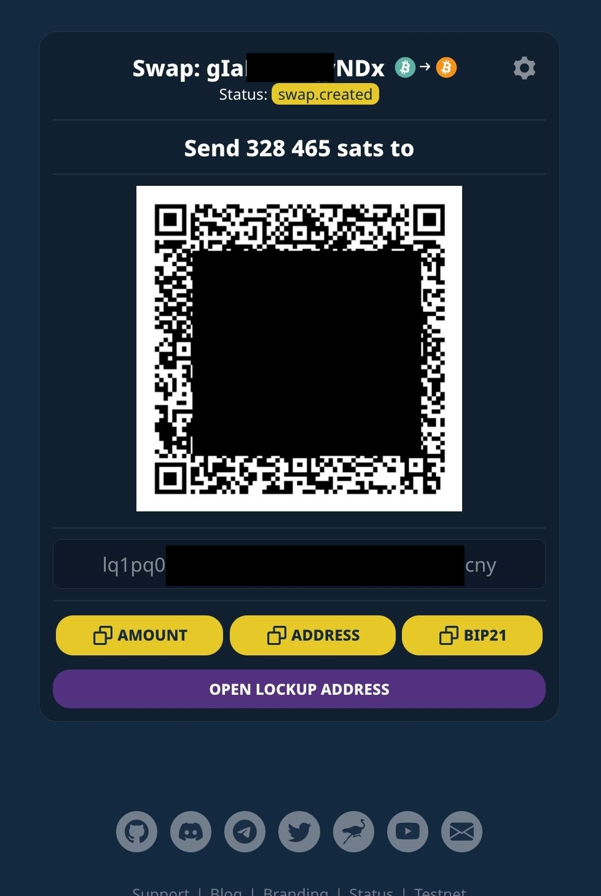
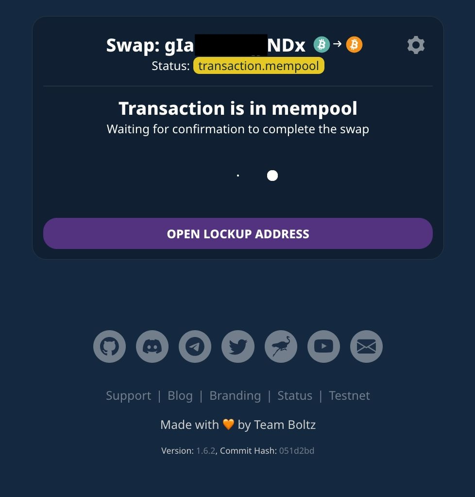
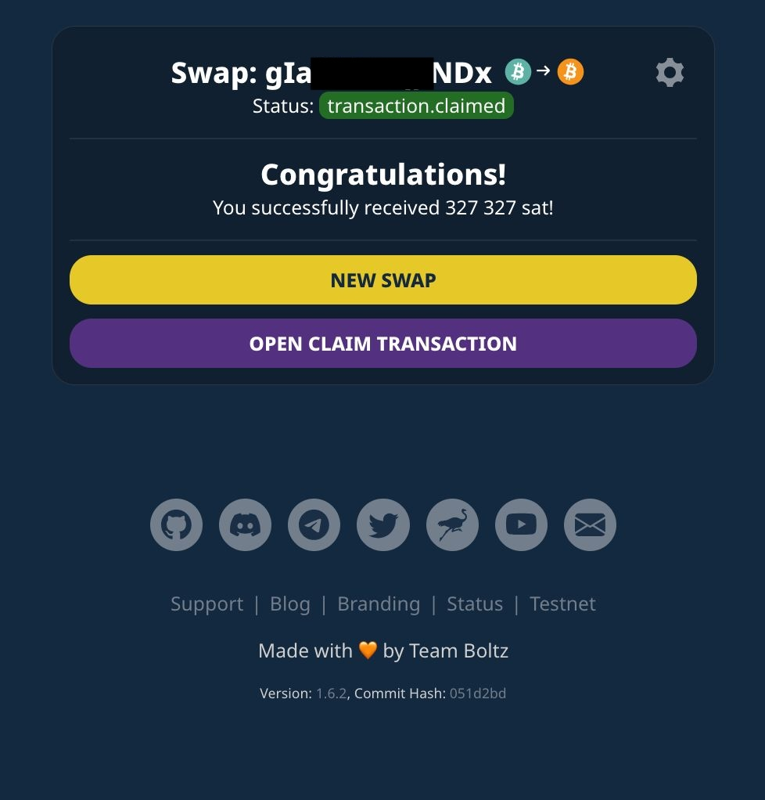

Tags: Blog, Liquid, Wallets
Link: /liquid-bitcoin-sideswap-boltz
Summary: Moving funds between Liquid and Bitcoin, test of SideSwap vs. Boltz services, fees and technical differences.
Date: 2025-03-06 11:00
Thumbnail: _SideSwap-vs-Boltz-result.jpeg

# From Liquid to the Bitcoin blockchain - SideSwap vs. Boltz

In case the transaction fees on the Bitcoin blockchain rise, it might be cost efficient to use either the [Lightning Network or the Liquid sidechain](/difference-bitcoin-lightning-liquid-ecash) to send funds. Recently I helped someone move their Liquid funds back to the Bitcoin blockchain. We took that opportunity to test two services that enable users to do this in both directions, which are [SideSwap.io](https://sideswap.io/peg-in-out/) and [Boltz](https://boltz.exchange). 

The big differences between the two are that 
* **SideSwap is a custodial** service, whereas **Boltz uses atomic swaps and never takes custody of your funds**
* SideSwap lets you choose the amount to send in your wallet, which gives more flexibility, whereas in Boltz you need to decide in the first step on their service page how much you want to swap. 

To send Liquid to the services we used the [Green wallet](/green-wallet-tutorial). We decided to test an amount of 300 USD, which was at that time 328,465 sats (0.00328465 BTC).

The [transaction fees](/save-small-amounts-bitcoin) on BTC were at 3 sats/vbyte at the beginning of the test, they went up to 4 sat/vByte for High Priority for a short time, but went back to 3 to the end the test. The conditions were the same for each service.

## SideSwap peg-out steps

On the first screen of [SideSwap](https://sideswap.io/peg-in-out/) we can select our BTC payout address and choose the confirmation speed on the Bitcoin bockchain.

### Liquid address

Then Sideswap reveals the Liquid address to send your L-BTC to. We copied this into the Green Wallet, chose the amount and sent L-BTC to it. 

### Transaction detected

Sideswap then showed us that it has detected our transaction. Sideswap needs to wait for 2 confirmations on Liquid, which is quite fast as the confirmation time on Liquid is only 1 minute, afterwards the bitcoin are released and wait to be settled in the mempools. 

### Transaction completed

As soon as the transaction is confirmed by the Bitcoin miners the peg-out is completed.

## Boltz swap steps

On https://boltz.exchange you have to add your BTC address and the amount for the swap on the first screen. 

### Liquid address

Then Boltz presents a Liquid address and the QR code, we used the Green wallet to send the amount which was already included, we didn't need to enter it. 

### Transaction is in mempool

The transaction is immediately moving to the mempools, no need to wait for a confirmation as the swap is done via the Lightning Network. 

### Transaction completed
As soon as the transaction is confirmed by the Bitcoin miners it is completed.

## Result: Self-Custody is priceless, but more expensive in the short run

The total fees on SideSwap were 583 sats, on Boltz 1,165 sats (0.18% vs 0.36% / 0.53 vs 1.06 USD), that means we received 327,908 sats vs. 327,327 sats on the Bitcoin blockchain.

The clear result is that centralized, custodial services can be more cost efficient as non-custodial means. Liquid is a federation that is holding your funds in a multisig on the Liquid chain, a Liquid wallet gives you the seed for your L-BTC, so you are have the power to move your funds, but have to trust the Liquid federation that the different signers (companies) don't collude and steal your money. Adding to that you also have to trust SideSwap, when you peg-in or peg-out. 

The same is of course true for Liquid, when you swap via Boltz, but this swap is trustless as Boltz never has custody over your L-BTC. 

Regarding the speed: SideSwap was lucky as a Bitcoin block was confirmed immediately after bitcoin was released from Liquid, bitcoin was settled in 2 minutes. With Boltz it could have been the same, if it wasn't for the long confirmation time of 32 minutes for the next Bitcoin block.
