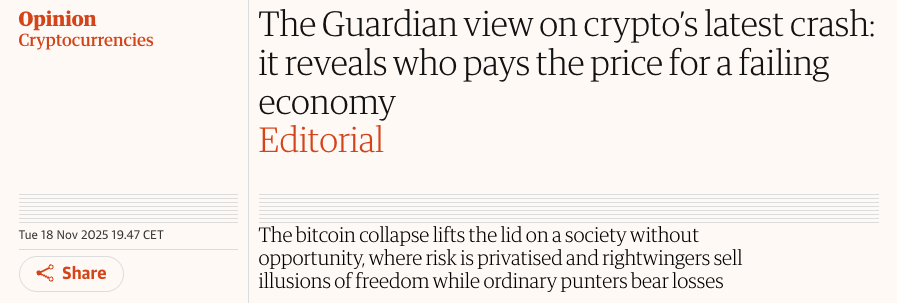

# Bitcoin Is Not Crypto: A Response to The Guardian

Since 2009, Bitcoin has grown from an experiment to a global monetary network used by millions. It's not only a high-performing asset, but also a tool for financial sovereignty. Yet many media organizations still frame Bitcoin as pure speculation—useless at best, harmful at worst. Whenever the market price falls, the same narratives resurface.

In November 2025, [The Guardian published another editorial making this case](https://www.theguardian.com/commentisfree/2025/nov/18/the-guardian-view-on-cryptos-latest-crash-it-reveals-who-pays-the-price-for-a-failing-economy). It opens with:

> The key to understanding crypto is that it has no “value” in any economic sense.

With years of experience in Bitcoin education and adoption across the Global South, I felt compelled to send a letter (max. 300 words) addressing these misconceptions. My letter was not published, but I want to share it here.

## Why Bitcoin Is Unique

I've spent years in Zimbabwe, South Africa, and Zambia learning about people's real financial problems. What I've seen is completely different from what The Guardian describes.

I've met teachers saving their wages when their currency collapses, farmers receiving remittances without losing 20% to corrupt middlemen, and human rights activists whose bitcoin can't be frozen by authoritarian governments like their bank accounts. For them, Bitcoin isn't speculation or gambling. It's a way to survive when traditional money fails.

The Guardian writes from a privileged place where state-backed money is somehow stable. That's not the reality in much of Africa. When your national currency gets manipulated and becomes worthless, Bitcoin's volatility looks very different. 

Bitcoin is not crypto. Crypto is a caricature of Bitcoin. Stop conflating them, they're not the same. Bitcoin was created after 2008 as an alternative to a broken financial system—one built on cheap credit and endless growth that makes the rich richer and ruins our environment. Crypto enriches creators through insider deals and scams.

I agree: Trump's World Liberty coin is a pump-and-dump scheme. Meme-coins are gambling. Worldcoin harvests biometric data from Africans for profit. Solana and similar projects are centralized. Crypto-trading to get rich quick is a losing game for regular people.

But Bitcoin is different. No one controls it. Anyone can use it without asking permission. It can't be censored. New monetary technology takes decades to stabilize—maybe 50 years to reach mass adoption. These price crashes are part of that journey, but it's still the best-performing asset of the past decade.

Exploiting people through crypto is wrong. That's not Bitcoin's fault—that's what bad actors do with open technology.

