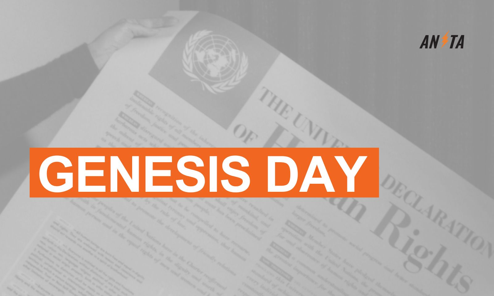

# Genesis Day

On Jan 3, 2009 the Bitcoin network went online with the first public block being mined. Today on Jan 3, 2026 the USA under President Trump went to war against Venezuela to "run the country" and "make it great again". Just ten days before the USA bombarded parts of Nigeria to take out ISIS militants and protect Christians. Coincidentally both countries are rich in oil and natural resources. Trump also said: “American dominance in the western hemisphere will never be questioned again.”

It's the usual interventionism that they sell us as "in the name of peace - to install democracy" when in reality it's an imperialistic power grab financed with your tax money, in your name.

This is possible with state money. Non-state money like bitcoin in self-custody gives agency back to the people. Bitcoin is an exit strategy, and this is what it was made for - money that can't be taken away from us to finance their wars.

---
<small>Sources:</small>
<small>[US attacks Venezuela](https://www.theguardian.com/world/2026/jan/03/why-trump-us-attacked-caracas-captured-venezuela-president-nicolas-maduro); [Strikes on Nigeria](https://edition.cnn.com/2025/12/26/africa/trump-christmas-strike-jabo-nigeria-latam-intl)</small>

