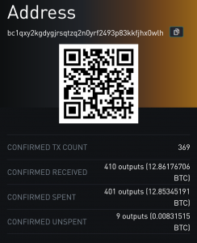

Title: Bitcoin was never hacked. Twitter was.
Link: /bitcoin-was-never-hacked-twitter-was
Date: 2020-07-16
Tags: Learn Bitcoin, Blog

# Bitcoin was never hacked. Twitter was.

On July 15th 2020 Twitter was severely hacked. Prominent and verified accounts like the ones of Elon Musk, Bill Gates, Joe Biden, Kim Kardashian and many others sent out tweets asking for Bitcoin.
Seems that the hacker got access to one of the Twitter employees keys, which is frightening.

Centralized platforms will always be the target of hackers. The honeypot is too big to not try. There will always be a race between security efforts on centralized platforms and hackers. There will always be <a href="https://anitaposch.com/what-is-a-ponzi-scheme/">scammers and hackers</a> exploiting people’s yearning for money and tricking them into believing that there is something like free give away money. Why? Because they always find victims, who send them money.

  <a href="https://blockstream.info/address/bc1qxy2kgdygjrsqtzq2n0yrf2493p83kkfjhx0wlh" rel="noopener noreferrer" target="_blank">see blockchain data</a>

Twelve bitcoin have been sent to the hackers address until now. That’s not much given the fact that so many prominent accounts were compromised. Maybe Bitcoin users on Twitter are more aware of the fact, that there is no free money. Many of them are financially literate, many prominent bitcoin accounts tweeted very early about the hack and warned their followers.

The hacker wanted Bitcoin. Not any other cryptocurrency. It shows that Bitcoin is the most sought after money, the most valuable one. If you think that this could not have happened without Bitcoins existence, think twice: you do not blame USD or Euros, when a bank is robbed or someone is kidnapped and the kidnappers demand 1 Mio Dollar ransom. 

Holding the keys for user accounts on centralized platforms is a high risk. In a decentralized system such a hack is not possible, because each user holds their own keys. Hackers can steal the account information of one user at a time, which is painful for the compromised user, but can do much less harm on a greater scale.

Bitcoin is a transparent system, that's why we know how much money the scammer got. Imagine <a href="https://anitaposch.com/what-is-a-ponzi-scheme/">how many scams</a> have never been and will never be public, because they happen behind closed doors. 
