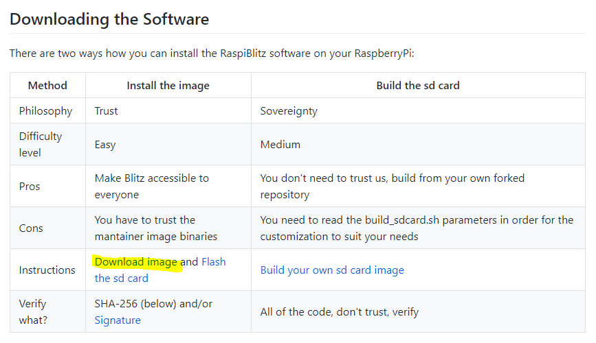
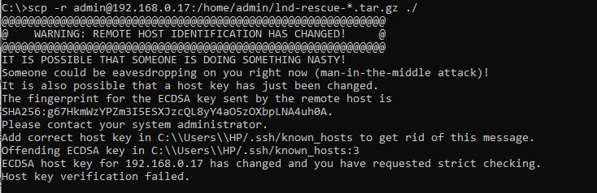
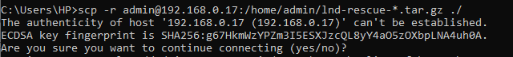
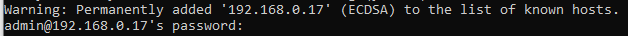
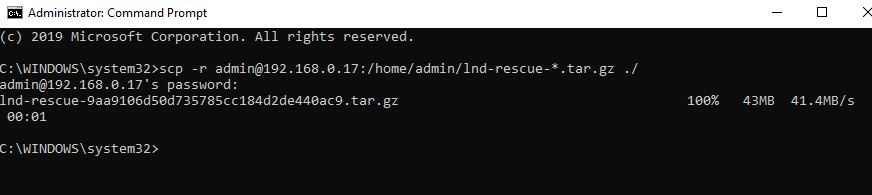
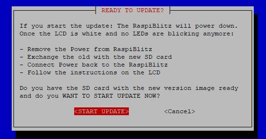
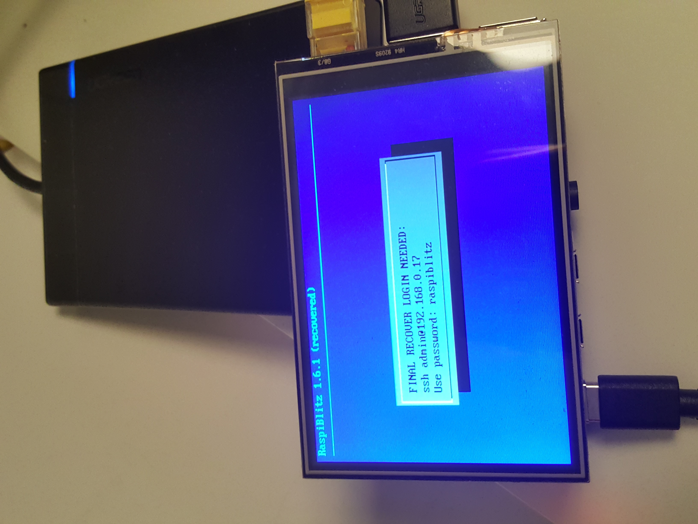

# Documentation of my RaspiBlitz 1.7 upgrade

I am a Windows user, I have some very basic BASIC knowledge. I know how to build websites with HTML, PHP and MySQL, but I am not a coder. I have difficulties using GitHub and how to handle the Command window and PuTTY.
<a href="https://bitcoin-austria.at/raspiblitz-lightning-network-building-workshop/" target="_blank" rel="noopener noreferrer">I set up my first RaspiBlitz at a Bitcoin Austria workshop in Feb 2020</a>. This device was a present to Alakanani Itireleng and the Satoshicentre in Botswana (our interview below).

<iframe src="https://www.vodio.fr/frameplay.php?idref=25622&urlref=1" style="border: 0px none; box-shadow: rgba(0, 0, 0, 0.28) 0px 0px 10px; width: calc(100% - 10px); height: 180px; margin-left: 5px; padding: 0;" scrolling="no"></iframe>

In July 2020 I set up a new RaspiBlitz for myself with the help of a friend from Bitcoin Austria, who also assisted me in the upgrade process. To be honest: I could not have done that without my friends. This is what makes Bitcoin and open source software so great. You are getting support from other people and I am learning every time.
The purpose of this documentation is to have a guide for the next upgrade for myself and maybe it is helpful for somebody else too.

(The upgrade to 1.6.1 took about 3 hours in total. Maybe be less, because I wrote this article at the same time and had to communicate with my friend in between.)
The update to 1.6.3 took 1.5 hours.
The update to 1.7 took 1.75 hours.

<a href="https://github.com/rootzoll/raspiblitz/blob/v1.6/FAQ.md#how-to-update-my-raspiblitz-since-12" target="_blank" rel="noopener noreferrer">Official Documentation How To Upgrade</a>

## Download file
Go to <a href="https://github.com/rootzoll/raspiblitz" target="_blank" rel="noopener">https://github.com/rootzoll/raspiblitz</a> and search for the file <strong>Download image</strong> download current img.gz file

## Open PuTTY and in the RaspiBlitz Main Menu go to UPDATE
Choose "RaspiBlitz update/recovery"
Start Update

(I did not use a second SD card as advised. I took the one inside the RaspiBlitz and updated it.)

## Make Backup
Then it asks you to make a backup of your lnd data or you can skip
I did not skip, I made a backup of my lnd data
therefore it tells you to open a CMD window and enter:

<code>scp -r 'admin@192.168.0.17:/home/admin/lnd-rescue-*.tar.gz' ./</code>

This did not work, I had to remove the ' at the beginning and end

<code>scp -r admin@192.168.0.17:/home/admin/lnd-rescue-*.tar.gz ./
</code>

<strong>Scroll down for v 1.7</strong>

In Version 1.6.1 this disturbing message showed up

My friend told me to delete the known_hosts file. So I changed to the directory with

<code>cd ..  | Goes up one folder
cd users  | Goes into folder users</code>

and then
<code>C:\Users\HP\.ssh&gt;del known_hosts</code>
Then I tried again

My reckless friend told me: YES so I put in yes

Result was another warning and the possibility to put in my Password A for the Raspiblitz, which is starting the download

Then it lost connection and I started the download again.

This downloaded the data into the directory, where I put in the command. For instance:
<code>C:\Users&gt;scp -r admin@192.168.0.17:/home/admin/lnd-rescue-*.tar.gz ./</code>

File is downloaded to C:/Users

In Version 1.7 I did not have above problems:

## Flash SD Card
After the download you can proceed in the PuTTY window with ENTER
And followed by this screen:

Choose START UPDATE - this powers the Raspiblitz down and you can take the SD card out of it and put it into your PC. Then you go to the IMG file for the new upgrade that you downloaded in the first step and flash the SD card with Balena Etcher software.

This takes some time. After completion put the SD card containing the updated RaspiBlitz files back into the RaspiBlitz and turn it on.

## Booting and rebooting
The device is booting and rebooting and starting to install services. This takes some hours.
Afterwards you have to reset password A (you can take the same PW as you had before).

It is shutting down and rebooting a final time. This takes some minutes. Then enter password C.
Then the node is syncing and is finally up and running again. After about one minute all the lightning channels are back again too.

Sidenote:
If you need to start the RaspiBlitz menu new, the command is

<code>raspiblitz</code>
OR
<code>/home/admin/00mainMenu.sh</code>