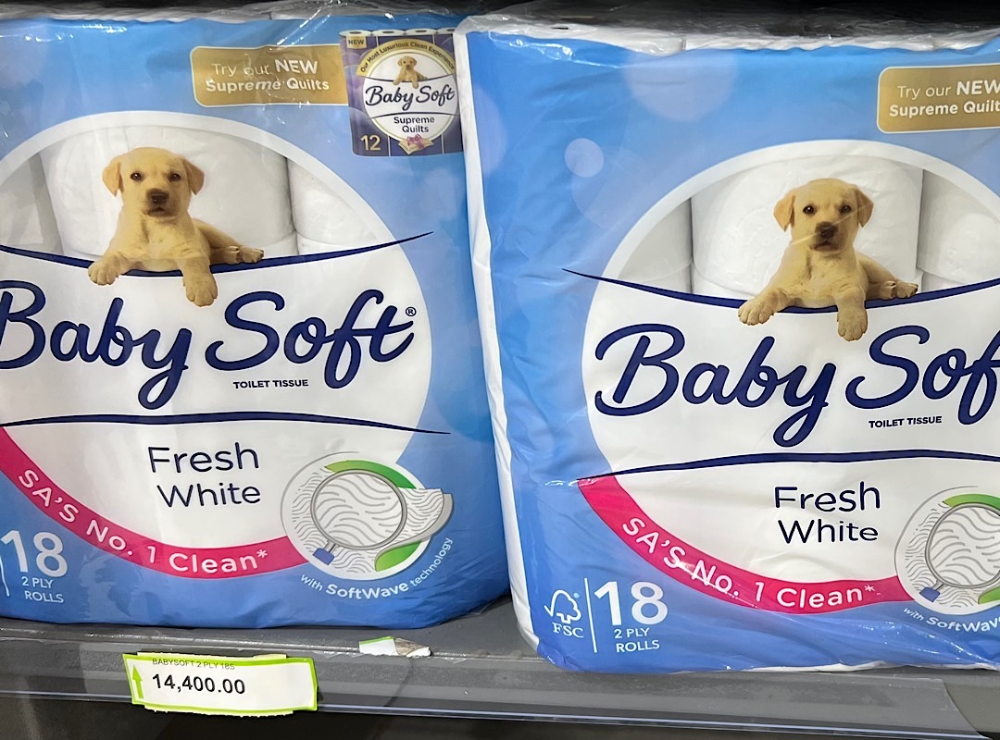
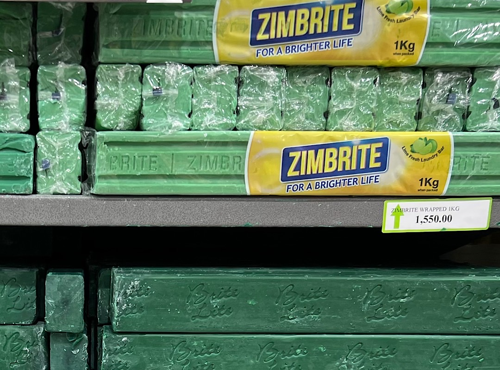
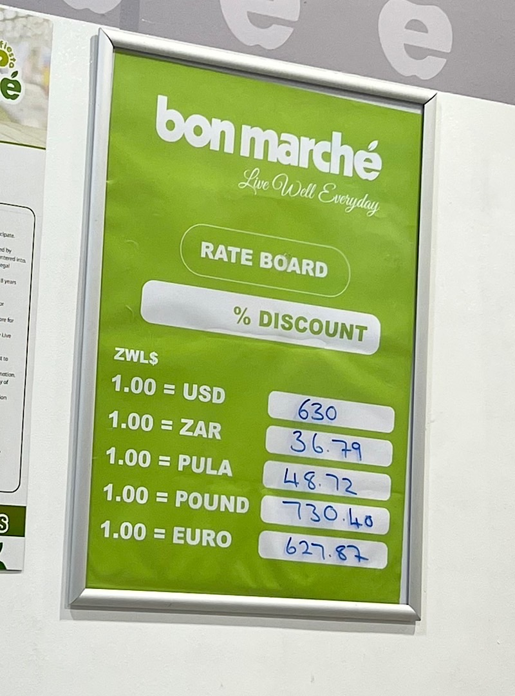

# Finding the best deals in Zimbabwe

Yesterday [I wrote about the price of toilet paper in Zimbabwe](shopping-with-two-currencies-in-zimbabwe). Well, guess what? Today we saw the same toilet paper in another store for more than double the price. Instead of 10 USD, it costs 23 USD. That's not due to inflation though, it's just that there are these huge price differences depending on where you go. You need to find out where you can find the best deals and you need a car or the money to drive around in Mini buses. Something that not all people have. 

While the price tags in the smaller shops are in USD - in this big supermarket they are in Zimbabwe Dollar, because this is the legal tender. USD is accepted too. Supermarkets like these co-exist with the smaller shops and informal stands on the side of the streets.

Since the exchange rates to the Zimbabwe Dollar change all the time many shops have these boards showing the daily rate. Depending on the rate the shop uses you then decide if you pay in USD or RTGS (Real Time Gross Settlement = digital Zimbabwe Dollar)

We exchanged USD to Zimbabwe Dollar with a friend today, who is working for an international law firm and is paid in RTGS. I asked her, if the RTGS payment is adjusted to the inflation. She said yes, but it's always lagging behind. Her salary in RTGS is growing but slower than inflation. Shows the Cantillon effect - people close to the central banks and money production profit more from newly issued money than the rest of the people - in a different form. After that we went to a coffee shop and asked if we can pay in bitcoin. The young waiter smiled and shook his head. I said, "but you know that bitcoin isn't a scam? He answered: "Yes, I'm trading bitcoin sometimes." I replied: "Good for you."

---

---

You like Anita Posch's work and efforts with [Bitcoin for Fairness](https://bffbtc.org) to foster Bitcoin adoption on the ground in the Global South? It's all community powered and funded by donations. Feel free to [support our work with a donation](https://anita.link/donate) or send sats to our Lightning address: bffbtc@getalby.com.