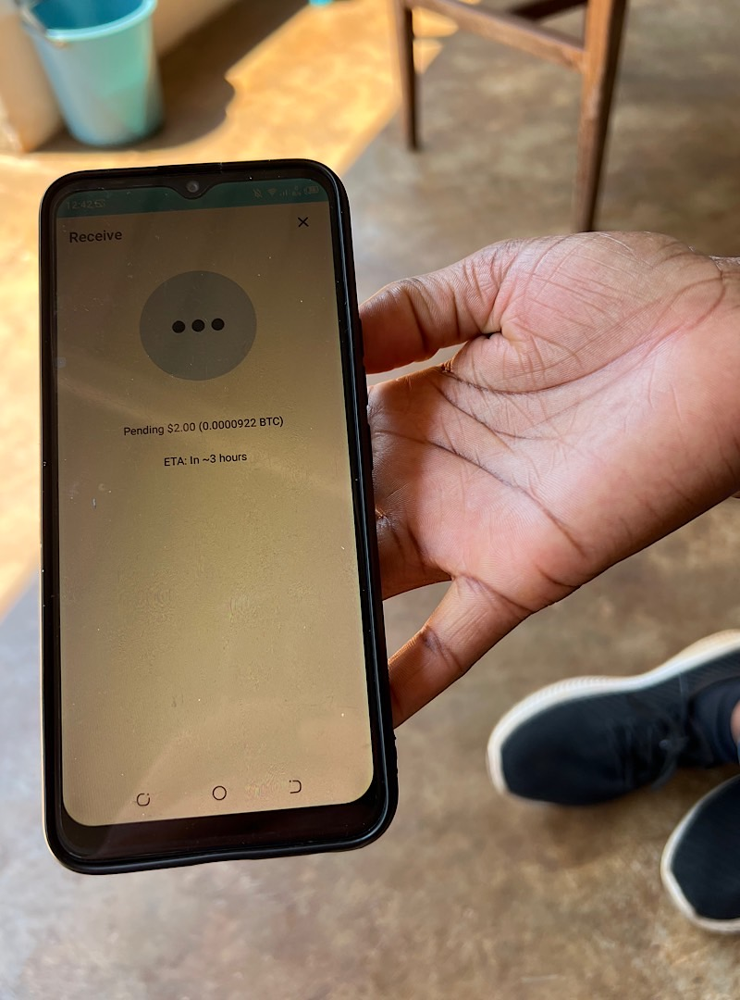

# P2P Adoption 

It’s Sunday and I treated myself with a massage by a therapist. A young woman, who came to our house. We spoke a little bit about life and the hardships of Zimbabwe and when I told her that I’m a Bitcoin educator, she sounded interested to learn more. 

While I was talking about the advantages of using bitcoin she asked if she needs to bring friends and how she can join Bitcoin. I told her that people who require to bring friends or pay for a starter package are scammers. 

We talked about the price of bitcoin, how it is derived from supply and demand and how it is changing over time. After a chat about the banking situation in Zimbabwe she asked which wallet she should install. I explained the differences between Bitcoin and Lightning and she installed Wallet of Satoshi for fast micropayments and Blue Wallet for on-chain savings. I tipped her lightning and bitcoin to see how it works.

After finishing the massage she wanted the payment in USD, which I understand, because it’s the currency that she can use daily. She said, she will use Bitcoin as a savings tool, because she was very fast in understanding that with the price at 20k and not 60k is a good time to start.

---

You like Anita Posch's work and efforts with [Bitcoin for Fairness](https://bffbtc.org) to foster Bitcoin adoption on the ground in the Global South? It's all community powered and funded by donations. Feel free to [support our work with a donation](https://anita.link/donate) or send sats to our Lightning address: bffbtc@getalby.com.