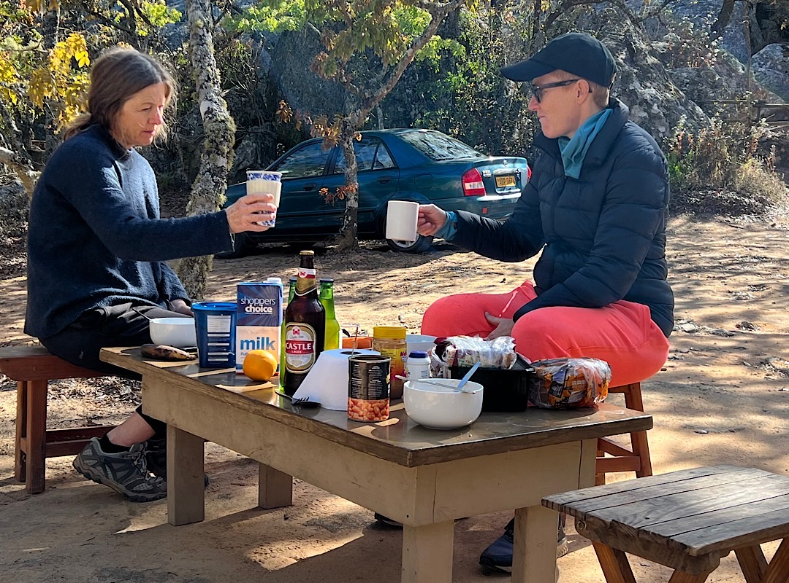
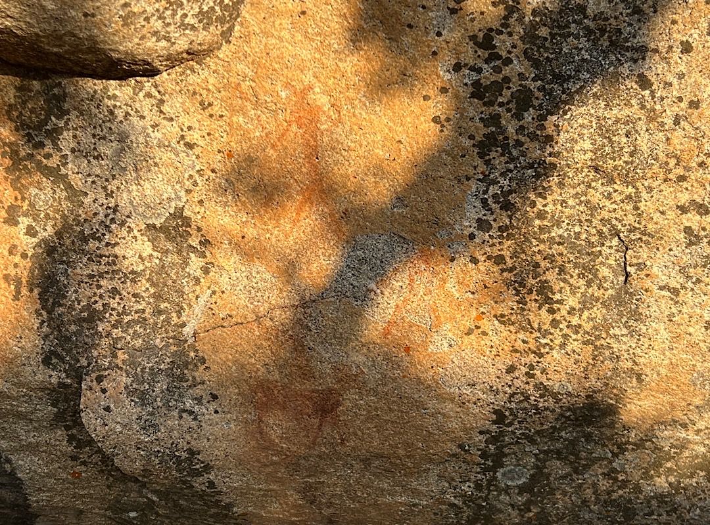
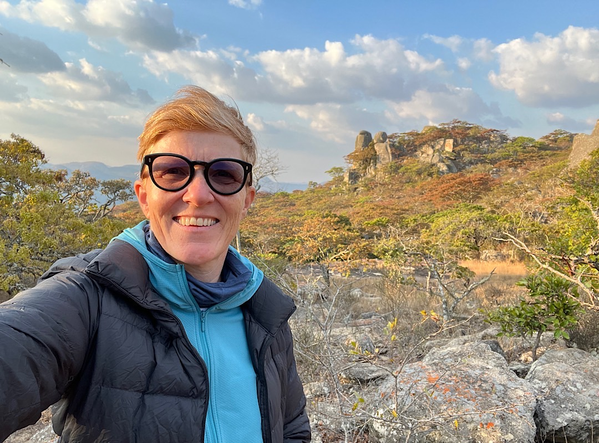
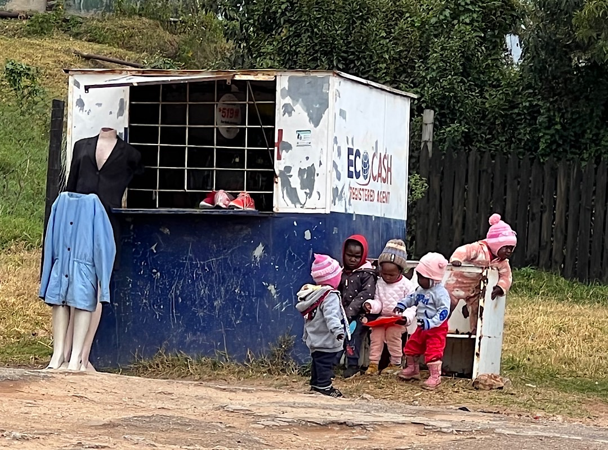
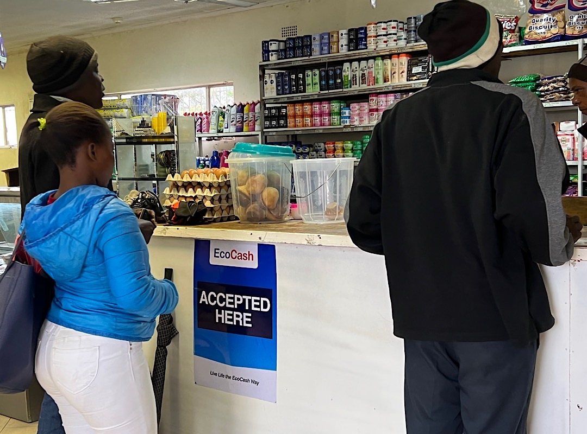
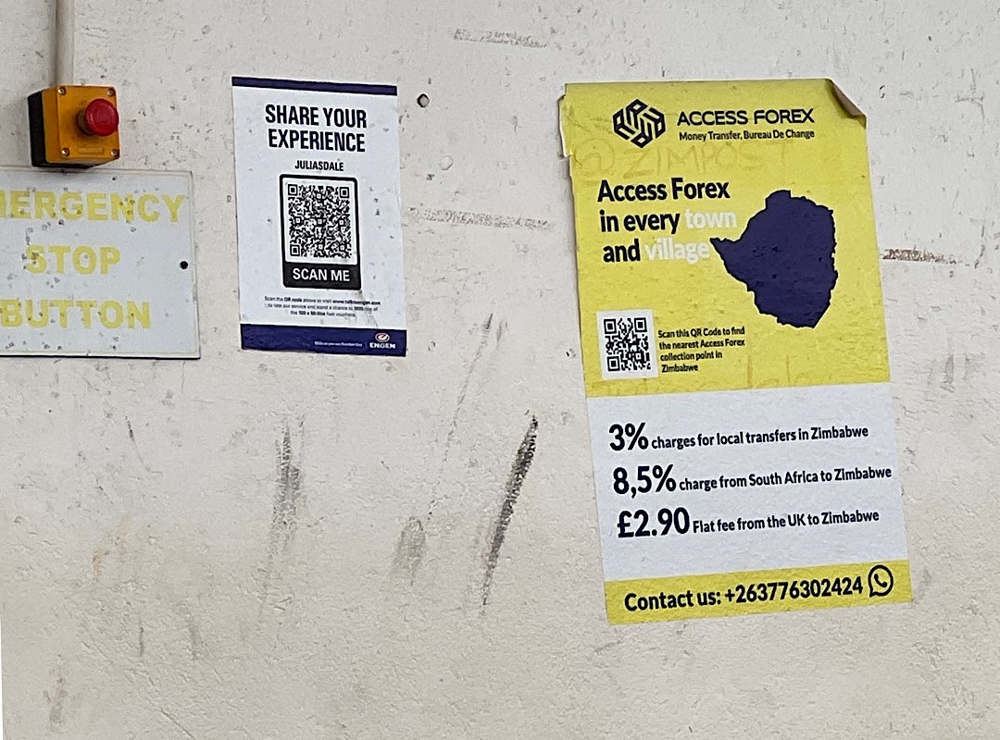

Tags: Blog, Zimbabwe, Nomad Diary
Link: /send-money-from-zimbabwe-to-south-africa-with-zero-fee
Date: 2022-10-02
Summary: An outing to the Eastern Highlands of Zimbabwe with camping, stunning views, ancient rock paintings and in this remote area I wanted to test Bitcoin payments.
Thumbnail: assets/_2022-09-14-BitcoinEkasi-invoice.jpg

# Sending money from Zimbabwe to South Africa with almost Zero fees
Middle of September we did a tour from Harare to the Eastern Highlands in Zimbabwe. It's interesting how my perception of Africa is changing by seeing all the different landscapes. I guess many people who aren't from the continent believe that Africa is only deserts. Red sand and dunes. But Zimbabwe is a very green country. The colors of the trees when they are blooming are stunning. It's September and this is spring. Many trees are blooming and others are losing their leaves. It looks a bit like autumn in Europe. The Eastern Highlands are famous for their red leaved trees in spring. It reminded me of Indian Summer in Maine, USA. The leaves are only red for a few days and then they turn green.

We were camping for a night on a camp site in the middle of nowhere. The area is know for its scenic views and its most probably several thousands of years old rock paintings. We did a short hike to see some rock paintings and the sunset. The next day we drove to World's View where you get a stunning view from high up on a plateau, at the edge of a sheer 800 meter drop one can see mountain ridges as far as the eye can see.

On the way there we stopped at Rhodes Nyanga Hotel, which was famous for its view, cones and coffee, but it was closed for renovation. "The founder of the original country of Rhodesia (now Zimbabwe), Cecil John Rhodes first visited Nyanga in the Eastern Highlands of the country in 1897. Captivated by the unspoilt and breathtaking beauty of the area, he immediately purchased a parcel of farms totaling 40,000ha and then proceeded to import cattle from Mozambique and develop extensive plantations of apple and fruit trees. When he died in 1902, Rhodes bequeathed most of the estate to the nation, and this now forms the Rhodes Nyanga National Park. Rhodes's original farmhouse has been meticulously preserved and is now the Rhodes Nyanga Hotel." [Cecil Rhodes' Wikipedia](https://en.wikipedia.org/wiki/Cecil_Rhodes)

The original homestead on the Estate was modernized to form the present Rhodes Nyanga Hotel in 1933, about three decades after his death. It was the only hotel in the Nyanga National Park with the [verandah](https://www.rhodesianstudycircle.org.uk/rhodes-inyanga-hotel/) overlooking the Rhodes Dam and the typical Nyanga mountain scenery. 

Standing on the verandah I had the idea to send a bitcoin payment to the [Bitcoin Ekasi](https://twitter.com/BitcoinEkasi) folks in South Africa. I wanted to see, if I could send from my own lightning node (hosted by [Voltage](https://twitter.com/voltage_cloud)) to Ekasi's donation page. Since I had to use the mobile hotspot of my friends phone and the internet connection was very slow it took some seconds to connect my [Zeus](https://twitter.com/ZeusLN) wallet to my node. 

As soon as I pasted the Lightning invoice the payment was sent within a second. This is really something special, because usually you can't make these payments so easy and fast. Lightning payments are immediately settled. You're not going through any intermediaries. My own lightning node is basically a full bank. All the bitcoin I receive on my node are validated by the Bitcoin software. I don't need a bank to verify that my payment worked. Same on the recipients side. It's very expensive to send a payment from Zimbabwe to South Africa and it always entails a lot of red tape since there are foreign exchange controls too. I sent 21.000 sats which is 4 USD. That's not even possible with fintech companies. With Access Forex for instance you have minimum payment limit of USD 10.

The fee was almost Zero, I paid 5 sats for this payment, which is under 1 USD cent, it was exactly 0.00095 USD. If I had used below fintech I had been charged 8.5% which is 0.35 USD compared to 0.00095 USD, which is 0,024%.

Last but not least: as soon as one receives the payment with Access Forex one has to visit one of their outlets to collect the money, which means that one has to pay for transport additionally one has the risk of being robbed. Bitcoin your receive directly into your mobile wallet. 

I was writing on Twitter that I was sure that it was the first payment from that remote area directly from a Lightning node to South Africa. I received some laughs from Zimbabweans in the comments on Twitter, who told me that I haven't been the first one. Of course I know that Zimbabweans have been using bitcoin already. But I still believe that I was the first with that special setting. Anyhow. It's not important who was first. It's great that I found out that the people living in that rural area are using bitcoin.

https://twitter.com/AnitaPosch/status/1570502853575450626

---

You like Anita Posch's work and efforts with [Bitcoin for Fairness](https://bffbtc.org) to foster Bitcoin adoption on the ground in the Global South? It's all community powered and funded by donations. Feel free to [support our work with a donation](https://anita.link/donate) or send sats to our Lightning address: bffbtc@getalby.com.