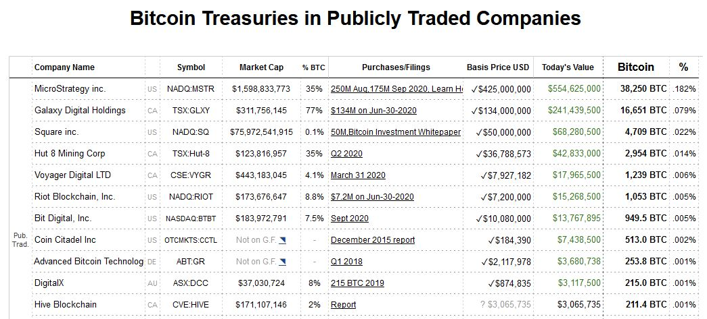

Link: /anita-s-weekly-1-nov-6th-2020
Tags: Learn Bitcoin, Weekly, Blog
Date: 2020-11-06

# Bitcoin Treasuries in Companies

## Articles
- [9-Bitcoin Treasuries in Publicly Traded Companies](9-Bitcoin%20Treasuries%20in%20Publicly%20Traded%20Companies.md)
-  [Ant, Uber, and the true nature of money](https://pluralistic.net/2020/11/05/gotta-be-a-pony-under-there/#jack-ma), Cory Doctorow
  

## Videos
-   [Scary Stories of Cryptoween](https://youtu.be/ZoirqYveaOs?t=51) - Livestream with Andreas M. Antonopoulos & special guests

## Podcast recommendations
-   [Fodé Diop: Bitcoin in Senegal](https://bitcoinundco.com/en/fode-diop/)
-   Meltem Demirors and Lyn Alden [on the Perfect Conditions for Bitcoin](https://unchainedpodcast.com/why-bitcoin-now-meltem-demirors-and-lyn-alden-on-the-perfect-conditions-for-bitcoin/)
-   [Yuval Noah Harari](https://tim.blog/2020/10/27/yuval-noah-harari/) on The Story of Sapiens, Forging the Skill of Awareness, and The Power of Disguised Books
-   [Seth Godin](https://tim.blog/2020/10/26/seth-godin-the-practice/) on The Game of Life, The Value of Hacks, and Overcoming Anxiety

## Bitcoin price
$15,461.74 | €13,026.70

<small>No financial advice. DYOR.</small>

---
## Subscribe to (L)earn Bitcoin

[Subscribe for my weekly newsletter. It's free.](https://anita.link/weekly)

---