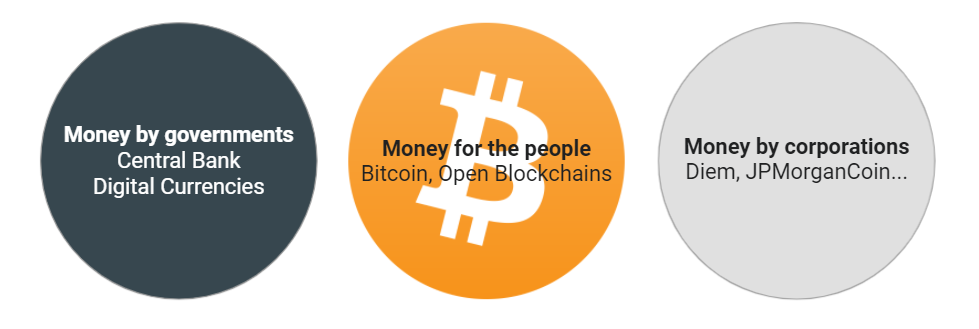

Tags: Weekly, Learn Bitcoin, Blog
Link: /petrodollar-bitcoin
Date: 2021-09-03 09:00
Summary: Basics of Bitcoin: The Petrodollar System
Thumbnail: assets/_new-forms-money.png

This is a series about the history of money and the current financial system taken from my book [(L)earn Bitcoin](https://learnbitcoin.link)

Pt. 1 [The evolution of money](https://anitaposch.com/evolution-money)  
Pt. 2 [How money is created](https://anitaposch.com/money-creation)  
Pt. 3 [Central banks and inflation](https://anitaposch.com/inflation)  
Pt. 4 [Bitcoin is not a Ponzi scheme](https://anitaposch.com/bitcoin-is-no-ponzi-scheme)  
Pt. 5 Today's Petrodollar System

# Today's Petrodollar System

Now that we have discussed [how money is created](https://anitaposch.com/money-creation), let's dive into the world of currency wars and how this system of national currencies is exclusive and has, historically, been dominated by different empires.

## Currency Wars

The history of currency wars is long. "Over the past century the world went from a gold standard system, to the Bretton Woods system, to the Petrodollar system. Each system mostly unraveled from within rather than being brought down externally, and each time one system transitioned to another, a significant and widespread currency devaluation occurred."[^17] 

The British monetary hegemony lasted from 1871 to World War I. Back then a nation's currency was pegged to gold. After the interwar period, when monetary power began to decentralize, the United States emerged as the central money powerhouse after the allied victory in the Second World War. The Bretton Woods system, founded in 1944, was the first example of a fully negotiated monetary order, intended to govern monetary relations among independent states. It set a system of rules, institutions, and procedures to regulate the international monetary system, like the International Monetary Fund (IMF). The United States, which controlled two-thirds of the world's gold, insisted that the Bretton Woods system rests on both gold and the US dollar. Soviet representatives attended the conference but later declined to ratify the final agreements, insisting that the institutions they had created were "branches of Wall Street". This can be interpreted as the starting point of the Cold War.

## From the Gold Standard to the Oil Standard

On 15 August 1971, the United States, lead by President Richard Nixon, unilaterally terminated the convertibility of the US dollar to gold, effectively bringing the Bretton Woods system to an end and rendering the dollar a fiat currency. At the same time, many fixed currencies (such as the pound sterling) also became free-floating.

Today's monetary system is built on the Petrodollar. Lyn Alden describes this in her article "The Structure of the Global Monetary System":

"Beginning in 1971 after the breakdown of the Bretton Woods system, currencies around the world all became fiat currencies, and the global monetary system became less ordered. This was the first time in human history that this happened, where all currencies in the world at the same time were rendered into unbacked paper.

Fiat currency is a monetary system whereby there is nothing of value in the currency itself; it’s just paper, cheap metal coins, or digital bits of information. It has value because the government declares it to have value and that it is legal tender to pay all things including taxes.

A country can enforce the usage of a fiat currency as a medium of exchange and unit of account within their country by making all taxes payable only in that currency, or by enacting other laws to add friction to, or in some cases outright ban, other mediums of exchange and units of account. If their currency has a big enough problem, though, as is the case for many emerging markets, a black market will develop for other mediums of exchange, such as foreign currency or hard assets.

A fiat currency can face particular problems when trying to be used outside of its home country. Why should businesses and governments in other countries accept pieces of paper, which can be printed endlessly by a foreign government and have no firm backing, as a form of payment for their valuable goods and services? Without a real backing, what is it worth? Why would you sell oil to foreigners for paper?

In the early 1970’s, there were a variety of geopolitical conflicts including the Yom Kippur War and the OPEC oil embargo. In 1974, however, the United States and Saudi Arabia reached an agreement, and from there, the world was set on the petrodollar system; a clever way to make a global fiat currency system work decently enough....With the petrodollar system, Saudi Arabia (and other countries in OPEC) sell their oil exclusively in dollars in exchange for US protection and cooperation. Even if France wants to buy oil from Saudi Arabia, for example, they do so in dollars....In return, the United States uses its unrivaled blue-water navy to protect global shipping lanes, and preserve the geopolitical status quo with military action or the threat thereof as needed....Some of us, particularly near the top of the income ladder, directly or indirectly benefit from this system. Americans who work around finance, government, healthcare, and technology get many of the benefits of living in the hegemonic power, without the drawbacks. On the other hand, Americans who make physical products tend not to benefit, because they lost their jobs or had their incomes suppressed, and thus haven’t benefited from the gains. And outside of the United States, exporting countries benefit from the system, while countries that don’t like how the global monetary system is structured don’t have much recourse to do anything about it, unless they get big enough like Russia and China."[^18]

We have been in currency wars for many decades. Which currency is stronger? Which country can gain more benefits from manipulating its currency? The Euro, the US Dollar, the Chinese Yuan? Or even Facebook's Diem? Corporation money is the new, strong player on the market. To retain their powers central banks started to work on their own digital currencies (CBDCs).

 [^19]

## Bitcoin is the Alternative

Bitcoin is our alternative to this system. Protecting our privacy in this digital age, voting against the abuse of monopolistic power in the current system, and giving people living in authoritarian states with corrupt rulers the same opportunities to participate in the economic system. Bitcoin is a defense strategy, a tool with which we can preserve the human right to transactional freedom and privacy.

[^17]: [Lyn Alden, The Structure of the Global Monetary System](https://www.lynalden.com/fraying-petrodollar-system/)

[^18]: [Lyn Alden, Petrodollar System (1974-Present)](https://www.lynalden.com/fraying-petrodollar-system/)

[^19]: Anita Posch

---
This content is part of my [(L)earn Bitcoin book](https://learnbitcoin.link) available as paperback and ebook. 
{|<}

---
## Subscribe to (L)earn Bitcoin

[Subscribe for my weekly newsletter. It's free.](https://anita.link/weekly)
