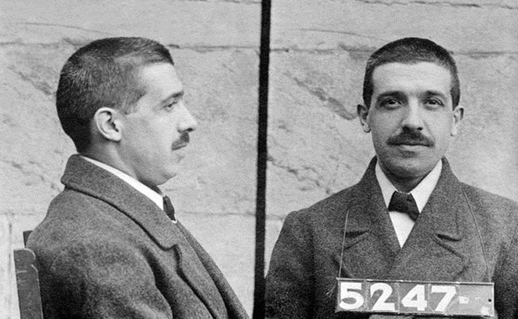
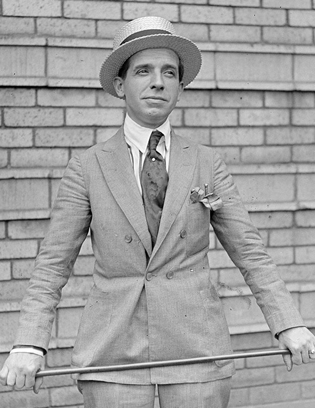
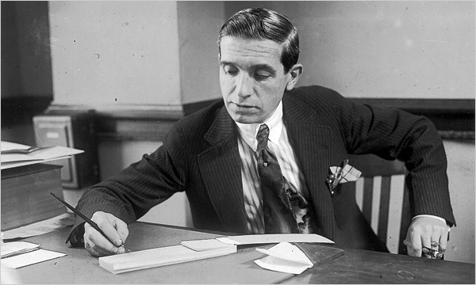
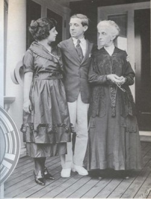
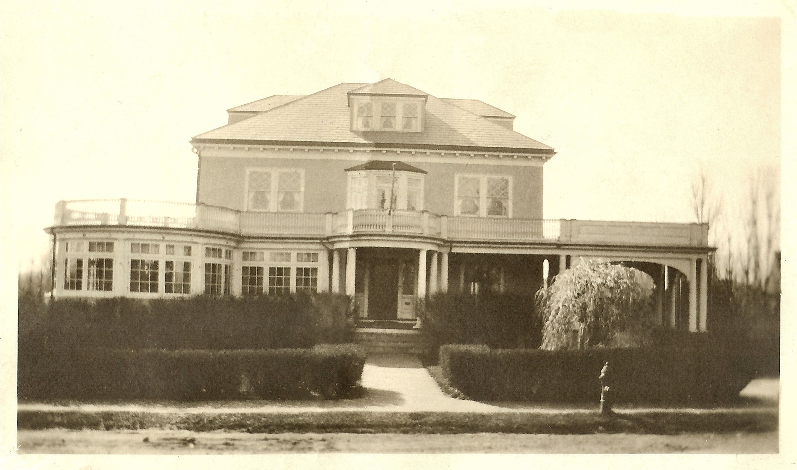
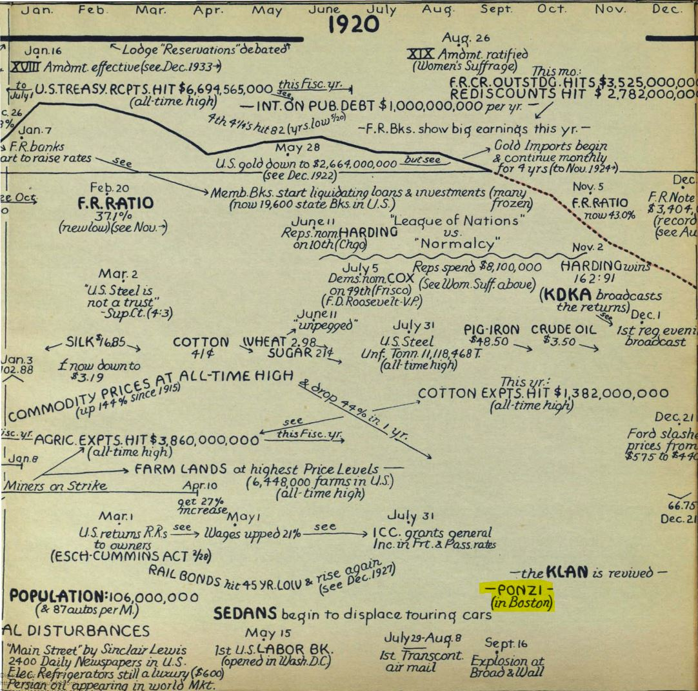

# Is Bitcoin a Ponzi scheme?
## The story of italian born Carlo Ponzi confidence trickster of 1920
In August 1920 the "financial legend" Charles Ponzi was arrested. In only a year he had taken in $20 million dollars from ten-thousands of victims. Often referred to as investors. His promise was to double their money within three months. In return for cash investors received promissory notes, that guaranteed the original investment plus 50 percent interest. These notes bore Ponzi‘s ink-stamped signature, many referred to them as "Ponzi notes". It was a classical "rob Peter to pay Pauline" scheme, that he did not invent nor did his conviction to three years in prison prevent other fraudsters from doing so. In 1957, the Encyclopedia Britannica - the Wikipedia of it’s time - formally acknowledged that his name had become synonymous with swindle. The Ponzi scheme officially had a name.

Listen to the story of Charles Ponzi here:
<iframe src="https://www.vodio.fr/frameplay.php?idref=25645&urlref=1" style="border: 0px none; box-shadow: rgba(0, 0, 0, 0.28) 0px 0px 10px; width: calc(100% - 10px); height: 180px; margin-left: 5px; padding: 0;" scrolling="no"></iframe>

Charles Ponzi's Wikimedia entry assigns his occupation to the categories: Influenceur, Banker, Autobiographer. No joke - in this order. On Wikipedia he is a Financier and confidence trickster.

Mug shot of Charles Ponzi. His aliases include Charles Ponei, Charles P. Bianchi, Carl and Carlo.  <small> [By US Government][1] , [Public Domain][2] </small>

But before we begin to tell the story of Mr. Ponzi let's take a look at....
## What can we learn from Charles Ponzi's scheme related to Bitcoin?

* **Do not call frauds**, where someone asks for bitcoin a "bitcoin scam". Ponzi's crime was not called  "**US dollar scam**". The fraud was called after the guy, who pulled it off and not after the money, he cashed in.
* **Bitcoin is not a Ponzi scheme**. The only similarity between Bitcoin and a Ponzi scheme is the network effect of greed. Investors who get in early, earn interest and tell others, who also want to get rich quick.
* In a [Ponzi scheme there is a centralized actor](https://anitaposch.com/bitcoin-was-never-hacked-twitter-was) a leader or organization that collects investments and runs off in the end.
* **Bitcoin is auditable.** Bitcoin is an Open Blockchain and these are transparent, all transactions are traceable. It is possible to proof where funds are. If people would have invested bitcoin in Charles Ponzi's scheme, it would have been possible to proof, if the funds have been moved - to buy a Locomobile for instance - or if they are still locked.
* 100 years ago Ponzi investors got a paper receipt with Ponzi’s signature in return, that promised a payout with interest. This is **comparable to many ICO and DeFi** projects from 2016 up until now, that promised to be the next and better bitcoin, projects that only had a fancy website and a whitepaper managed to earn millions from hopeful investors, who lost their money in the end.
* **Bitcoin is decentralized**, there is no company behind, no leader, it’s software is built on consensus by all participants. **No one can run away with your money as long as you hold your keys. It’s yours like the cash in your pocket.**

## Ponzi's roots and La Dolce Vita

Let's start from the beginning. Ponzi‘s short term success had been decades in the making. His thirty-eight years of life before were full of setbacks, misadventures, failures and even two times in jail in pursuit of riches.

Charles Ponzi was born in Lego, Italy, in spring 1882 named Carlo Ponzi. His family was comfortable but far from wealthy, richer in reputation than in savings. His father was descended from middle-class hoteliers and tradesmen, but was working as a postman. His mother Imelde Ponzi’s family was part of the aristocracy in the duchy of Parma. She was staking the family‘s future on her only child Carlo, building "castles in the air" in her stories of the glory she hoped he would achieve.

With the inheritance from his father Ponzi was able to attend the University of Rome, only to gravitate toward a group of wealthy students who lived *la dolce vita*.

## Emigration to the United States in 1903
Soon the money was gone and the chances to earn a degree, too. He had become an impoverished fop. Taking a mundane job would be beneath him. An uncle told him that the streets in the United States are paved with gold and he could make a fortune easily. In November 1903 Carlo Ponzi entered a ship bound to Boston.

For the first four years Ponzi worked as a grocery clerk, road drummer, factory hand and a dishwasher. He rarely lasted long. In America Carlo Ponzi became Charles Bianchi. In 1907 he moved to Montreal and was hired as a clerk by an Italian bank, Banco Zarossi. But Mr. Zarossi was doing dubious banking business. He was paying higher interests than any other bank and was suspected to be paying one customer with another customers money, an age-old fraud known as "robbing Peter to pay Paul". The bank collapsed and 26 year old Ponzi had, as usual, spent all the money he had earned. Wanting to hit the road he stole and forged a check, but was caught and sentenced to three years in prison.

## His epiphany to gain riches
Afterwards Ponzi returned to the United States and after nine years of taking different jobs, he was "tired of making money for my employers and none for myself". With support of his wife Rose he rented a one-room office in Boston spinning up ideas and working on projects, that he thought would make him rich. That’s how he found out about International Reply Coupons. The instrument he built his famous Ponzi scheme on top. It was an international postal currency, that could be redeemed for stamps in any post office of a country belonging to the Universal Postal Union and was setup in 1906. Coupons purchased for one American dollar in New York yielded the equivalent of one dollar‘s worth of French stamps in Paris. But the Great War left some countries‘ currencies deeply devalued.

 
Charles Ponzi posing for a photographer in the year of his world renowed scam.
<small> [Mgreason at English Wikipedia][3] </small>

Ponzi saw in it a global currency, whose value fluctuated widely depending on where it was used. An opportunity to profit on arbitrage. Ponzi was delighted. He would not only operate under the umbrella of the postal service, also everybody was a potential customer. Even better, the supply of coupons was potentially limitless. Ponzi was certain that it was legal. He even admitted that it might be unethical, but "...then nobody gave a rap for ethics. The almighty dollar was the only goal." In December 1919 Charles Ponzi was sure, he found a legitimate, foolproof formula to Get Rich Quick. He registered the "Securities Exchange Company" and began hunting for investors who had 10 dollars to spare. "We are all gamblers. We all crave easy money. And plenty of it. If we didn’t, no get-rich-quick scheme could be successful.", Ponzi believed.

Charles Ponzi maybe signing "Ponzi notes" while posing for a photographer.
<small> [By Boston Library (NYT); en.wikipedia.org - Boston Library (NYT); en.wikipedia.org, Public Domain][4] </small>

## The good life
In early 1920 Ponzi’s business started to take off. He never really exchanged International Reply Coupons for money, but took the model as an explanation, where the 50% interest for his customers come from. In July 1920 Ponzi had taken in nearly $6.5 million, from more than twenty thousand investors. In the seven months since opening business, the Securities Exchange Company had amassed $9.6 million from thirty thousand investors. To keep them satisfied he would have to pay them nearly $15 million in return.

Ponzi bought himself and his wife a luxury home, a "Locomobile" the most expensive car of the time driven by a chauffeur and lived the life of a rich man.

  
The Locomobile, the most expensive car in 1920.  
<small> [By Unknown author - Photo from 1920 magazine ad; file previously uploaded to en:wikipedia.org on 18:52, 26 June 2003 by Infrogmation, Public Domain][5] </small>

  
Charles Ponzi proudly posing with his wife Rose and mother Imelde on the porch of his newly acquired mansion. <small>Source: Boston University Journalism Library</small>

  
Ponzi's mansion in Lexington, Massachusetts.
<small> Historic photos courtesy of Christine McLaughlin and Ofer Gneezy. </small>

## The end after a few months
In the meantime government authorities, the postal office and the Boston *Post* started to investigate his business and prior life. And Ponzi knew he couldn’t last. He tried to find ways out believing that he will make it. After the Boston *Post* reported about Ponzi’s time in jail in Montreal, the financial investigations made clear that he didn’t have the money to pay his victims back. Charles Ponzi was arrested on August 12, 1920.

The news brought down six banks and Ponzi's investors were practically wiped out, receiving less than 30 cents to the dollar. They lost about $20 million in 1920 dollars (approximately $193 million in 2019) .

Charles Ponzi was sentenced to five years in prison. In September 1925, Ponzi was released on bail and fled to Jacksonville, Florida and launched the Charpon Land Syndicate ("Charpon" is an amalgamation of his name), offering investors tiny tracts of land, some under water, and promising 200% returns in 60 days. It was another scam that sold swampland in Columbia County.

Ponzi again went to jail and was released in 1934. Ponzi's charismatic confidence had faded, and when he left the prison gates, he was met by an angry crowd. He told reporters before he left, "I went looking for trouble, and I found it." On October 7, 1934, Ponzi was officially deported to Italy.

His beloved wife Rose stayed in the U.S. and divorced Ponzi in 1937. She had not wanted to leave Boston, and Ponzi was in no position to support her in any event. Charles and Rose stayed in contact with each other, writing letters and missing each other.

Ponzi spent the last years of his life in poverty, working occasionally as a translator. Ponzi died aged 66 in a charity hospital in Rio de Janeiro on January 18, 1949. He had seventy-five dollars to his name, just enough for his burial.

Rose wanted to have his body returned to Boston for a proper funeral, but she had lacked the money to do so. Rose was working as a bookkeeper and re-married in 1956. She lived a happy life and died aged ninety-seven in 1993. Despite the divorce and the heartaches, despite her dashed dreams and decades apart, the one thing that Ponzi never lost was Rose‘s love.

Ponzi granted one last interview to an American reporter, confessing:
>"My business was simple. It was the old game of robbing Peter to pay Paul. You would give me one hundred dollars and I would give you a note to pay you one-hundred -and-fifty dollars in three months...My notes became more valuable than American money...Then came trouble. The whole thing was broken."

While being seriously ill, he still maintained his optimism and believed the triumphant words he had used to end his memoirs:
>"Life, hope, and courage are a combination which knows no defeat. Temporary setbacks, perhaps, but utter and permanent defeat? Never!"

He also said later:
>"Even if they never got anything for it, it was cheap at that price. Without malice aforethought, I had given them the best show that was ever staged in their territory since the landing of the Pilgrims! It was easily worth fifteen million bucks to watch me put the thing over."

  
Ponzi's scheme added to a graphical presentation of 75 years of American Finance dating 1936. <small> [The work was created by L. Merle Hostetler in 1936][6] </small>

The Peter-to-Pauline scheme did not die with him. People began to call these scams Ponzi schemes. In 1957, the Encyclopedia Britannica - the Wikipedia of it’s time - formally acknowledged that his name had become synonymous with swindle. Soon the Oxford English Dictionary followed, entering "Ponzi scheme" to the book. Defined as: "**A form of fraud in which believe in the success of a fictive enterprise is fostered by payment of quick returns to first investors from money invested by others.**"

Charles Ponzi started talking of "him" instead of "I" when the Post printed the fraud story of Bank Zarossi, where he afterwards was sentenced to three years in jail for forgery. He twisted stories excusing his fraud and covered Zarossi‘s crime. He insisted on "not trying to pose as a hero", when in fact that was exactly what he was doing. He pushed the story of the "wrong-place-at-the-wrong-time-Samaritarian" trying to get away with his scheme.

Charles Ponzi dreamed of living the rich life, which he did for as short as some months.
> Ponzi’s victims lost about $20 million in 1920 dollars (approximately $193 million in 2019 dollars). By comparison, Bernard Madoff's similar scheme that collapsed in 2008 cost his investors about $18 billion, 53 times the losses of Ponzi's scheme.

I recommend reading the full story written by [Mitchell Zuckoff](https://twitter.com/mitchellzuckoff) in his book [Ponzi's Scheme](https://amzn.to/2Z5JDHo), the main source of my story. 

Other source <a href="https://en.wikipedia.org/wiki/Charles_Ponzi" target="_blank" rel="noopener noreferrer">Wikipedia</a>.

[1]: http://www.smithsonianmag.com
[2]: https://commons.wikimedia.org/w/index.php?curid=15575288
[3]: https://commons.wikimedia.org/w/index.php?curid=67236353
[4]: https://commons.wikimedia.org/w/index.php?curid=31534797
[5]: https://commons.wikimedia.org/w/index.php?curid=900735
[6]: https://fraser.stlouisfed.org/title/75-yrs-american-finance-162/chart-5373