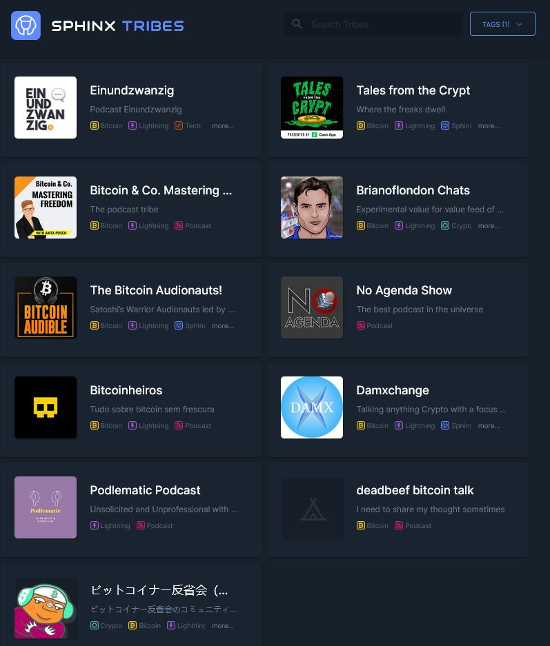
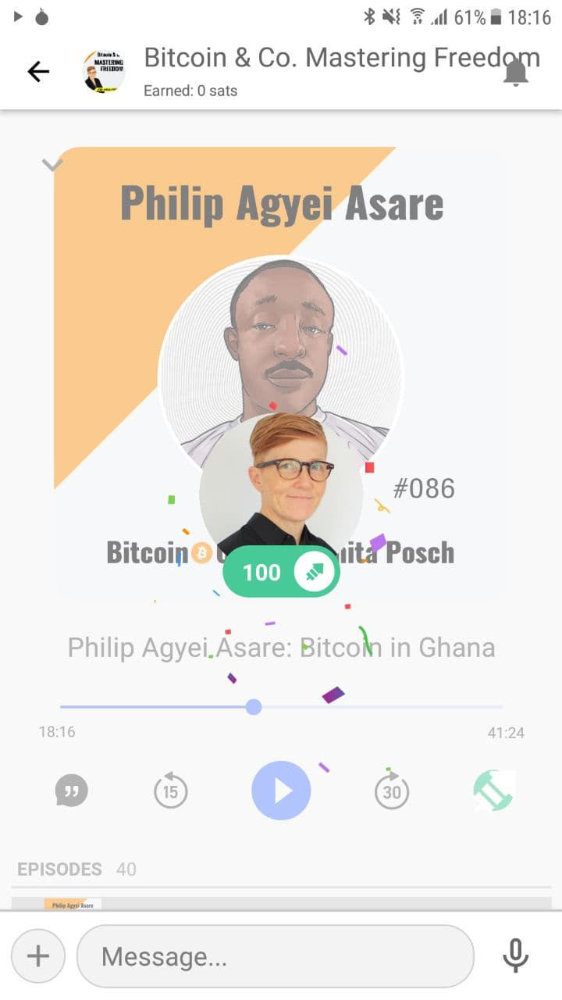

# The Anita Posch Show One of the First Podcasts Enabling Streaming Money

The <a href="https://tribes.sphinx.chat/" target="_blank" rel="noopener noreferrer">The Anita Posch show tribe</a> is live. Now you can listen to my podcast episodes and at the same time send some sats.

There are two ways of doing this. You can "boost" sections while listening or in the chat and you can automatically send sats while streaming.

You need to connect the <a href="https://sphinx.chat/" target="_blank" rel="noopener noreferrer">Sphinx App</a> to your lightning node. If you do not run a lightning node yourself, you can rent one. As soon as you have set up the App and connected it to your node, you can join a tribe. You can look out for the tag "podcast" in the <a href="https://tribes.sphinx.chat/" target="_blank" rel="noopener noreferrer">directory of all tribes</a>. As soon as you have entered the tribe you can boost and stream money.

[Prior article around this topic](https://anitaposch.com/streaming-money-podcast-player/)