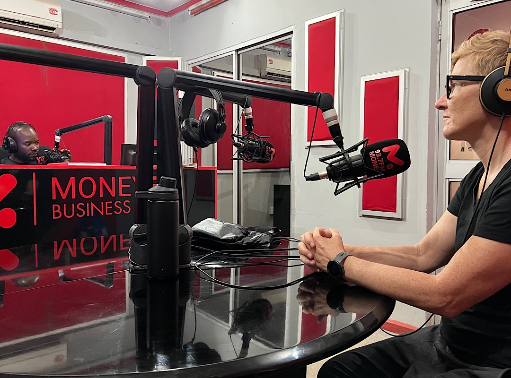
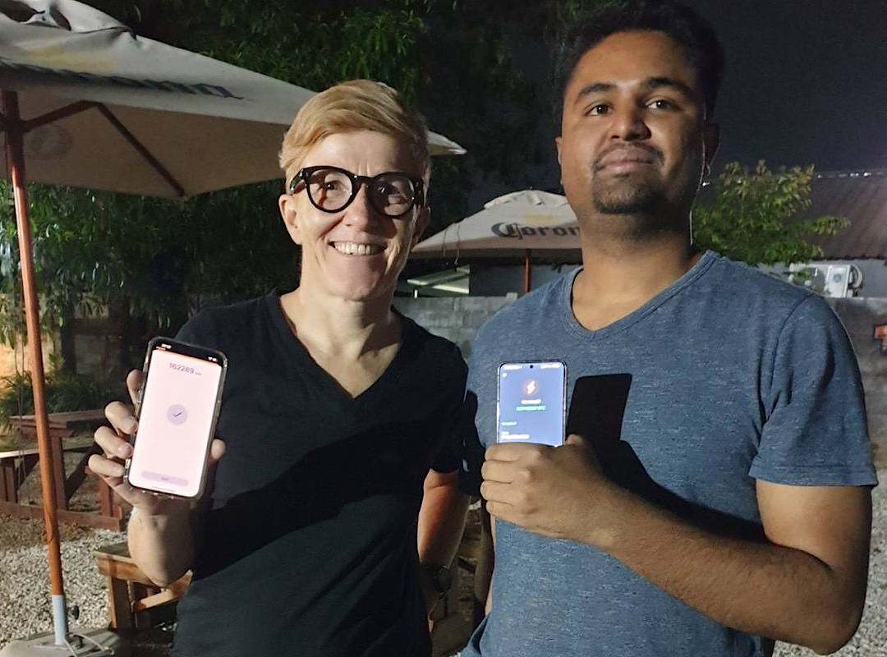

# Bitcoin for Fairness on the ground in Lusaka

In the morning we met with human rights activist Meron Estefanos at the FIFAfrica22 pre-event to discuss Bitcoin education and financial privacy on the continent. I found a PoshMedia vehicle and had a laugh with Meron, because my company in Austria is called PoshMedia too.

In the afternoon I was interviewed on MoneyFMZambia a radio station about personal finance and e-commerce. Later I was interviewed for Tech Trends Zambia. 

We met with the Tech Trends blogger at Scallywags the first restaurant in Lusaka to accept Bitcoin. Devon, the owner's son is using the Muun wallet. We'll bring 20-30 guests to Scallywags for our meetup on Sunday.

---

You like Anita Posch's work and efforts with [Bitcoin for Fairness](https://bffbtc.org) to foster Bitcoin adoption on the ground in the Global South? It's all community powered and funded by donations. Feel free to [support our work with a donation](https://anita.link/donate) or send sats to our Lightning address: bffbtc@getalby.com.