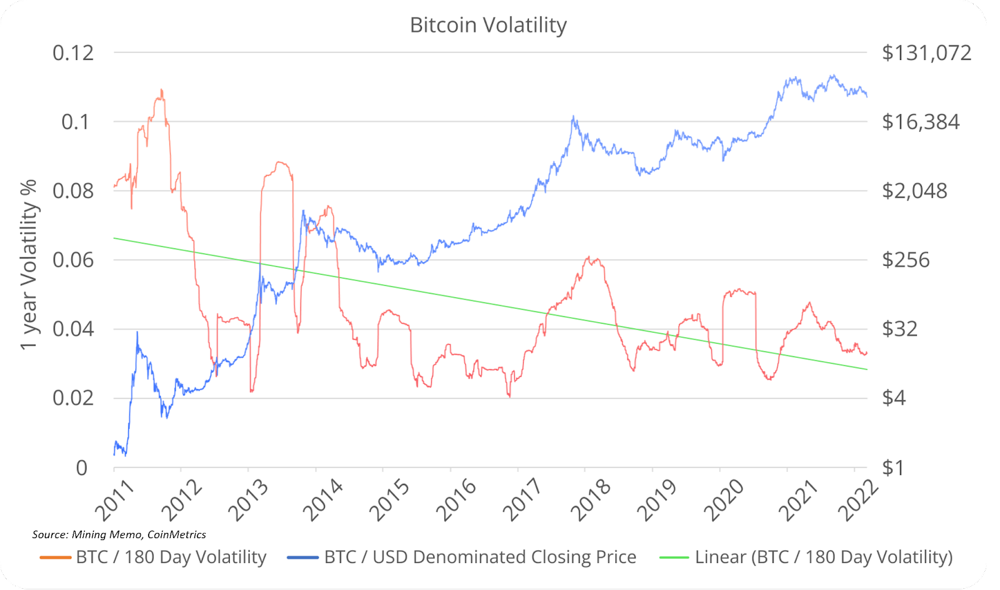
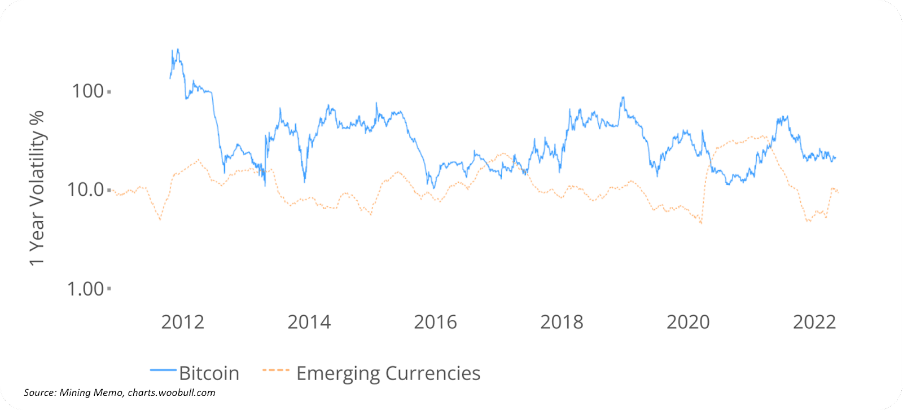

# Bitcoin's Volatility Is Decreasing
## What is volatility?

Simply put: the volatility of a currency or money describes its value change. If the price of bitcoin goes up 5% on one day and down 10% the next day then this up and down is called volatility. Historic volatility is measuring a time series of past market prices.

## How can low income people use bitcoin?
These price swings make it hard to use bitcoin as a store of value, when you can't afford to hold it for a longer period like 3 -4 years. People in emerging countries with high inflation in their local currency and very low income simply have to spend their money. One thing to do is to receive bitcoin and immediately exchange it to local currency to buy what you need. Due to the short time span between sending and spending, you'll have only a small loss or even a gain. 

The use of bitcoin as financial rails to send money easily around the world without banks or the need for an ID, with low fees and the security that the money can't be taken away from you by the government is especially important in countries with flawed democracies and even more in authoritarian or dictatorship settings. Let's not forget that 54% of humankind have to live in these circumstances.

## Bitcoin's volatility has been decreasing
Agreed bitcoin's volatility can be difficult to handle, but "bitcoin’s average volatility has decreased significantly from 2011 to 2022. As the asset gains more volume, there are fewer large fluctuations in price. Assuming this trend continues, Bitcoin will become less erratic over time and therefore become more attractive to countries with emerging currency."

[Bitcoin's volatility over time, Source: Compass Mining](https://compassmining.io/education/comparing-bitcoins-volatility-to-that-of-other-assets/)

## Comparison to Emerging Currencies

Comparing bitcoin's volatility to that of emerging country currencies we can see that in 2016 and 2020, emerging currencies not only had higher volatility than bitcoin, but the volatility was often created by inflation.

Due to its finite supply of 21 million bitcoin's price tends to swing to the upside in the long run, which gives it an advantage compared to emerging currencies, where the value tends to decrease due to inflation.

[Bitcoin's volatility compared to emerging currencies, Source: Compass Mining](https://compassmining.io/education/comparing-bitcoins-volatility-to-that-of-other-assets/)

The volatility of bitcoin can be a huge problem. But there are ways to mitigate it and in the long run bitcoin's price has been increasing and the volatility went down. Especially for people in countries with weak currencies, a broken banking system and authoritarian rulers Bitcoin is life changing.