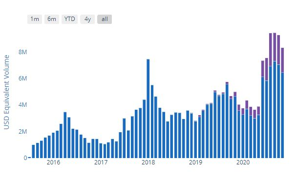

# Bitcoin Trading Volume in South Africa Is Surging

This is the chart depicting the <strong>cumulative trading volume</strong> on the P2P platforms LocalBitcoins and Paxful <strong>in South Africa from 2016 to 2020</strong>.

There are steady ups and downs, peaking in 2016, 2018 and 2019, with an all-time high recently in September 2020. The trend shows an <strong>overall increase in volume of bitcoin trading</strong>. The blue bars stand for LocalBitcoins' volume and the purples are for Paxful.

 
<small> [Source: usefultulips, Nov 2020](https://www.usefultulips.org/combined_ZAR_Page.html) </small>

Notice the change in mid-2020, which analysts attribute to the Covid-19 crisis.

The overall trend shows that more and more people are starting to use bitcoin in South Africa. If they find it useful for their purposes, not only will they to continue using it, but they will also tell their friends and family about it. Their business partners will start using it and the <strong>network effect will set in</strong>. First time users will become regular users. This forms a solid basis upon which new users will join. 

What I have learned while traveling through southern Africa is <strong>big chunks of trading goes on with WhatsApp and Facebook groups</strong>, which is P2P without a centralized platform. This means that <strong>true trading volume can not be known</strong>. 