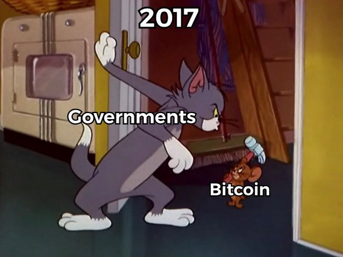

# Weekly Nr. 20 - Bitcoin is Maturing

<h2>Thought of the week by Anita Posch</h2>

<strong>Square's Bitcoin Mining Mythology</strong>
Sometimes I wonder, if the work I do is longer needed. When I started in the space in 2017/18 most educational content was done by podcasters, enthusiasts and advocates. Now that more and more companies come into the space and exchanges are maturing, they also produce great content. Square has published a [Bitcoin Mythology - this time about mining](https://bitcoinmythology.org/).

<h2>Interview with Climate Change Scientist Abe Cambridge</h2>
Abe Cambridge is the founder and CEO of The Sun Exchange, the world’s first peer-to-peer solar leasing platform. He has some mind-boggling ideas how the transition from fossil fuels towards solar power can work out and also how the Bitcoin network could be powered by solar.
<blockquote class="twitter-tweet">
3. Spend 0.5% of the <a href="https://twitter.com/hashtag/bitcoin?src=hash&amp;ref_src=twsrc%5Etfw">#bitcoin</a> market cap on 51.85 GWp of solar power, and you&#39;ll meet the annual 77.782 TWh energy needs of the <a href="https://twitter.com/hashtag/bitcoin?src=hash&amp;ref_src=twsrc%5Etfw">#bitcoin</a> mining network. <a href="https://twitter.com/hashtag/letsdoitalready?src=hash&amp;ref_src=twsrc%5Etfw">#letsdoitalready</a>
&mdash; abecambridge (@abecambridge) <a href="https://twitter.com/abecambridge/status/1369662577626734593?ref_src=twsrc%5Etfw">March 10, 2021</a></blockquote> 

And how we could use bitcoin to finance solar-energy:
<blockquote class="twitter-tweet">
2. The <a href="https://twitter.com/hashtag/Bitcoin?src=hash&amp;ref_src=twsrc%5Etfw">#Bitcoin</a> network mines 900 BTC per day from 0.213 TWh of energy. 900 BTC can finance 70MW of solar power plant. 70MW of solar will generate 2.651 TWh of electricity. That&#39;s 12 times as much energy as it took to mine the BTC in the first place, which still exists. <a href="https://twitter.com/hashtag/Magic?src=hash&amp;ref_src=twsrc%5Etfw">#Magic</a>.
&mdash; abecambridge (@abecambridge) <a href="https://twitter.com/abecambridge/status/1369661255498297344?ref_src=twsrc%5Etfw">March 10, 2021</a></blockquote> 

You can buy a solar-panel for as little as 5 USD. Sun Exchange is opening access to solar for anyone and you can earn bitcoin in return. I put my money where my mouth is.
<blockquote class="twitter-tweet">
Just bought solar cells to offset my carbon footprint AND I will earn returns in <a href="https://twitter.com/hashtag/Bitcoin?src=hash&amp;ref_src=twsrc%5Etfw">#Bitcoin</a> in the largest <a href="https://twitter.com/hashtag/crowdsourcing?src=hash&amp;ref_src=twsrc%5Etfw">#crowdsourcing</a> campaign in Africa so far. Fantastic project in <a href="https://twitter.com/hashtag/Zimbabwe?src=hash&amp;ref_src=twsrc%5Etfw">#Zimbabwe</a> by <a href="https://twitter.com/TheSunExchange?ref_src=twsrc%5Etfw">@TheSunExchange</a>. My interview with CEO and founder <a href="https://twitter.com/abecambridge?ref_src=twsrc%5Etfw">@abecambridge</a> will be released next Thursday. <a href="https://t.co/K4ZLHTuJxp">pic.twitter.com/K4ZLHTuJxp</a>
&mdash; Anita ✊🏼🔑🏳️‍🌈🏊🏻🚴‍♂️☮️ (@AnitaPosch) <a href="https://twitter.com/AnitaPosch/status/1370343885050896396?ref_src=twsrc%5Etfw">March 12, 2021</a></blockquote> 

<h2>Quote of the Week</h2>
>"Sun Exchange allows micro ownership of the solar panels. And there were children in the Stellenbosch Waldorf school who were purchased solar panels by their parents. And they’re earning Bitcoin once per month from them. So you’ve got kids who are growing up, earning Bitcoin, powering their own school and know that solar energy works." – **Abe Cambridge**

And with this I close my current content focus on the subject of "Bitcoin is boiling the oceans":
<blockquote class="twitter-tweet">
If only all the people, who care so much about the energy consumption of <a href="https://twitter.com/hashtag/Bitcoin?src=hash&amp;ref_src=twsrc%5Etfw">#Bitcoin</a> would fight so strongly against the Petrodollar and the war machines. <a href="https://t.co/pCI1iu9ape">https://t.co/pCI1iu9ape</a>
&mdash; Anita ✊🏼🔑🏳️‍🌈🏊🏻🚴‍♂️☮️ (@AnitaPosch) <a href="https://twitter.com/AnitaPosch/status/1370394143307014154?ref_src=twsrc%5Etfw">March 12, 2021</a></blockquote> 

It goes to see, if this topic will pop-up in the coming years. I guess it will. Although I haven't heard many comparisons with the tulip bubble recently. Might be because, the big players are coming in.

<blockquote class="twitter-tweet">
Morgan Stanley is only ALLOWING its wealthier clients access to the volatile asset. Does it get any sillier?<a href="https://twitter.com/hashtag/Bitcoin?src=hash&amp;ref_src=twsrc%5Etfw">#Bitcoin</a> is permissionless. If you&#39;re not rich, get some bitcoin now and hold your own keys. No need for intermediaries who tell you what you&#39;re allowed to do! <a href="https://t.co/VDnl0yTzi4">pic.twitter.com/VDnl0yTzi4</a>
&mdash; Anita ✊🏼🔑🏳️‍🌈🏊🏻🚴‍♂️☮️ (@AnitaPosch) <a href="https://twitter.com/AnitaPosch/status/1372284758936403968?ref_src=twsrc%5Etfw">March 17, 2021</a></blockquote> 

No, just because the price of bitcoin is 60k you haven't missed the bus!
<blockquote class="twitter-tweet">
Everyone that buys <a href="https://twitter.com/hashtag/bitcoin?src=hash&amp;ref_src=twsrc%5Etfw">#bitcoin</a> feels like they &quot;missed the bus&quot; <a href="https://t.co/rH1f5GFZEG">pic.twitter.com/rH1f5GFZEG</a>
&mdash; Documenting Bitcoin 📄 (@DocumentingBTC) <a href="https://twitter.com/DocumentingBTC/status/1370367759381639181?ref_src=twsrc%5Etfw">March 12, 2021</a></blockquote> 

You can still front-run the financial institutions and banks, the people who are responsible for the greatest financial crisis in 2008! They are buying into Bitcoin, which is thought to be an alternative to the current system. Do it, before they do it and start educating yourself about self-custody. 

I'm writing my book on this topic at the moment. It will be called (L)earn Bitcoin. I want to publish it in April. If you feel you can contribute, through proof-reading, adding information, or something else please reply.

<h2>Meme of the Week</h2>

Credits: https://twitter.com/RD_btc

<h2>CBDC will give full control to central banks</h2>
In case you wonder what Central Bank Digital Currencies are about, and think that they might be a good thing, I urge you to listen to the General Manager of the Bank of International Settlements, which is owned by central banks. He is literally saying that it will give them full control over, who is using a 100 dollar bill. 
CBDCs will give central banks the power to enforce negative interest, automatically deduct taxes and surveillance over every day purchases. This is madness. This massive control is taking away our privacy. Bitcoin is through it's uncensorability and coming privacy improvements our only chance for financial freedom.

<blockquote class="twitter-tweet">
In case it wasn’t obvious to you yet, here’s the head of the Bank of International Settlements clarifying that the difference between cash and CBDCs is that the former provides privacy while the latter gives the central bank “absolute control” 🥶 <a href="https://t.co/pBm7aKxnjJ">pic.twitter.com/pBm7aKxnjJ</a>
&mdash; Alex Gladstein (@gladstein) <a href="https://twitter.com/gladstein/status/1372795740620083201?ref_src=twsrc%5Etfw">March 19, 2021</a></blockquote> 

<h2>Security: Don't use text/SMS for 2FA</h2>
SIM jacking attacks are easy and happen rather often in the crypto space. Now there are even [services that allow attackers to send messages from your number](https://www.vice.com/en/article/y3g8wb/hacker-got-my-texts-16-dollars-sakari-netnumber). Use Google Authenticator instead.

<h2>Giveaway scams - be aware and warn your friends</h2>
As in every bull market a growing number of scammers is successfully ripping of people. Very often through [giveaway scams](https://www.bbc.com/news/amp/technology-56402378). Don't fall for that, if it sounds to good to be true, it is to good to be true. Nobody is giving away money. 

<blockquote class="twitter-tweet">
<a href="https://twitter.com/hashtag/Bitcoin?src=hash&amp;ref_src=twsrc%5Etfw">#Bitcoin</a> scam alert in <a href="https://twitter.com/hashtag/Zimbabwe?src=hash&amp;ref_src=twsrc%5Etfw">#Zimbabwe</a>   Whenever someone promises huge returns and shows off in nice offices, it‘s a scam.   Educate yourself first: <a href="https://t.co/wYNdH4AQrD">https://t.co/wYNdH4AQrD</a> <a href="https://t.co/vAqANjK2tm">https://t.co/vAqANjK2tm</a>
&mdash; Anita ✊🏼🔑🏳️‍🌈🏊🏻🚴‍♂️☮️ (@AnitaPosch) <a href="https://twitter.com/AnitaPosch/status/1371725515548196867?ref_src=twsrc%5Etfw">March 16, 2021</a></blockquote> 

Source: @BitcoinMemeHub

<h2>Price predictions are silly...but...</h2>
...through the transparency of Bitcoin it is possible to analyse data and trends very easily. This chart shows "Coin Days Destroyed". Coin Days are the period how long coins have not been moved. As you can see, the red bars indicate that people sold their coins to make profit and now the bar is blue, indicating that people are holding again. Which can be a sign for the price going up.

<blockquote class="twitter-tweet">
Monthly Binary Coin Days Destroyed  The number of days per month in which more coin days were destroyed than on average.  Yes, we are in a bull market. Yes, profits have been taken. Yes, seems to be cooling off again – bullish!  (Note: current month is still incomplete)<a href="https://twitter.com/hashtag/Bitcoin?src=hash&amp;ref_src=twsrc%5Etfw">#Bitcoin</a> <a href="https://t.co/zVbbLiyvyx">pic.twitter.com/zVbbLiyvyx</a>
&mdash; Rafael Schultze-Kraft (@n3ocortex) <a href="https://twitter.com/n3ocortex/status/1371137332171116552?ref_src=twsrc%5Etfw">March 14, 2021</a></blockquote> 

With this outlook and some content recommendations I wish you a happy weekend!
Next weeks guest is Edan Yago of Sovryn, a DeFi platform on top of Bitcoin.

<h2>Podcast of the week audio only</h2>
<a href="https://bitcoinundco.com/en/abe-cambridge/" target="_blank" rel="noopener noreferrer">Abe Cambridge: Invest in Solar Powered Bitcoin</a> 
<h2>Video</h2>
https://youtu.be/SeNc2m2dLuA

---
## Subscribe to (L)earn Bitcoin

[Subscribe for my weekly newsletter. It's free.](https://anita.link/weekly)

---

If you want to check, here is today's [Bitcoin price](https://www.coingecko.com/en/coins/bitcoin).

No financial advice. DYOR.