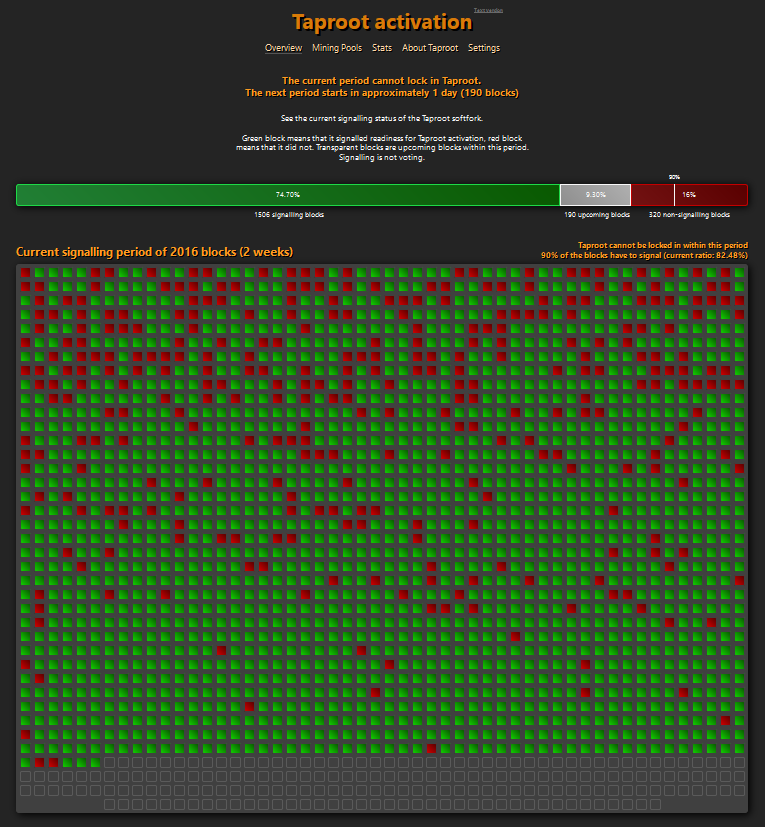
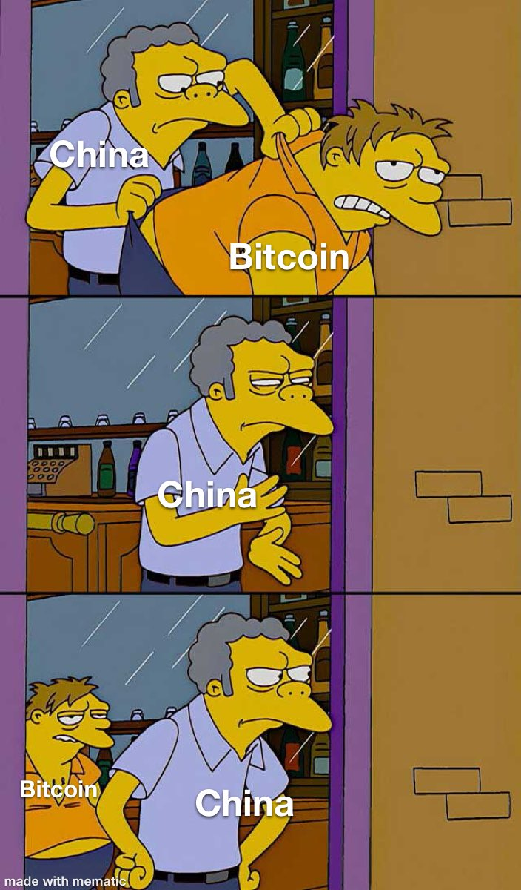
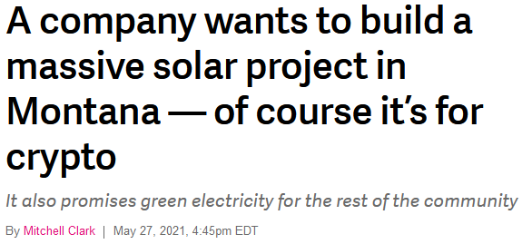
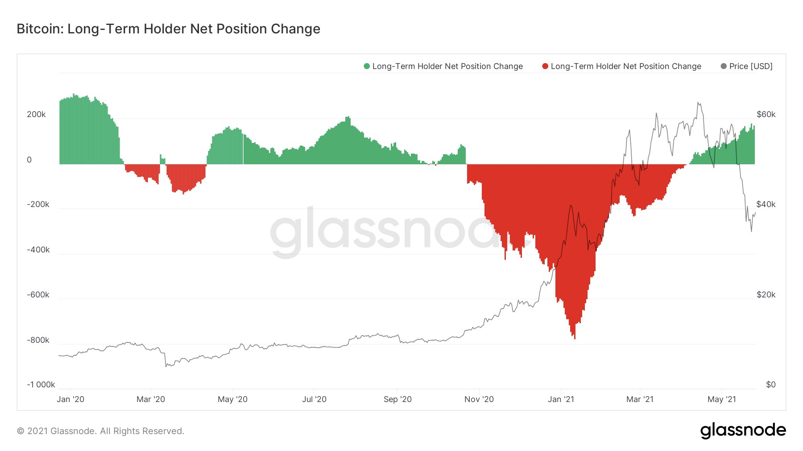

# Weekly Nr. 30 - Keep calm and carry on

<iframe width="100%" height="476" src="https://www.youtube-nocookie.com/embed/Lj2V2HfoTwQ" title="YouTube video player" frameborder="0" allow="accelerometer; autoplay; clipboard-write; encrypted-media; gyroscope; picture-in-picture; web-share" referrerpolicy="strict-origin-when-cross-origin" allowfullscreen></iframe>

## 1 Thought of the Week by Anita Posch
Bitcoin has been taking a deep breath these days after the news and price declines in the last weeks. As soon as the price plunged, media requests from Austrian and German press in my mailbox declined as well. Thank you, Bitcoin! Time to concentrate on building. 

---

## 2 Quote of the Week

> "It doesn't matter if you have nothing to hide. Because privacy isn't about something to hide. Privacy is about something to protect. And the thing to protect is a free and open society." - **Edward Snowden**

---

## 3 Major privacy increase may come soon
Only a few people really understand what "Taproot" means and how important this update to the Bitcoin Core software is. This soft-fork might be locked-in in a few weeks. The miner signals are looking very promising, still 1815 blocks within a period of 14 days have to signal for Taproot. If they do, Taproot will be automatically activated in November. There is no turning back. The decision can not be changed afterwards. The next signaling period starts tomorrow. 

Taproot brings three big changes: it improves scalability, privacy and sets up foundational scaffolding for future improvements. 

With Taproot all types of Bitcoin transactions will look the same. Cashing out from the Lightning Network for instance will look like a simple transaction between two parties although there might be thousands of payments included in one lightning channel. Taproot can hide complex scripts and show only the branch of the script that has been executed. This makes Bitcoin transactions cheaper (less data, less fees) and more efficient for everyone. Taproot introduces new address types starting with 'bc1p'. The whole implementation process will take some years until all wallets support the new address format.

It's a very important step for Bitcoin, because it strengthens core properties like privacy, neutrality, and open access. Even more: Taproot makes it more difficult for regulators to intervene, which secures the financial inclusion of billions of people without IDs, status or wealth.

 [Source](https://taproot.watch)

---
## 4 Bitcoin Mining banned in China?
Over the past weeks we heard a lot of news coming from China about another Bitcoin ban, miners gone offline and it was reported that the Chinese State Council was cracking down on mining. These stories and possible changes in regulation come on a regulary basis, see this headline from 2013:
<blockquote class="twitter-tweet">
China bans banks from doing business in <a href="https://twitter.com/hashtag/bitcoin?src=hash&amp;ref_src=twsrc%5Etfw">#bitcoin</a>. <a href="http://t.co/KLU7MWq4g1">http://t.co/KLU7MWq4g1</a>
&mdash; WIRED (@WIRED) <a href="https://twitter.com/WIRED/status/408747743201329152?ref_src=twsrc%5Etfw">December 6, 2013</a></blockquote> 

Most of the times it was business as usual afterwards, this time it might be different.

 Credits: [@Labrahodl9](https://twitter.com/labrahodl9/status/1395764334668783616?s=12)

This is good news. Because Bitcoin miners will move their mining rigs from China to other countries, which have a greener mix of electricity sources. While China is producing the same amount of electricity with renewables as the world on average does, their share of coal is higher as we can see from Friar Hass' research.

 Source: [@FriarHass](https://twitter.com/FriarHass/status/1396977767741235202?s=20)

Now the first miners are being relocated from China to Central Asia, Russia, the Middle East and to a lesser extent to North America.
<blockquote class="twitter-tweet">
Good news: hashrate is becoming more distributed across the globe, reducing attack vectors and easing concerns around usage of coal energy in Xinjiang. Good timing considering recent happenings around the topic of energy usage and mining.
&mdash; Edward Evenson (@WillHash4Coins) <a href="https://twitter.com/WillHash4Coins/status/1397919995259023373?ref_src=twsrc%5Etfw">May 27, 2021</a></blockquote> 

Don't forget: Bitcoin mining is in total 3x as renewable as the world primary energy supply. 

---
## 5 Solar power is bad, when used for Bitcoin
You can't make this up and it shows the absurdity of the discussions around Bitcoin mining. [The Verge](https://www.theverge.com/2021/5/27/22456993/butte-montana-solar-project-atlas-ethereum-cryptocurrency-mining-renewables) is running a story about a new solar power plant in the USA, which is incentivized by cryptocurrency mining while at the same time bashing the project, because it will be used for mining - in the subtitle it adds: It also promises green electricity for the rest of the community. 

---
## 6 Hodlers hodl
Below chart shows that long-term hodlers have been buying bitcoin since the price plunged in April. The network is healthy, don't let yourself get distracted from media headlines.

---
## 7 Lightning Network growth
In the last three years the number of Lightning Network nodes has grown from 250 to 9,500 nodes with 41,000 channels. That's an **increase of 3,700%**.

<blockquote class="twitter-tweet">
The <a href="https://twitter.com/hashtag/Bitcoin?src=hash&amp;ref_src=twsrc%5Etfw">#Bitcoin</a> Lightning Nework, three years ago vs today <a href="https://t.co/A7ksWi3RhR">pic.twitter.com/A7ksWi3RhR</a>
&mdash; Documenting Bitcoin 📄 (@DocumentingBTC) <a href="https://twitter.com/DocumentingBTC/status/1396791399958388736?ref_src=twsrc%5Etfw">May 24, 2021</a></blockquote> 

---
## 8 How Bitcoin enables new art forms
This week's interview guest is Rarescrilla, he's a Bitcoin music pioneer who did hie first NFTs as early as 2014 on the Counterparty platform. We're talking about why he is focusing on Bitcoin and new evolving art forms.

<blockquote class="twitter-tweet">
<a href="https://twitter.com/hashtag/Bitcoin?src=hash&amp;ref_src=twsrc%5Etfw">#Bitcoin</a> enables new art forms and <a href="https://twitter.com/hashtag/music?src=hash&amp;ref_src=twsrc%5Etfw">#music</a>, new ep with <a href="https://twitter.com/ScrillaVentura?ref_src=twsrc%5Etfw">@ScrillaVentura</a>, who did his first <a href="https://twitter.com/hashtag/NFTs?src=hash&amp;ref_src=twsrc%5Etfw">#NFTs</a> in 2014 and DJ PEPE based on Counterparty. We talk about why he is focusing on Bitcoin, the future of NFTs, his Sound Money album and upcoming projects üéß <a href="https://t.co/iYUOlsnglH">https://t.co/iYUOlsnglH</a> <a href="https://t.co/rhQcf5wH8k">pic.twitter.com/rhQcf5wH8k</a>
&mdash; Anita 🟩🔑🏳️‍🌈🏊🏻🚴‍♂️ (@AnitaPosch) <a href="https://twitter.com/AnitaPosch/status/1397944994053472262?ref_src=twsrc%5Etfw">May 27, 2021</a></blockquote> 

https://youtu.be/dZA9dGSf7nI

---
## Subscribe to (L)earn Bitcoin

[Subscribe for my weekly newsletter. It's free.](https://anita.link/weekly)

---

If you want to check, here is today's [Bitcoin price](https://www.coingecko.com/en/coins/bitcoin).

No financial advice. DYOR.