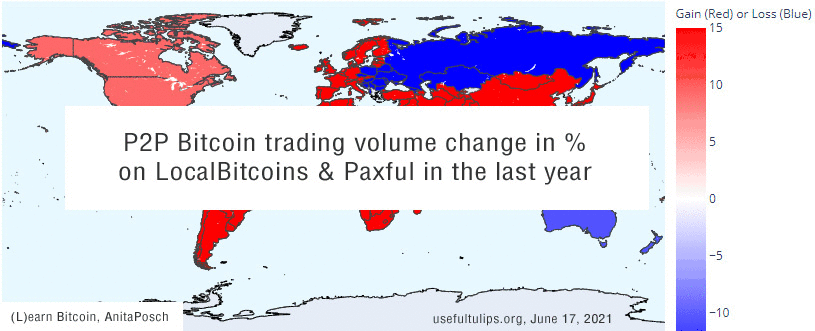
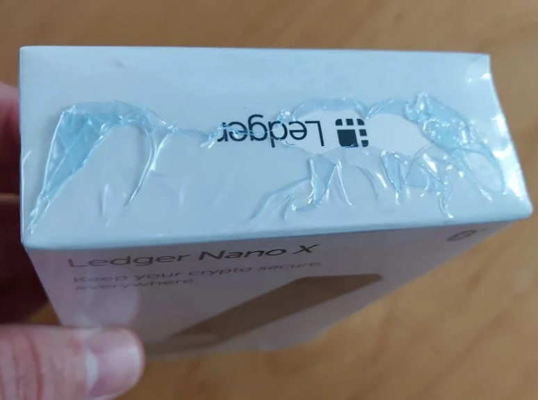

# Weekly Nr. 33 - Don't Trust, Verify! Scammers Send Fake Hardware Wallets

<iframe width="100%" height="476" src="https://www.youtube-nocookie.com/embed/PgUUilZTyqE" title="YouTube video player" frameborder="0" allow="accelerometer; autoplay; clipboard-write; encrypted-media; gyroscope; picture-in-picture; web-share" referrerpolicy="strict-origin-when-cross-origin" allowfullscreen></iframe>

## 1 Thought of the week
There always will be scammers and naysayers. While the first want your money, the last want to wear you down. Both steal your time and energy. Ignore the naysayers, read this article [explaining the history and characteristic of Ponzi schemes](https://anitaposch.com/bitcoin-ponzi-scheme/) and build stuff. Stay optimistic. It's the forward-thinking optimists and builders who change the world to the better. Naysayers achieve nothing but destruction.

---

## 2 Quote of the week

> "Bitcoin has come much further and much faster than people expected. There was a saying in the early dotcom era about 'internet time', and Bitcoin time seems to be moving even faster." - **Adam Back, Cypherpunk and CEO Blockstream**

---
## 3 Bitcoin 12 years in one minute
<blockquote class="twitter-tweet">
12 years of <a href="https://twitter.com/hashtag/Bitcoin?src=hash&amp;ref\_src=twsrc%5Etfw">#Bitcoin</a> development in 1 minute.<a href="https://t.co/GilHowpepC">pic.twitter.com/GilHowpepC</a>
&mdash; Documenting Bitcoin 📄 (@DocumentingBTC) <a href="https://twitter.com/DocumentingBTC/status/1404783098383015944?ref\_src=twsrc%5Etfw">June 15, 2021</a></blockquote> 

---

## 4 HODLer net position positive
As you know, I'm not into trading and I'm also not into price predictions. Nevertheless Bitcoin's transparency enables data analytics unseen in traditional financial systems. 

Hodler net position change is one of those interesting metrics. It shows the monthly position change of long term investors (HODLers). It indicates when HODLers cash out (negative) and when net new positions are accumulated by HODLers. The metric was coined by Adamant Capital with [Tuur Demeester](https://anita.link/57).
You can see that this metric has turned green for the first time since October 2020, a bullish signal.

<blockquote class="twitter-tweet">
HODLer Net Position Change has flipped green for the first time since October. <a href="https://t.co/0hhjXrSdmF">pic.twitter.com/0hhjXrSdmF</a>
&mdash; William Clemente III (@WClementeIII) <a href="https://twitter.com/WClementeIII/status/1404803572588494852?ref_src=twsrc%5Etfw">June 15, 2021</a></blockquote> 

---
## 5 Bitcoin trading volume development
I've built an animation showing the increase and decrease in trading volume on Bitcoin peer-to-peer platforms LocalBitcoins and Paxful within the last year. (Data: usefultulips.org). A lot of trading on other platforms and directly between individuals goes unaccounted for in this illustration, but it shows the overall development in different regions around the world.

Red areas show a gain in trading volume, while blue signals a loss compared to the previous time frame. In the last 30 days we saw blue or white all over the globe, that was the last dip in full effect. This week the trading volume increased again in Africa and Eastern Europe. 

---

## 6 Reactions towards El Salvador

The head of the **Central American Bank for Economic Integration** (CABEI) said on Monday the bank will give El Salvador technical assistance to implement bitcoin as legal tender, even though it still issues debt only in dollars. CABEI's executive president, Dante Mossi, said [the move would offer Salvadorans many opportunities](https://www.reuters.com/business/cenam-development-bank-help-el-salvadors-bitcoin-implementation-2021-06-14/), including lowering the cost for relatives abroad to send remittances.

The **World Bank** was [less supportive, citing "environmental and transparency shortcomings"](https://www.theblockcrypto.com/linked/108682/world-bank-rejects-el-salvador-bitcoin-request) as reasons why they cannot support Bitcoin. Apart from the fact, that they lack the knowledge to do so anyway - what a hypocrisy given the fact, that the World Bank itself is still investing billions in fossil fuels.

<blockquote class="twitter-tweet">
🧐 <a href="https://t.co/zE1pST2G3A">pic.twitter.com/zE1pST2G3A</a>
&mdash; Lina Seiche (@LinaSeiche) <a href="https://twitter.com/LinaSeiche/status/1405400243064082434?ref_src=twsrc%5Etfw">June 17, 2021</a></blockquote> 

As one follower - citing Nicolas Dorier - put it:
<blockquote class="twitter-tweet">
this is lies, we should make them obsolete <a href="https://t.co/OGz03oof2o">pic.twitter.com/OGz03oof2o</a>
&mdash; gabor 🇸🇻 (@btc_rev_) <a href="https://twitter.com/btc_rev_/status/1405458125755338762?ref_src=twsrc%5Etfw">June 17, 2021</a></blockquote> 

And of course it didn't take long and the first affinity scammers landed in El Salvador trying to sell their snake oil. For all the new readers: Brock Pierce has a history of fraudulently selling ICOs and pumping Altcoins. He definitely is not representing an official Bitcoin delegation. Because there is no such thing. 

<blockquote class="twitter-tweet">
Dear <a href="https://twitter.com/nayibbukele?ref_src=twsrc%5Etfw">@nayibbukele</a>, Please be careful.  1) Nobody has the right to speak for Bitcoin &quot;officially&quot;. 2) History should raise severe caution flags: * Brock raised billions for EOS ICO, later sued for fraud and SEC violations. * also see: Chinese prison labor<a href="https://t.co/a3ToNOHRl6">https://t.co/a3ToNOHRl6</a> <a href="https://t.co/ymp2pK9yB4">pic.twitter.com/ymp2pK9yB4</a>
&mdash; Warren Togami (@wtogami) <a href="https://twitter.com/wtogami/status/1405370441959542791?ref_src=twsrc%5Etfw">June 17, 2021</a></blockquote> 

---
## 7 Watch out for fake hardware wallets

A user reported on reddit that they were sent a Ledger hardware wallet although they didn't order it. Victims of the latest data breach be aware, you might receive this Ledger Nano X too. It comes with a letter by Ledger's CEO and in a Ledger branded bag. Enclosed in the package is a [shrinkwrapped Ledger Nano X box](https://www.bleepingcomputer.com/news/cryptocurrency/criminals-are-mailing-altered-ledger-devices-to-steal-cryptocurrency/) that contains what appears to be a legitimate device.

While regular Ledger hardware wallets are safe, Ledger's address data breaches are very annoying and endanger people. What really upsets me, is Ledger's negligence and that they never offered any kind of compensation to their affected customers.

When you order a hardware wallet: never use your real location as shipping address, always use a fake email and a fake phone number. Always buy from the manufacturer. Malicious sellers send you manipulated devices. No pin code or seed phrase should ever be given to you by anybody else prior to the device initialization.

---

## 8 Blockstream, a pure Bitcoin company
Blockstream is one of the companies in the Bitcoin space that's staying true to their Cypherpunk roots. I spoke with CSO Samson Mow about the strategy behind building tools and protocols like Liquid, their satellites sending bitcoin down to earth, their mining operations and much more.

https://www.youtube.com/watch?v=gZTmtdnmMMM

---
## Subscribe to (L)earn Bitcoin

[Subscribe for my weekly newsletter. It's free.](https://anita.link/weekly)

---

If you want to check, here is today's [Bitcoin price](https://www.coingecko.com/en/coins/bitcoin).

No financial advice. DYOR.